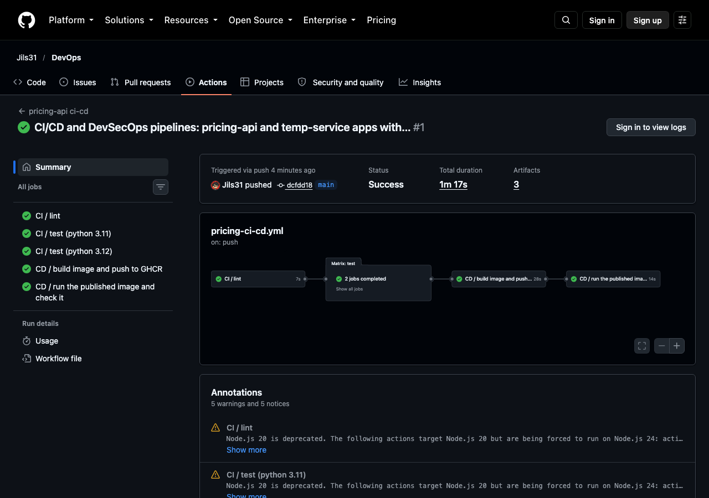
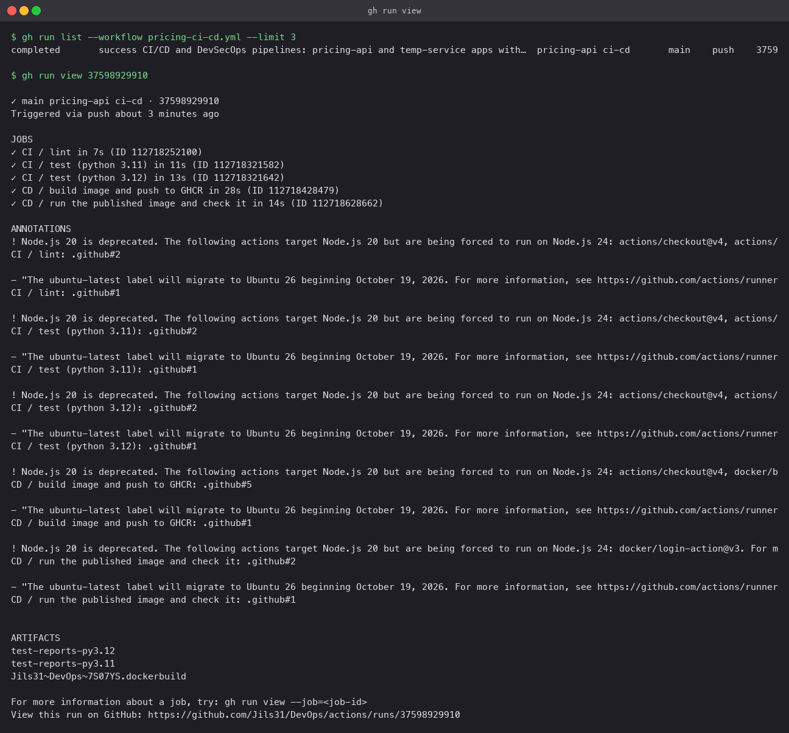
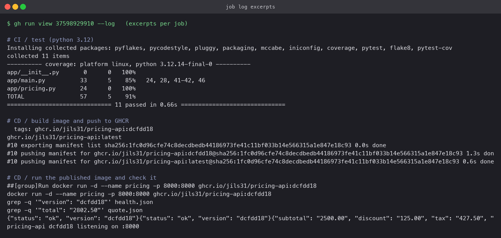

# CI/CD with GitHub Actions

A small pricing API with a real pipeline behind it. Every push that touches this folder runs
lint and tests (CI); on `master` it then builds a container image, publishes it to the GitHub
Container Registry and runs the published image to check it (CD). Pull requests stop after
CI, so nothing unreviewed gets published.

Workflow file: [`.github/workflows/pricing-ci-cd.yml`](../.github/workflows/pricing-ci-cd.yml)
(workflows must live at the repository root, which is why it is not in this folder).

## The application

- `app/pricing.py`: subtotal, tiered discount, tax. Pure functions on `Decimal`.
- `app/main.py`: `GET /health` and `POST /quote` on the standard library HTTP server. No
  runtime dependencies, so the image is `python:3.12-alpine` plus one directory.
- `tests/`: 11 tests. Unit tests for the pricing rules, and API tests that start the server
  on a random port and call it over HTTP.
- `Dockerfile`: bakes the git short SHA in as `APP_VERSION`, which `/health` reports. That
  is how the smoke test later proves it is running *this* build.

## CI versus CD, in this pipeline

| | Jobs | Trigger | Purpose |
|---|---|---|---|
| CI | `lint`, `test` | every push and pull request | catch mistakes before they merge |
| CD | `build-and-publish`, `deploy-smoke-test` | push to `master` only | ship the tested commit |

## Pipeline structure

```
lint ──> test (matrix: 3.11, 3.12) ──> build-and-publish ──> deploy-smoke-test
```

**Workflow**: one YAML file with `on:` triggers (`push` to master filtered by path, `pull_request`,
and `workflow_dispatch` for a manual run).

**Jobs** run on separate runners and are ordered with `needs:`. The test job uses a **matrix**
so two Python versions run in parallel.

**Steps** inside a job run in order on the same machine: `actions/checkout`, `setup-python`
with pip caching, then `run:` shell commands.

**Runners**: `ubuntu-latest`, GitHub-hosted. Nothing self-hosted is needed.

**Secrets**: the only credential is `GITHUB_TOKEN`, which GitHub issues per run. The publish
job requests `permissions: packages: write` and uses it to log in to `ghcr.io`. No personal
token is stored anywhere.

**Artifacts**: the test job uploads JUnit XML and coverage XML for each Python version
(`actions/upload-artifact`), kept for 14 days and downloadable from the run page.

**Build**: `docker/build-push-action` with buildx, layer cache in GitHub's cache
(`type=gha`), tagged with the short SHA and `latest`.

**Test**: `pytest` with `--cov`, failing the job on any test failure. `flake8` runs first and
is a hard gate too.

## Run

Pushed as commit `dcfdd18`. The run completed with every job green:

```
CI / lint                                    success
CI / test (python 3.11)                      success
CI / test (python 3.12)                      success
CD / build image and push to GHCR            success
CD / run the published image and check it    success
```

Test job: `collected 11 items`, `11 passed`, coverage 91%. Publish job: pushed
`ghcr.io/apassie/pricing-api:dcfdd18` and `:latest`. Smoke-test job: pulled that exact tag,
started it, `/health` returned `{"status": "ok", "version": "dcfdd18"}` and `/quote` for one
item at 2500 returned `total 2802.50`, both asserted with `grep -q` so a wrong answer fails
the job.





## Useful commands

```bash
gh workflow list
gh run list --workflow pricing-ci-cd.yml
gh run view <id>                 # job summary
gh run view <id> --log           # full logs
gh run watch <id>                # follow a live run
gh run download <id> -n test-reports-py3.12
gh workflow run pricing-ci-cd.yml   # manual trigger (workflow_dispatch)
```

## Trying it locally

```bash
python3 -m venv .venv && . .venv/bin/activate
pip install -r requirements-dev.txt
flake8 app tests && python -m pytest --cov=app
docker build -t pricing-api --build-arg APP_VERSION=local .
docker run -p 8000:8000 pricing-api
curl -X POST localhost:8000/quote -d '[{"price": 100, "qty": 3}]'
```
