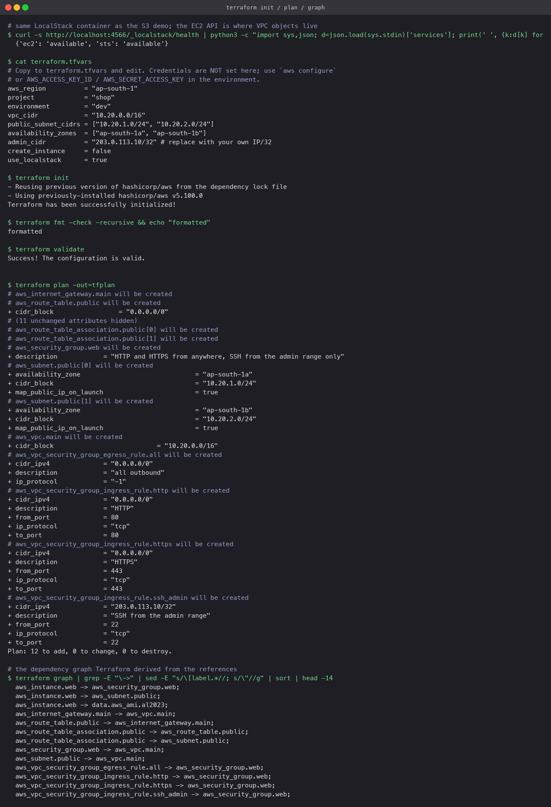
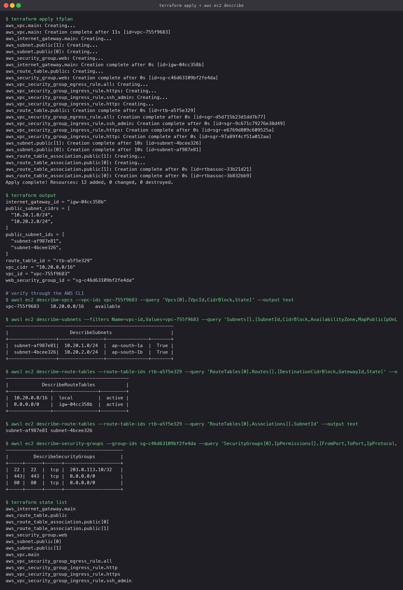
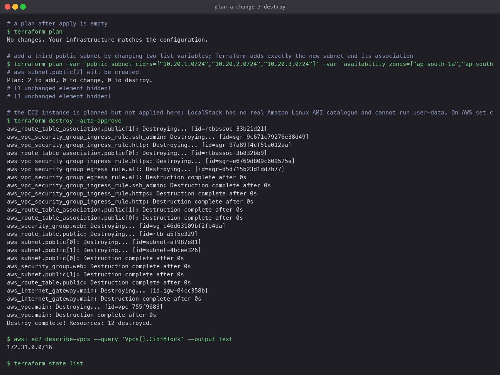

# Terraform VPC project

A public network for a web tier, built end to end with Terraform and verified with the AWS
CLI: VPC, two public subnets in two availability zones, internet gateway, route table and
associations, a web security group, and an optional EC2 web server.

## Architecture

```
                         Internet
                             │
                     Internet Gateway  (igw)
                             │
   ┌─────────────────────────┼──────────────────────────┐
   │  VPC 10.20.0.0/16       │                          │
   │                 Route table "public"               │
   │                 10.20.0.0/16 -> local              │
   │                 0.0.0.0/0    -> igw                │
   │           ┌───────────────┴───────────────┐        │
   │  ┌────────┴─────────┐           ┌─────────┴───────┐│
   │  │ public-1         │           │ public-2        ││
   │  │ 10.20.1.0/24     │           │ 10.20.2.0/24    ││
   │  │ ap-south-1a      │           │ ap-south-1b     ││
   │  │  ┌────────────┐  │           │                 ││
   │  │  │ EC2 web-1  │  │           │                 ││
   │  │  │ t3.micro   │  │           │                 ││
   │  │  └─────┬──────┘  │           │                 ││
   │  └────────┼─────────┘           └─────────────────┘│
   │     SG "web": 80, 443 from 0.0.0.0/0; 22 from admin │
   └────────────────────────────────────────────────────┘
```

## Files

| File | Holds |
|---|---|
| `versions.tf` | Terraform and provider constraints; the provider with the LocalStack switch |
| `variables.tf` | region, project, environment, VPC CIDR (validated), subnet CIDR list, AZ list, admin CIDR, `create_instance`, `use_localstack` |
| `main.tf` | VPC, subnets (`count`), IGW, route table, associations, security group and its rules, AMI lookup, instance |
| `outputs.tf` | VPC id and CIDR, subnet ids and CIDRs, IGW id, route table id, SG id, instance id and public IP |
| `terraform.tfvars.example` | Every variable with a sample value and no credentials. Copy to `terraform.tfvars` |

Resources are tied together by references, so Terraform builds the graph itself: the subnets
need the VPC id, the route table needs the IGW id, the associations need both the subnets and
the table, the instance needs a subnet and the security group.

## The run (LocalStack, `create_instance = false`)

```bash
cp terraform.tfvars.example terraform.tfvars      # set use_localstack = true for this run
terraform init
terraform fmt -check -recursive && terraform validate
terraform plan -out=tfplan
terraform graph | grep -- '->'
terraform apply tfplan
terraform output
aws --endpoint-url=http://localhost:4566 ec2 describe-vpcs / describe-subnets / describe-route-tables / describe-security-groups
terraform plan                                     # No changes
terraform plan -var 'public_subnet_cidrs=[...3 entries...]' -var 'availability_zones=[...3 entries...]'
terraform destroy -auto-approve
```

### init, validate, plan, graph

Twelve resources planned. The graph output lists each edge Terraform inferred, for example
`aws_route_table_association.public -> aws_subnet.public` and `aws_route_table.public ->
aws_internet_gateway.main`.



### apply and verify

All twelve created. The AWS CLI then showed: the VPC `available` with `10.20.0.0/16`; two
subnets in `ap-south-1a` and `1b` with public IPs on launch; a route table with the `local`
route and `0.0.0.0/0 -> igw-...`, associated with both subnets; and the security group with
exactly three inbound rules, SSH restricted to the admin `/32`.



### change, and destroy

A second `plan` was empty. Adding a third CIDR and AZ to the two list variables produced a plan
of exactly two additions, the new subnet and its route-table association, and nothing else,
which is the point of expressing the subnets as a `count` over a list. `destroy` removed all
twelve and left the state empty.



## The EC2 instance

`create_instance` defaults to `true`. It was set to `false` for the LocalStack run because
LocalStack has no real AMI catalogue to satisfy the `data "aws_ami"` lookup and cannot execute
user data. On a real account the same `apply` adds a `t3.micro` in `public-1` with a public
IP, and `curl http://$(terraform output -raw web_public_ip)` returns the nginx page written by
user data. Remember to `destroy`; a `t3.micro` is in the free tier but an idle one still counts
against it.

## Running on real AWS

```bash
aws configure                                   # credentials never go in any .tf or .tfvars file
# in terraform.tfvars: use_localstack = false, admin_cidr = "<your ip>/32"
terraform init && terraform plan && terraform apply
terraform destroy
```
