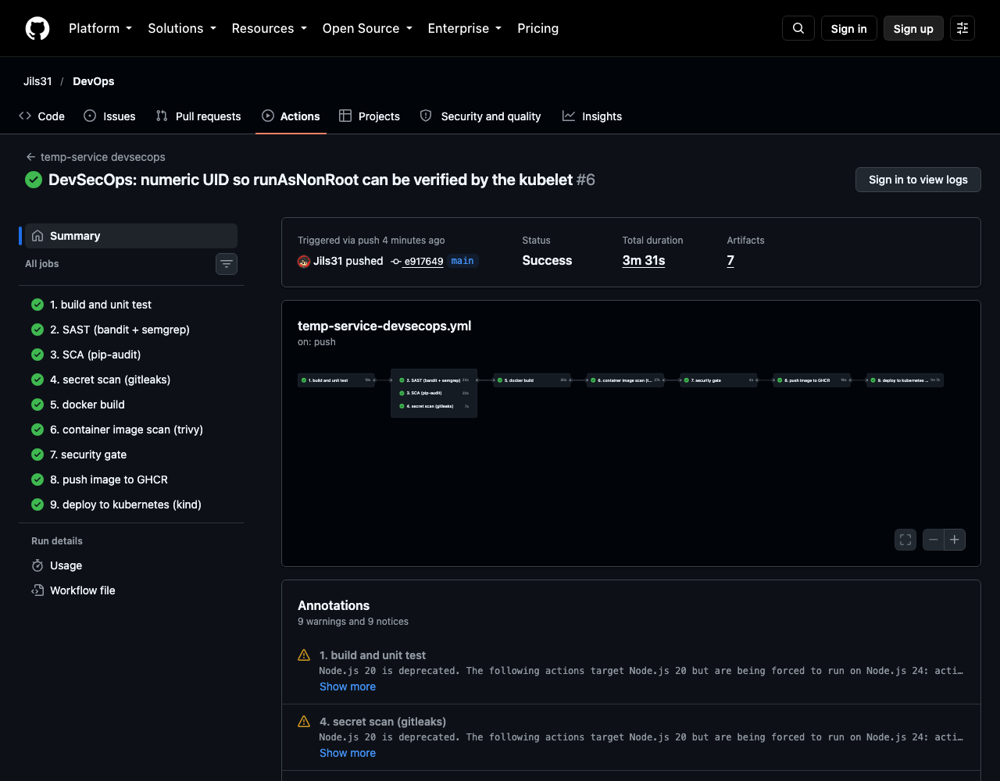
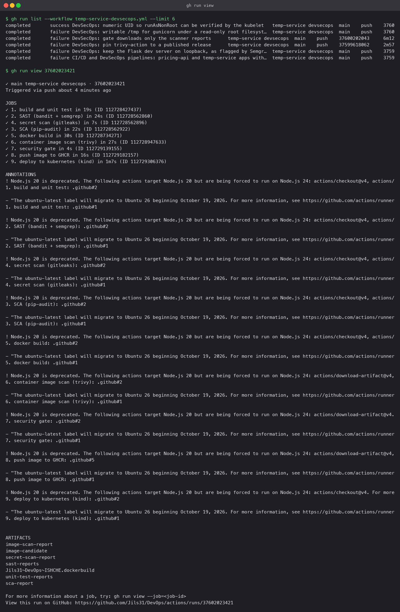
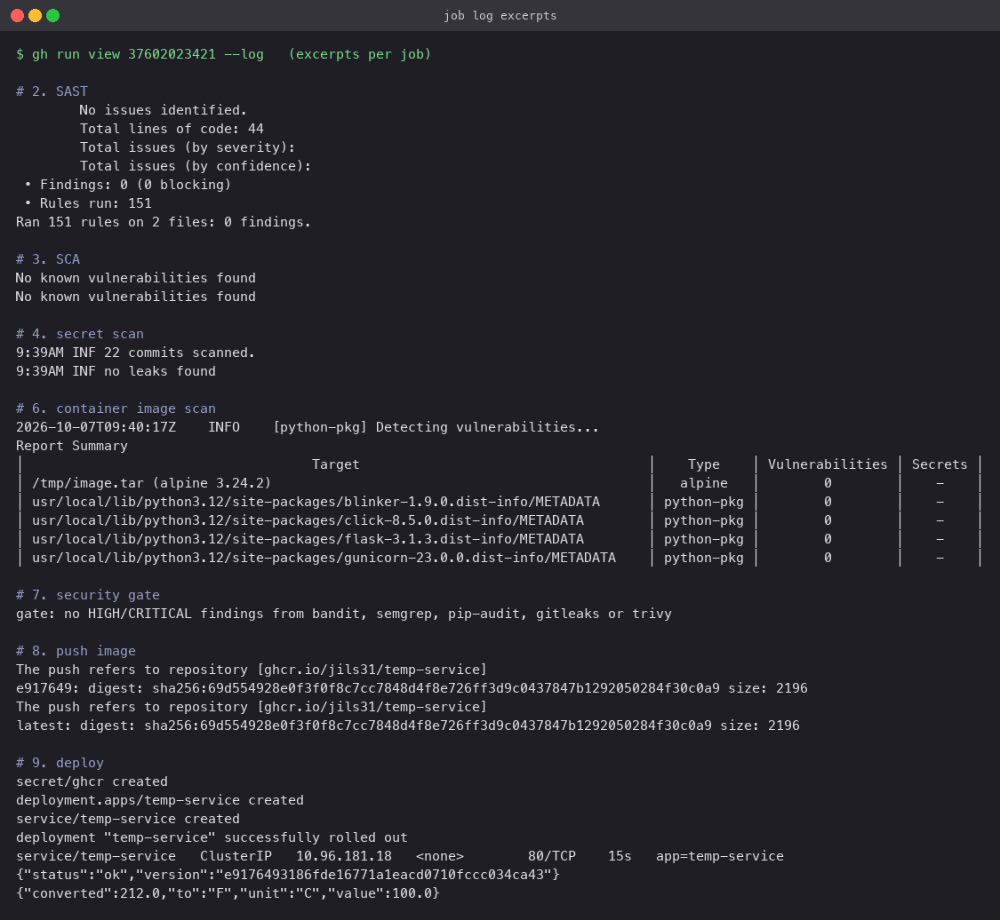

# DevSecOps pipeline

A Flask service wrapped in a GitHub Actions pipeline that will not ship an image unless the
code, its dependencies, the repository history and the built container have all been scanned
and nothing HIGH or CRITICAL was found. If the gate passes, the image goes to the GitHub
Container Registry and is deployed to a Kubernetes cluster (kind, created inside the runner)
and smoke-tested there.

Workflow: [`.github/workflows/temp-service-devsecops.yml`](../.github/workflows/temp-service-devsecops.yml)

## The application

- `app/server.py`: Flask app with `/` (dashboard page), `/health`, `/api/status` and
  `POST /api/convert` (Celsius/Fahrenheit, with input validation).
- `tests/test_server.py`: 9 tests using Flask's test client.
- `Dockerfile`: two stages; the runtime image copies only the installed packages, runs as a
  non-root user, and serves with gunicorn.
- `k8s/`: Deployment (2 replicas, non-root, read-only root filesystem, no capabilities,
  probes, resource limits, an in-memory `/tmp`) and a ClusterIP Service.
- `requirements.txt` pins exact versions so the SCA result is reproducible.

## Pipeline flow

```
1 build + unit test
      │
      ├── 2 SAST      bandit + Semgrep           static analysis of the source
      ├── 3 SCA       pip-audit                  known CVEs in pinned dependencies
      └── 4 secrets   gitleaks over full history  leaked credentials
                 │
           5 docker build  (image saved as an artifact, not pushed)
                 │
           6 image scan    Trivy, HIGH/CRITICAL, fixable only
                 │
           7 security gate   reads every scanner's JSON report; any finding fails the run
                 │
           8 push image    GHCR, tagged with the short SHA and latest
                 │
           9 deploy        kind cluster in the runner, pull secret, rollout, smoke test
```

Steps 2 to 4 run in parallel after the tests pass. Nothing is pushed anywhere before step 8.
Pull requests run steps 1 to 7 only.

## The security tools

| Stage | Tool | What it looks at | Why it is there |
|---|---|---|---|
| SAST | **bandit** | Python AST: shell=True, weak hashes, hard-coded passwords, binding to all interfaces | Python-specific, fast, no setup |
| SAST | **Semgrep** (`p/python`, `p/flask`) | Pattern rules across the source, including Flask-specific ones | Broader rule set, catches framework misuse |
| SCA | **pip-audit** | Each pinned package against the Python Packaging Advisory Database and OSV | The code can be perfect and still ship a vulnerable library |
| Secrets | **gitleaks** | Every commit in history, not just the working tree | A key committed and then deleted is still leaked |
| Image | **Trivy** | OS packages and Python packages inside the built image | The base image brings its own CVEs |
| Gate | a short Python script | The JSON reports from all of the above | One place that decides, so the rule is auditable |

Each scanner uploads its report as a run artifact, so findings can be read without rerunning.

## Deployment details

- The image is built once (step 5), saved with `docker save` and passed between jobs as an
  artifact. The scanner scans exactly the bytes that are later pushed.
- The gate downloads only `*-report*` artifacts, not the image tarball.
- GHCR packages are private by default, so the deploy job creates an `imagePullSecret` from
  the run's `GITHUB_TOKEN` and the Deployment references it.
- The deploy substitutes the real image tag into `k8s/deployment.yaml`, waits for the rollout,
  then calls `/health` and `/api/convert` from a Pod inside the cluster.
- Permissions are scoped per job: only `push-image` has `packages: write`.

## What the pipeline caught, in order

The run did not go green on the first attempt. Each failure was real and the fix is in the
commit history.

1. **Semgrep blocked SAST** on `app.run(host="0.0.0.0")` (rule
   `avoid_app_run_with_bad_host`). The Flask dev server is not used in the container, but the
   line was still a footgun. Fixed by binding the dev server to loopback; gunicorn owns the
   bind address in production.
2. **pip-audit, run locally before the first push,** flagged `flask==3.0.3`
   (PYSEC-2026-2151). Bumped to 3.1.3. In CI the SCA stage has been clean since.
3. **The gate job could not download its inputs** because it pulled every artifact including
   the image tarball. Narrowed to the report artifacts.
4. **The kind deploy timed out.** Reproduced locally with `docker run --read-only`: gunicorn
   needs a writable temp directory and the Pod's root filesystem is read-only, as it should
   be. Fixed with an in-memory `emptyDir` at `/tmp`, keeping the read-only root.
5. **The kind deploy failed again** with `container has runAsNonRoot and image has non-numeric
   user (web)`. The kubelet cannot prove a named user is non-root without the image's
   `/etc/passwd`, so the Dockerfile now creates the user with UID 10001 and the Pod sets
   `runAsUser: 10001`. The diagnostics step added in the previous fix is what surfaced this.

## Final run

Run [37602023421](https://github.com/aPassie/devops-assignment/actions/runs/37602023421) on commit `e917649`:

```
1. build and unit test: success
2. SAST (bandit + semgrep): success
4. secret scan (gitleaks): success
3. SCA (pip-audit): success
5. docker build: success
6. container image scan (trivy): success
7. security gate: success
8. push image to GHCR: success
9. deploy to kubernetes (kind): success
```

Trivy found no fixable HIGH or CRITICAL vulnerabilities in `python:3.12-alpine` plus Flask and
gunicorn. gitleaks found no secrets across the repository history. The pushed image is
`ghcr.io/apassie/temp-service:e917649`. In the kind cluster both replicas reached `Running`,
`/health` returned `ok` and `/api/convert` converted 100 C to 212 F.





## Local equivalents

```bash
python3 -m venv .venv && . .venv/bin/activate
pip install -r requirements-dev.txt
pytest --cov=app
bandit -r app
pip-audit -r requirements.txt
docker build -t temp-service .
docker run --read-only --tmpfs /tmp -p 5000:5000 temp-service
```
