# Final DevOps Project: Issue Tracker, end to end

## 1. Overview

An issue tracker (React front end, FastAPI back end, PostgreSQL) taken from a developer laptop
to a monitored Kubernetes deployment with every layer of the course applied: version control,
CI with tests and image scanning, a container registry, Kubernetes with Helm, Ingress, HPA and
probes, Prometheus and Grafana, GitOps with Argo CD, Terraform for the cloud network, and a
troubleshooting drill with planted faults.

The application code and its Dockerfiles live in [Issue Tracker Compose](../Issue%20Tracker%20Compose/)
(the session 21 submission). This folder holds everything that deploys and operates it.

## 2. Architecture

```
developer ── git push ──> GitHub ──> GitHub Actions
                                       ├─ pytest + frontend build
                                       ├─ docker build (backend, frontend)
                                       ├─ Trivy scan, fail on HIGH/CRITICAL
                                       ├─ push ghcr.io/apassie/issue-tracker-{backend,frontend}:<sha>
                                       └─ helm upgrade --install on a kind cluster + smoke test
                     │
                     └──────────────> Argo CD (in the cluster) watches helm/issue-tracker on master
                                                         │ sync
   browser ──> Ingress (nginx) ──┬── /     ──> frontend Service ──> nginx Pods (x3)
     tracker.local               └── /api  ──> backend  Service ──> FastAPI Pods (2..5, HPA)
                                                                        │
                                                      Prometheus scrapes /metrics ──> Grafana
                                                                        │
                                                            postgres StatefulSet + PVC
```

## 3. Technologies

| Layer | Used |
|---|---|
| Application | React 18 + Vite, FastAPI, SQLAlchemy 2, Alembic, PostgreSQL 16, pytest |
| Containers | Multi-stage Dockerfiles, non-root users, nginx-unprivileged, Docker Compose |
| CI/CD | GitHub Actions, GHCR, Trivy, Helm, kind |
| Kubernetes | Minikube v1.39 (Kubernetes v1.37), ingress-nginx, metrics-server, Helm 4 |
| Observability | prometheus_client in the app, Prometheus 2.55, Grafana 11 |
| GitOps | Argo CD 3.5 |
| Infrastructure | Terraform 1.16, AWS provider 5.100, LocalStack 3.8 |

## 4. Folder layout

```
Final DevOps Project/
├── kubernetes/namespace.yaml      the namespace, applied once
├── helm/issue-tracker/            the chart: postgres StatefulSet+PVC, backend, frontend, Ingress, HPA, ConfigMap, Secret
│   ├── values.yaml                defaults (Minikube)
│   ├── values-dev.yaml            single replicas, no HPA
│   └── values-prod.yaml           3+ replicas, external Secret, registry pull policy
├── monitoring/                    Prometheus (annotation discovery, alert rules), Grafana (provisioned dashboard), load-test.sh
├── gitops/application.yaml        Argo CD Application tracking the chart in this repo
├── security/README.md             what each stage enforces and why
├── terraform/README.md            where the cloud pieces are and why EKS was not run
├── troubleshooting/               two planted faults, their diagnosis, fixes and captures
└── screenshots/
```

The workflow is at the repository root: `.github/workflows/issue-tracker-cicd.yml`.

## 5. Application setup, Docker, Compose

Covered in full, with its own screenshots, in the session 21 README:
[Issue Tracker Compose](../Issue%20Tracker%20Compose/README.md). Summary: seven passing tests,
manual run of each tier, `docker compose up -d --build`, API tests through nginx. For this
project the backend gained a `/metrics` endpoint (request counter by route and status, latency
histogram, in-flight gauge, issues-created counter) and an eighth test for it.

## 6. Kubernetes deployment with Helm

```bash
minikube image build -t issue-tracker-api:1.0 "Issue Tracker Compose/backend"
minikube image build -t issue-tracker-ui:1.0  "Issue Tracker Compose/frontend"
kubectl apply -f kubernetes/namespace.yaml
helm lint helm/issue-tracker
helm upgrade --install tracker helm/issue-tracker --wait --timeout 5m
kubectl -n issue-tracker get pods,svc,ingress,hpa,pvc
```

What the chart creates and what the run showed:

- **postgres**: a StatefulSet with a `volumeClaimTemplate` (1Gi PVC, bound to the default
  StorageClass), headless Service, `pg_isready` probes, credentials from a Secret.
- **backend**: 2 replicas, `DATABASE_URL` assembled from ConfigMap and Secret, startup,
  readiness (`/ready` checks the DB) and liveness probes, `runAsNonRoot`, capabilities dropped,
  resource requests and limits, Prometheus scrape annotations, a `checksum/config` annotation so
  config changes roll the Pods.
- **frontend**: 2 replicas (3 after the GitOps change) of nginx serving the bundle, with an
  nginx config from a ConfigMap that proxies `/api` to the backend Service.
- **Ingress**: `tracker.local`, `/api` to the backend, `/` to the frontend.
- **HPA**: backend 2 to 5 replicas at 60% CPU.

All five Pods reached `Running` in 25 seconds; Alembic ran the migration on first start.

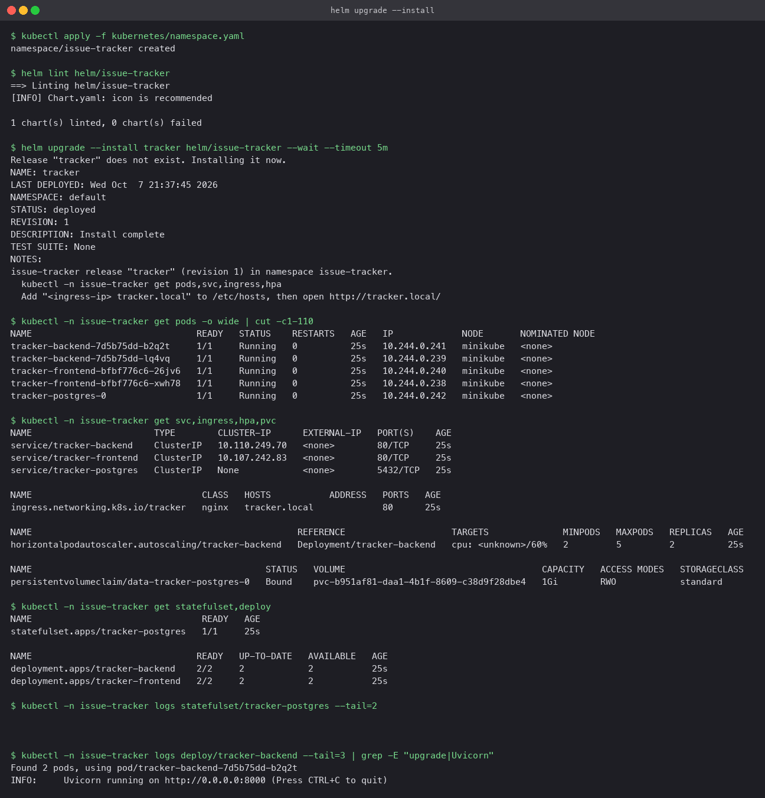

Through the Ingress: the page, `/ready`, create two issues, list them, `/metrics`, and the
persistence test (delete the postgres Pod; the StatefulSet recreates it on the same PVC and the
two issues are still there).

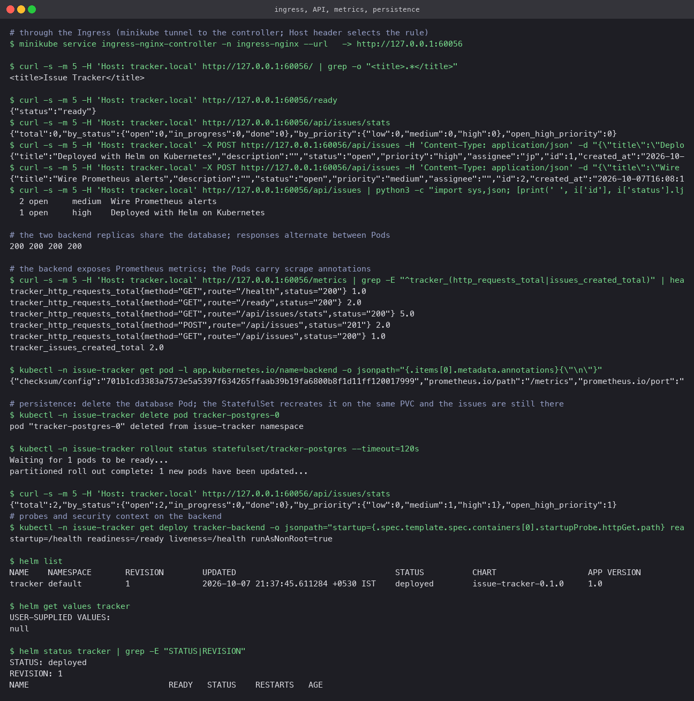
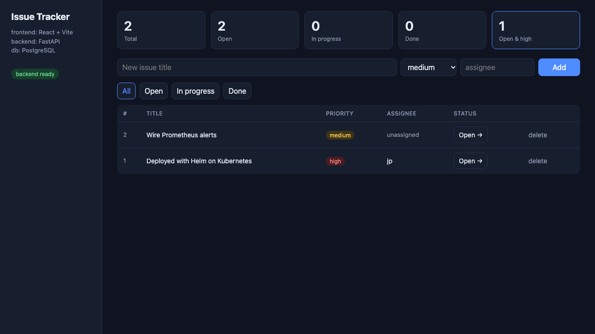

## 7. Terraform infrastructure

See [terraform/README.md](terraform/README.md). The S3 and VPC projects were applied and
destroyed against LocalStack with full captures; the EKS cluster was not created because it
needs a paid AWS account, so this project ran on Minikube. The manifests, chart and pipeline
are cluster-agnostic.

## 8. CI/CD pipeline

`issue-tracker-cicd.yml`, triggered by pushes touching the app or this folder:

1. **backend tests** (pytest, JUnit artifact) and **frontend build** (Vite, dist artifact) in parallel.
2. **images**, a matrix over `backend` and `frontend`: build with buildx and a per-service
   cache, **Trivy** scan with `severity: HIGH,CRITICAL`, `ignore-unfixed`, `exit-code: 1`, JSON
   report as an artifact, then push to GHCR tagged with the 7-character git SHA. Pull requests
   stop before the push.
3. **deploy**: a kind cluster in the runner, the namespace, a pull secret from the run's token,
   `helm upgrade --install` with the just-pushed tag, then a smoke test from inside the cluster
   through the frontend Service: `/ready`, create an issue, `/stats`, and `/metrics` must show
   the created-issues counter.

### What the pipeline caught

The first run **failed in the Trivy stage** on the frontend image: 42 fixable HIGH/CRITICAL
findings in Alpine 3.21 packages, led by OpenSSL (`CVE-2026-31789`, a heap overflow in X.509
handling, CRITICAL) and c-ares (`CVE-2026-33630`). Nothing in our code; the base image was
simply behind. The fix was to move to `nginx-unprivileged:1.29-alpine` and run `apk upgrade`,
and to add `apt-get upgrade` to the backend's Debian stage for the same reason. A local scan
after the change shows zero findings on both images, and the next run went green.

The second run then **failed on the backend image**: three HIGH findings in Starlette, the
ASGI framework under FastAPI, which the pinned FastAPI 0.115 would not let pip upgrade past
0.41. A first bump to FastAPI 0.118 only reached Starlette 0.48, which Trivy still rejected
(`CVE-2025-62727`, `CVE-2026-48818`, `CVE-2026-54283`, fixed in 0.49.1, 1.1.0 and 1.3.1).
Moving to FastAPI 0.142 and pinning Starlette 1.7.0 cleared all three; the tests still passed
and the local scan of both images reported zero fixable HIGH or CRITICAL findings.

That is the scan doing exactly its job three times: a release with a vulnerable base image or a
vulnerable library never reached the registry, and each fix was a one-line version change.

Final run: [37652658661](https://github.com/aPassie/devops-assignment/actions/runs/37652658661) on commit `7df25a3`, images `ghcr.io/apassie/issue-tracker-backend:7df25a3` and `ghcr.io/apassie/issue-tracker-frontend:7df25a3`.

```
1. backend tests: success
1. frontend build: success
2. build, scan, push backend: success
2. build, scan, push frontend: success
3. helm deploy to kind and smoke test: success
```

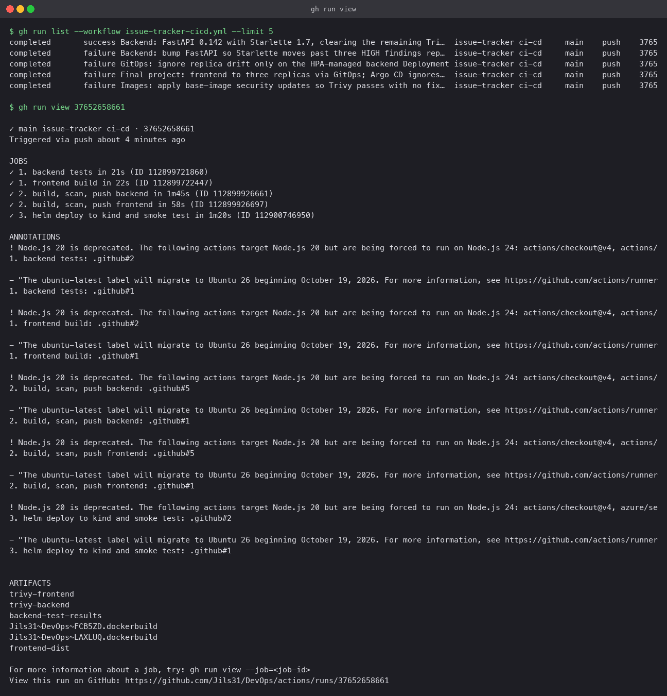
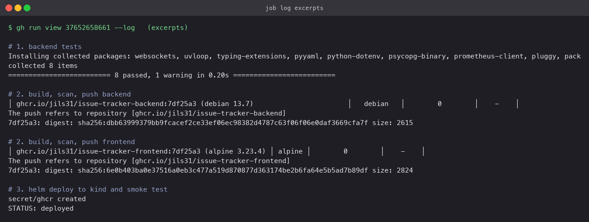
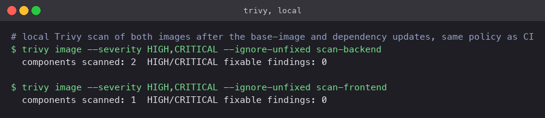

## 9. DevSecOps

[security/README.md](security/README.md) lists every control by layer. In short: tests gate
the build, Trivy gates the push, images run as non-root with capabilities dropped, the database
is never exposed, the registry is private with a short-lived pull token, no credential is in
Git, and `values-prod.yaml` expects the database Secret to be created out of band. SAST, SCA
and secret scanning run in the [DevSecOps Pipeline](../DevSecOps%20Pipeline/) workflow against
the same patterns.

## 10. Monitoring

`monitoring/prometheus.yaml` deploys Prometheus in the application namespace with RBAC to list
Pods and a `kubernetes_sd_configs` job that keeps only Pods annotated
`prometheus.io/scrape: "true"`. The Helm chart puts those annotations on the backend, so every
backend Pod, including ones the HPA adds, is scraped automatically. Two alert rules:
`BackendHighErrorRate` (5xx share over 5% for 2 minutes) and `BackendDown`.

`monitoring/grafana.yaml` deploys Grafana with the Prometheus datasource and an
"Issue Tracker" dashboard provisioned from ConfigMaps: requests per second by route, p95
latency, issues created, error rate, backend Pods scraped.

Under 150 seconds of load from `load-test.sh`: about 92 requests per second per route, p95
latency under 5 ms, the HPA scaled the backend 2 to 4 to 5, and Prometheus picked up each new
Pod within one scrape interval (five targets, all `up`).

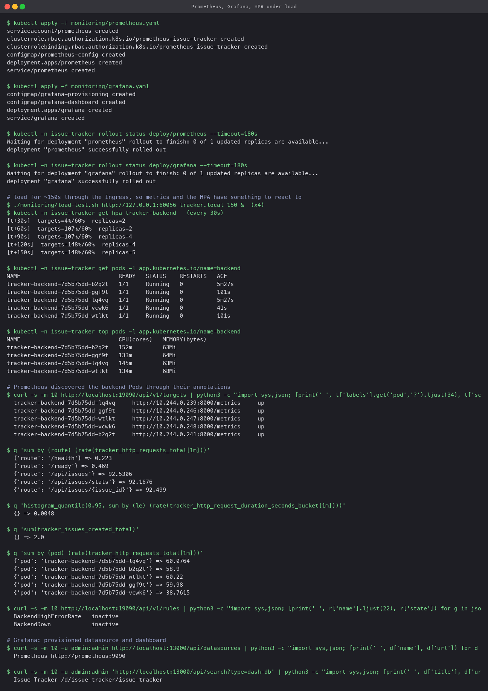
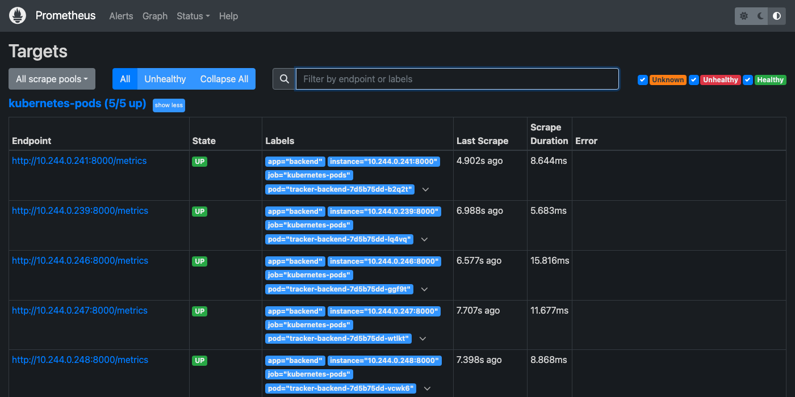
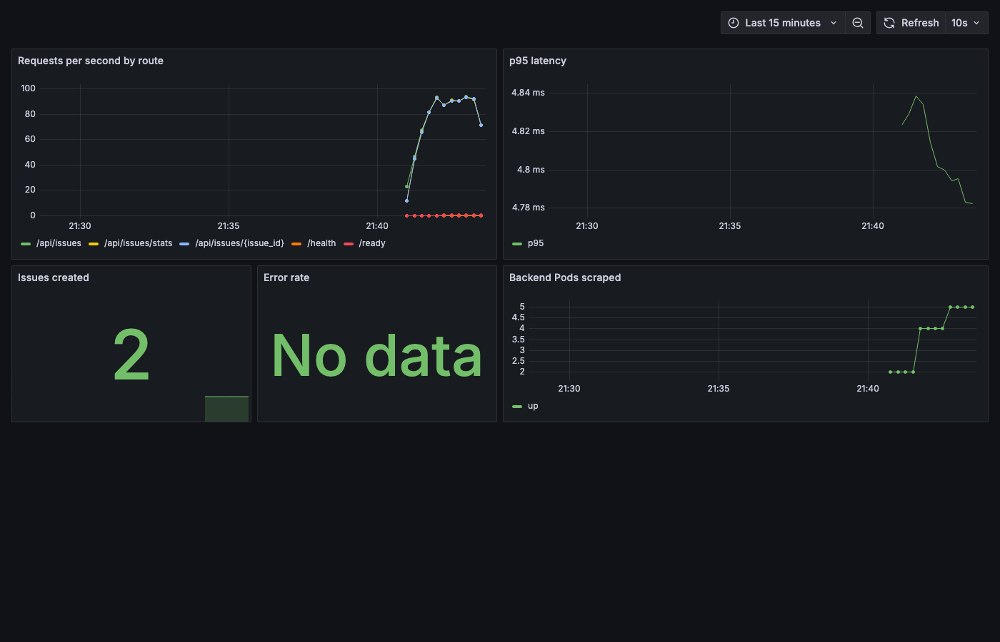

## 11. GitOps

`gitops/application.yaml` is an Argo CD `Application` pointing at `helm/issue-tracker` on
`master` with automated sync, prune and self-heal. Applying it made Argo CD adopt the release:
every object showed `Synced / Healthy`. Then the frontend replica count was changed in
`values.yaml`, committed and pushed; Argo CD saw the new commit and the Deployment went to
three replicas with no `helm` or `kubectl` command.

One lesson from the run: `ignoreDifferences` on `/spec/replicas` has to be scoped to the
HPA-managed backend Deployment only. The first version applied it to every Deployment, which
made Argo CD ignore the frontend change too. Scoping it by name fixed that.

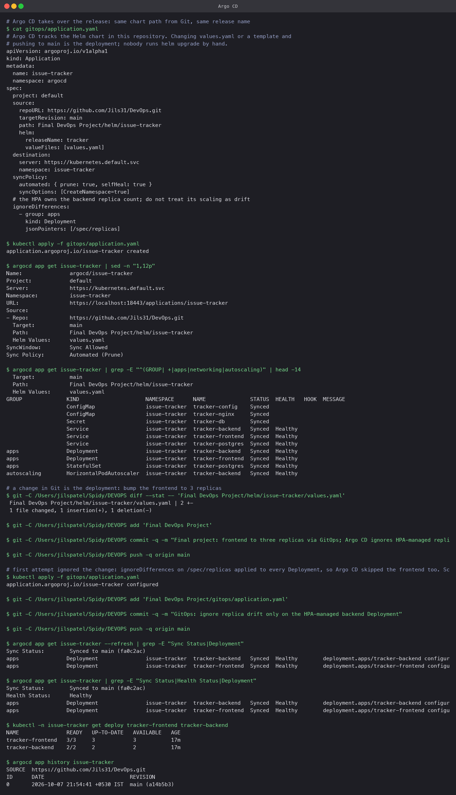

## 12. Troubleshooting challenge

Two faults introduced into the running release and diagnosed before any fix:

| Fault | Symptom | Found with | Root cause | Fix |
|---|---|---|---|---|
| Wrong database host via a values override | rollout stuck, new Pod `0/1`, old Pods still serving | `kubectl logs` (name resolution error), `describe` probe events, `get configmap` | `POSTGRES_HOST=tracker-postgres-typo` | `helm rollback tracker` |
| Ingress `/api` to a non-existent Service | UI loads, every API call `503` | `describe ingress` shows `services "tracker-backend-v2" not found`; backend fine from inside | misspelled Service name in the Ingress | re-render the chart's Ingress |

Full write-up and captures in [troubleshooting/](troubleshooting/README.md).

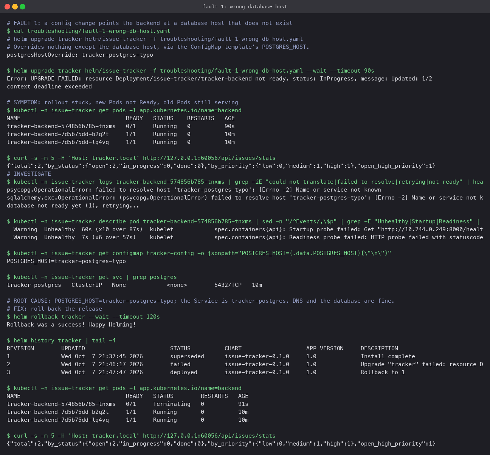
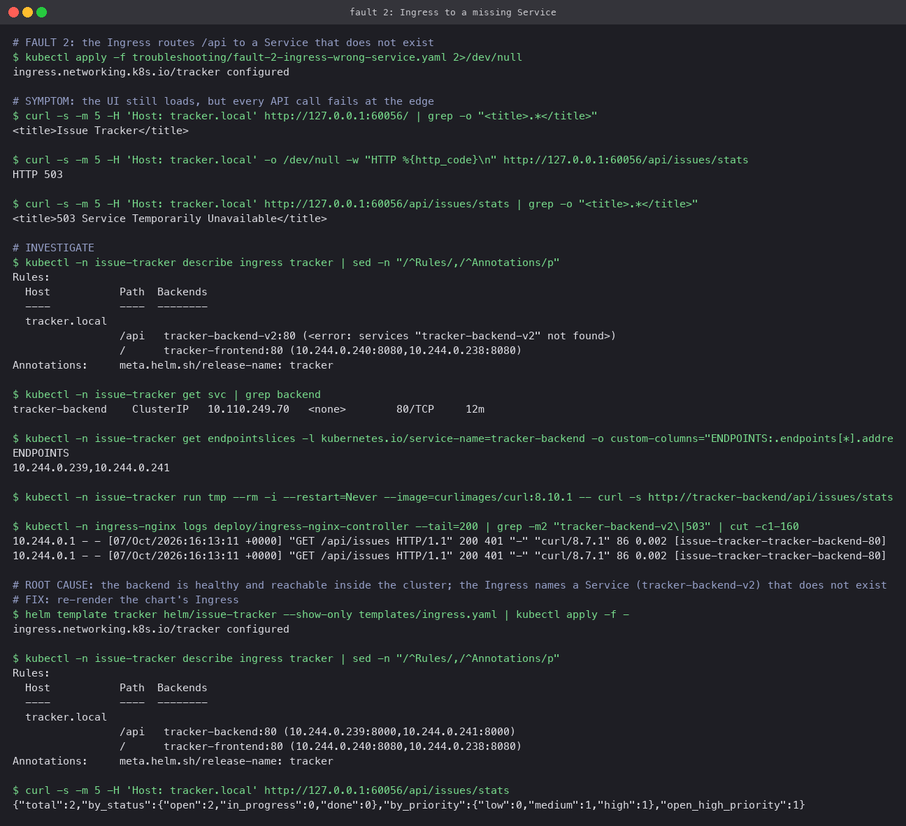

## 13. Lessons learned

- Rolling updates plus a readiness probe that checks the database turned a bad config change
  into a stuck rollout instead of an outage. The old Pods never stopped serving.
- A security scan that fails the build is only useful if the fix is cheap; base-image updates
  are, so `ignore-unfixed` with a hard fail on the rest is the right policy.
- GitOps and autoscaling disagree about who owns `replicas`; say so explicitly, and say it for
  the right object.
- Running the whole stack on Minikube first made the cloud part a one-variable switch rather
  than a separate project.
- The same `curl` through the Ingress, repeated after every change, caught more than any
  dashboard did.
