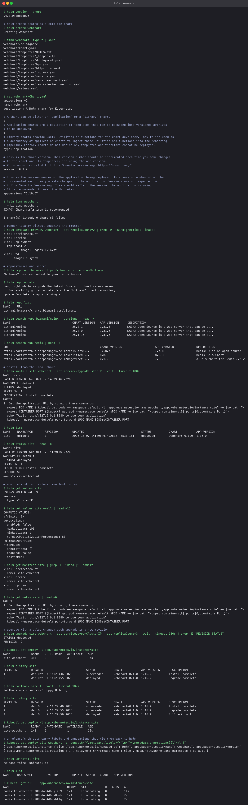

# Helm commands

Each command was run once against a chart scaffolded with `helm create webchart`. The
generated chart (`webchart/`) is committed as produced, apart from the empty `charts/`
directory.

## Chart lifecycle

```bash
helm create webchart          # Chart.yaml, values.yaml, templates/, a sample nginx Deployment
helm lint webchart            # 1 chart(s) linted, 0 chart(s) failed
helm template preview webchart --set replicaCount=2 | grep -E '^kind:|replicas:|image:'
```

`helm template` renders the YAML locally. It is the fastest way to check what a values change
does before touching the cluster, and it is what CI pipelines diff.

## Repositories

```bash
helm repo add bitnami https://charts.bitnami.com/bitnami
helm repo update
helm repo list
helm search repo bitnami/nginx --versions | head
helm search hub redis | head
```

`search repo` looks in repositories you have added; `search hub` queries Artifact Hub for
charts from anyone.

## Install and inspect

```bash
helm install site webchart --set service.type=ClusterIP --wait --timeout 180s
helm list
helm status site
helm get values site          # only what you supplied
helm get values site --all    # merged with chart defaults
helm get manifest site        # the exact YAML that was applied
helm get notes site           # the rendered NOTES.txt
```

`--wait` blocks until the Deployment is available, which turns a bad chart into a failed
install instead of a release that says "deployed" with crashing Pods.

## Upgrade, history, rollback, uninstall

```bash
helm upgrade site webchart --set service.type=ClusterIP --set replicaCount=3 --wait
kubectl get deploy -l app.kubernetes.io/instance=site     # 3/3
helm history site                                         # revisions 1 and 2
helm rollback site 1 --wait
helm history site                                         # revision 3: "Rollback to 1"
kubectl get deploy -l app.kubernetes.io/instance=site     # back to 1/1
helm uninstall site
```

Note that `--set` values are not remembered across upgrades unless you pass `--reuse-values`;
the `service.type` flag had to be repeated. A values file in Git is the better habit.

## How Helm tracks ownership

Every object Helm creates carries labels `app.kubernetes.io/managed-by=Helm` and
`app.kubernetes.io/instance=<release>`, plus annotations `meta.helm.sh/release-name` and
`meta.helm.sh/release-namespace`. The release history itself is stored as Secrets named
`sh.helm.release.v1.<release>.v<revision>` in the release namespace. `helm uninstall`
removes the objects and the history; `kubectl get all -l app.kubernetes.io/instance=site`
then returns nothing.


