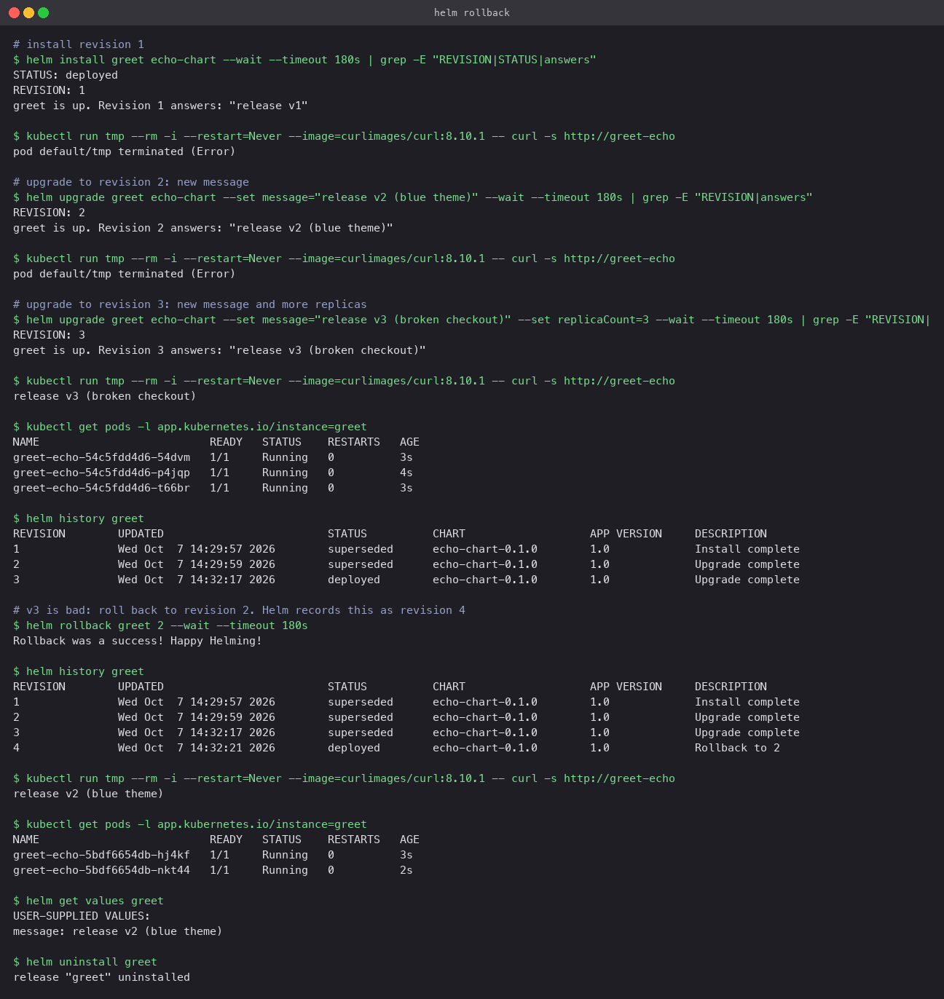

# Upgrade and rollback

`echo-chart/` deploys `hashicorp/http-echo` with a configurable `message`. Changing the
message is the stand-in for releasing a new version, and because the response text changes,
a single `curl` shows which revision is live.

One detail in the Deployment template makes this work: an annotation
`checksum/message: {{ .Values.message | sha256sum }}` on the Pod template. Without it, a
values-only change that does not alter the Pod spec would not restart anything.

## The cycle

```bash
helm install greet echo-chart --wait                                   # revision 1
curl http://greet-echo        -> release v1

helm upgrade greet echo-chart --set message="release v2 (blue theme)" --wait          # revision 2
curl http://greet-echo        -> release v2 (blue theme)

helm upgrade greet echo-chart --set message="release v3 (broken checkout)" --set replicaCount=3 --wait   # revision 3
curl http://greet-echo        -> release v3 (broken checkout)
kubectl get pods              -> 3 Pods

helm history greet            -> 1 superseded, 2 superseded, 3 deployed

helm rollback greet 2 --wait  -> "Rollback was a success!"
helm history greet            -> revision 4, description "Rollback to 2"
curl http://greet-echo        -> release v2 (blue theme)
kubectl get pods              -> 2 Pods again
helm get values greet         -> message: release v2 (blue theme)
helm uninstall greet
```

(The `curl` calls were run from a throwaway Pod with `kubectl run tmp --rm -i --image=curlimages/curl ...`.)

## What to notice

- A rollback is not an undo. It creates revision 4 whose content equals revision 2. History is
  append-only, so you can roll "forward" again to 3 if the alarm was false.
- Both the message and the replica count came back, because a revision stores the complete
  rendered manifest and values, not a diff.
- `helm rollback greet` with no revision number goes to the previous one. Naming the revision
  is safer when more than one bad upgrade has happened.
- `--wait` on the rollback matters as much as on the upgrade: it confirms the old Pods are
  actually serving before the command returns.


