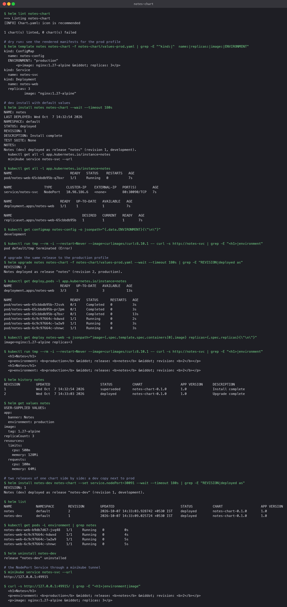
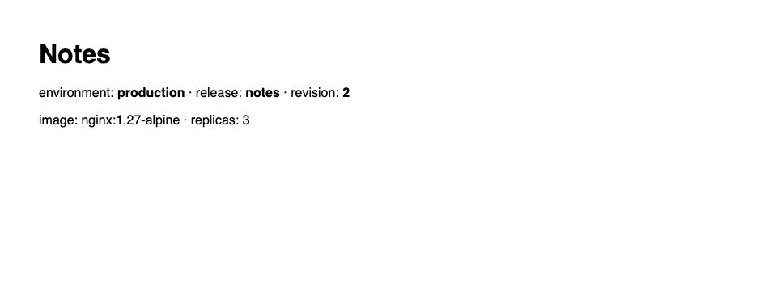

# Mini project: notes-chart

A chart for the Notes web front end (nginx serving a generated landing page) with two
value profiles. The point is that one chart, unchanged, produces a development release and
a production release that differ only in values.

## Chart layout

```
notes-chart/
├── Chart.yaml
├── values.yaml          # development defaults
├── values-prod.yaml     # overrides for production
└── templates/
    ├── _helpers.tpl     # shared label blocks
    ├── configmap.yaml   # APP_NAME, ENVIRONMENT, and the index.html page
    ├── deployment.yaml  # mounts the page, envFrom the ConfigMap, checksum annotation
    ├── service.yaml     # NodePort by default, port from values
    └── NOTES.txt
```

Values that differ between the profiles:

| Key | `values.yaml` (dev) | `values-prod.yaml` |
|---|---|---|
| `replicaCount` | 1 | 3 |
| `image.tag` | `1.26-alpine` | `1.27-alpine` |
| `app.environment` | development | production |
| `app.banner` | Notes (dev) | Notes |
| `resources` | 50m / 32Mi requests | 100m / 64Mi requests |

Template features used: `{{ .Release.Name }}` and `{{ .Release.Revision }}` in names and
on the page, `include` of a named template for labels, `toYaml | nindent` for the resources
block, an `if eq` around `nodePort`, and a `checksum/config` annotation so a ConfigMap change
rolls the Pods.

## Run

```bash
helm lint notes-chart
helm template notes notes-chart -f notes-chart/values-prod.yaml      # preview prod

helm install notes notes-chart --wait                                  # dev
kubectl get all -l app.kubernetes.io/instance=notes
curl http://notes-svc  (from a Pod)      -> <h1>Notes (dev)</h1> environment: development

helm upgrade notes notes-chart -f notes-chart/values-prod.yaml --wait  # same release, prod profile
kubectl get deploy notes-web -o jsonpath='image={.spec.template.spec.containers[0].image} replicas={.spec.replicas}'
                                          -> image=nginx:1.27-alpine replicas=3
curl http://notes-svc                     -> <h1>Notes</h1> environment: production
helm history notes                        -> revision 1 install, revision 2 upgrade

helm install notes-dev notes-chart --set service.nodePort=30091 --wait # a second release beside it
helm list                                 -> notes (prod values) and notes-dev
kubectl get pods -L environment           -> three production Pods, one development Pod
helm uninstall notes-dev

minikube service notes-svc --url          # open the page
```

## What the run showed

- The dev install produced one Pod and a page titled "Notes (dev)". The upgrade with
  `values-prod.yaml` rolled the same release to three Pods on the newer image with the
  production banner, and `helm history` recorded it as revision 2.
- A second release from the same chart ran alongside the first with its own ConfigMap,
  Deployment and Service, distinguished entirely by release name and the `environment` label.
- The landing page, served through the NodePort, shows the release name, revision, image and
  replica count that the templates baked in.



