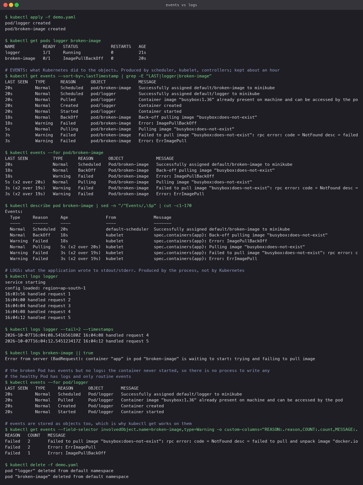

# Kubernetes Events versus Logs

Two signals that get confused because both are "what happened", but they come from different
places and answer different questions.

## Events

An **Event** is a record the cluster writes about an object: scheduled, image pulled, container
started, probe failed, back-off. They come from the scheduler, kubelet and controllers, never
from your code. They are namespaced objects (`kubectl get events` works), attached to the thing
they describe, and kept for about an hour before being dropped.

Events answer: *what did Kubernetes do to my Pod, and why is it in this state?*

## Logs

**Logs** are whatever the process inside the container writes to stdout and stderr. The kubelet
captures them per container; `kubectl logs` reads them, and they live as long as the Pod does
unless a log shipper forwards them somewhere durable.

Logs answer: *what is my application doing or complaining about?*

## Side by side

| | Events | Logs |
|---|---|---|
| Written by | Kubernetes components | The application process |
| About | Object lifecycle and state changes | Application behaviour |
| Exists for a Pod that never started | Yes, that is exactly when they matter | No, there was no process |
| Retention | About one hour | Life of the Pod, or external storage |
| Read with | `kubectl get events`, `kubectl events --for`, the tail of `kubectl describe` | `kubectl logs [--previous] [-f] [--since] [--timestamps]` |
| First stop when | Pending, ImagePullBackOff, CrashLoopBackOff, probe failures, scheduling | 500 errors, wrong output, slow requests, anything the app can see |

## The demonstration

`demo.yaml` creates `logger`, a busybox loop that prints a line every four seconds, and
`broken-image`, whose image tag does not exist.

```bash
kubectl apply -f demo.yaml
kubectl get events --sort-by=.lastTimestamp
kubectl events --for pod/broken-image
kubectl describe pod broken-image            # Events section at the end
kubectl logs logger
kubectl logs logger --tail=2 --timestamps
kubectl logs broken-image                    # fails: the container never started
kubectl get events --field-selector involvedObject.name=broken-image,type=Warning
```

What it showed:

- `broken-image` has a rich event history (`Pulling`, `Failed ... not found`, `BackOff`) and
  **no logs at all**, because no container ever ran. The failure is entirely a cluster-side
  story.
- `logger` has four routine events (`Scheduled`, `Pulled`, `Created`, `Started`) and then
  nothing more, while its **log** keeps growing with the application's own lines. Everything
  interesting about it is application-side.
- `--field-selector` on `kubectl get events` filters by object and type, which is how you
  pull just the warnings for one Pod out of a busy namespace.



The rule that falls out of this: if the Pod is not `Running`, read events; if it is `Running`
and still misbehaving, read logs. The [troubleshooting folder](../Kubernetes%20Troubleshooting/)
applies that rule to nine scenarios.
