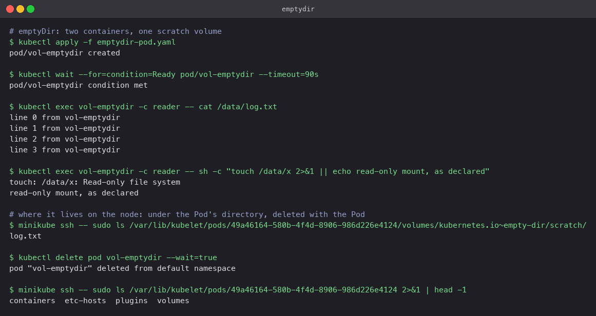
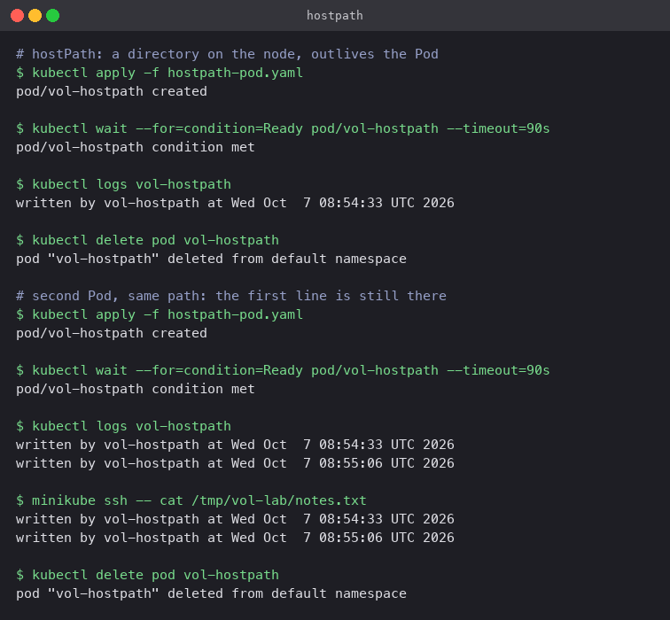
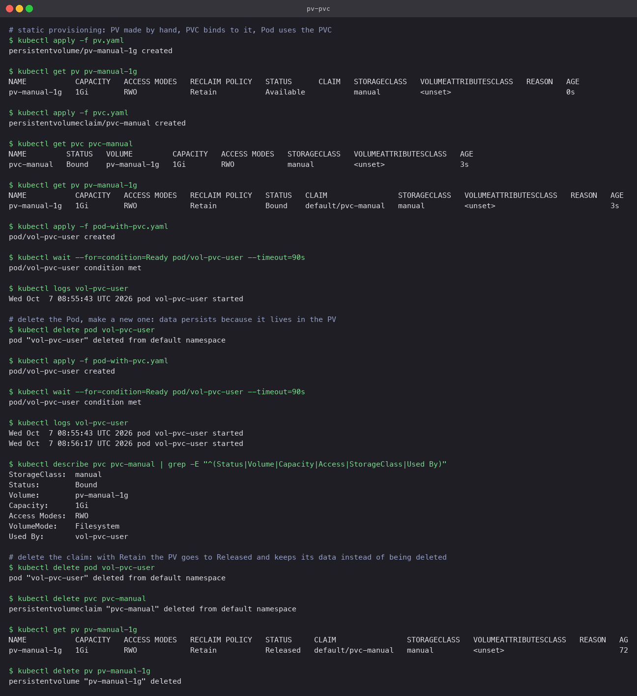
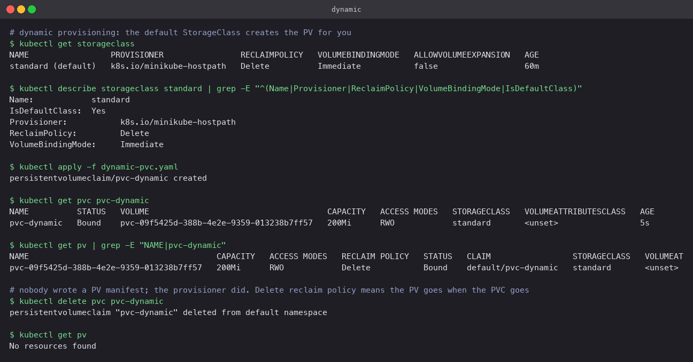

# Kubernetes volumes

A container's filesystem is thrown away when the container stops. Volumes are how Pods get
storage that outlives a container, is shared between containers, or outlives the Pod itself.
Each type below was run on Minikube; the manifest, the commands and what happened are given
for each.

## emptyDir

Created empty when the Pod is scheduled, deleted when the Pod is removed. Lives on the node's
disk (or in RAM with `medium: Memory`). Its main use is sharing files between containers in
the same Pod, or scratch space that must not persist.

`emptydir-pod.yaml`: a `writer` container appends a line every 2s; a `reader` container
mounts the same volume read-only.

```bash
kubectl apply -f emptydir-pod.yaml
kubectl exec vol-emptydir -c reader -- cat /data/log.txt
kubectl exec vol-emptydir -c reader -- touch /data/x       # Read-only file system
minikube ssh -- sudo ls /var/lib/kubelet/pods/<pod-uid>/volumes/kubernetes.io~empty-dir/scratch/
kubectl delete pod vol-emptydir
```

The reader saw the writer's lines; the `readOnly: true` mount refused a write; on the node the
data sat under the Pod's own directory. After deletion the Pod directory was being torn down
with it. Nothing about emptyDir survives the Pod.



## hostPath

Mounts a path from the node into the Pod. Data survives the Pod, but it is tied to that one
node: reschedule the Pod elsewhere and the data is not there. It also exposes the node's
filesystem, so it is restricted on most managed clusters. Legitimate uses are node agents
that read `/var/log` or `/proc`, and single-node labs like this one.

`hostpath-pod.yaml` appends a timestamp to `/node-data/notes.txt`, which is `/tmp/vol-lab`
on the node (`type: DirectoryOrCreate`).

```bash
kubectl apply -f hostpath-pod.yaml && kubectl logs vol-hostpath
kubectl delete pod vol-hostpath
kubectl apply -f hostpath-pod.yaml && kubectl logs vol-hostpath     # two lines now
minikube ssh -- cat /tmp/vol-lab/notes.txt
```

The second Pod printed the first Pod's line before its own, and the file is visible from the
node directly.



## PersistentVolume and PersistentVolumeClaim

These split storage into two roles. A **PersistentVolume** is a piece of storage in the
cluster: its size, access mode, reclaim policy and backing (a cloud disk, NFS, a hostPath).
A **PersistentVolumeClaim** is an application's request for storage by size and access mode.
Kubernetes binds a claim to a volume that satisfies it, and the Pod references only the claim.
The Pod never knows or cares where the disk is.

Access modes: `ReadWriteOnce` (one node at a time, the common case for block disks),
`ReadOnlyMany`, `ReadWriteMany` (needs a shared filesystem like NFS), `ReadWriteOncePod`.

Reclaim policy decides what happens to the PV when its claim is deleted: `Retain` keeps the
volume and data (status `Released`, needs manual cleanup), `Delete` removes the volume too.

`pv.yaml` is a 1Gi hostPath PV with class `manual` and `Retain`. `pvc.yaml` asks for 500Mi
of class `manual`. `pod-with-pvc.yaml` mounts the claim at `/mnt/state` and appends a line.

```bash
kubectl apply -f pv.yaml && kubectl get pv
kubectl apply -f pvc.yaml && kubectl get pvc && kubectl get pv      # both Bound
kubectl apply -f pod-with-pvc.yaml && kubectl logs vol-pvc-user
kubectl delete pod vol-pvc-user && kubectl apply -f pod-with-pvc.yaml && kubectl logs vol-pvc-user
kubectl delete pvc pvc-manual && kubectl get pv                      # Released, data kept
```

The PV went `Available` -> `Bound` when the claim appeared (the claim got the whole 1Gi even
though it asked for 500Mi; binding is to a volume, not a slice of one). The replacement Pod
saw the first Pod's line. Deleting the claim left the PV `Released` with its data intact,
which is the `Retain` policy doing its job.



## StorageClass and dynamic provisioning

Writing PVs by hand (static provisioning) does not scale. A **StorageClass** names a
provisioner and its parameters; a PVC that references the class, or has no class and the
cluster has a default, gets a PV created for it on demand. In the cloud this is how a PVC
turns into an EBS volume or a Persistent Disk without anyone touching the console.

Minikube ships a default class `standard` using `k8s.io/minikube-hostpath` with
`ReclaimPolicy: Delete` and `VolumeBindingMode: Immediate`. (`WaitForFirstConsumer` is the
other mode: delay creating the volume until a Pod is scheduled, so the disk lands in the
right zone.)

`dynamic-pvc.yaml` has no `storageClassName` at all.

```bash
kubectl get storageclass
kubectl apply -f dynamic-pvc.yaml && kubectl get pvc pvc-dynamic && kubectl get pv
kubectl delete pvc pvc-dynamic && kubectl get pv
```

A PV named `pvc-<uid>` appeared within seconds and bound, created by the provisioner. Deleting
the claim deleted the PV as well (`Delete` policy), leaving `No resources found`.



## Choosing

| Need | Use |
|---|---|
| Scratch space or sharing between containers in one Pod | `emptyDir` |
| Read node files from an agent | `hostPath` (DaemonSet) |
| Durable app data, portable across nodes | PVC, dynamically provisioned |
| Pre-existing disk or NFS share | Static PV + PVC |
| Per-replica durable data (databases) | StatefulSet `volumeClaimTemplates` |
| Config files | ConfigMap or Secret volume, not storage at all |
