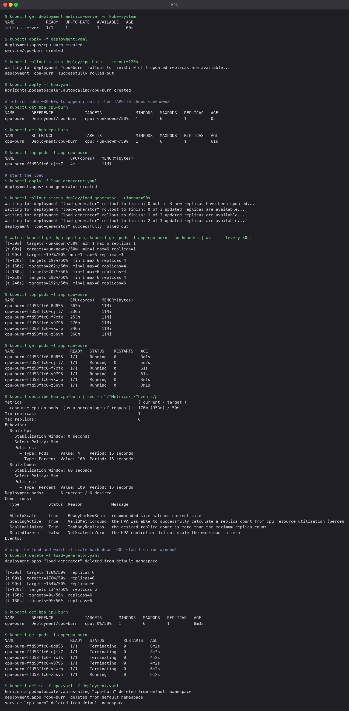

# Horizontal Pod Autoscaler

The HPA controller compares a metric (here CPU utilisation as a percentage of the Pod's
request) against a target and adjusts a Deployment's replica count to bring the average back
to the target. It needs metrics-server to be installed, and every container it scales must
declare `resources.requests.cpu`, because "50% utilisation" means 50% of the request.

## Pieces

- `cpu-burn/`: a tiny Python HTTP server that runs a SHA-256 loop on every request, so load
  turns into CPU reliably. Built into Minikube with `minikube image build -t cpu-burn:1.0 cpu-burn`.
  (The usual `php-apache` demo image is amd64-only and does not run on this Apple-silicon node.)
- `deployment.yaml`: one replica, `requests.cpu: 200m`, `limits.cpu: 500m`, readiness probe.
- `hpa.yaml`: target 50% CPU, 1 to 6 replicas, and a `behavior` block that shortens the
  scale-down stabilisation window from the default 5 minutes to 60 seconds so the demo fits.
- `load-generator.yaml`: three busybox Pods calling the Service in a tight loop.

## Commands

```bash
kubectl get deployment metrics-server -n kube-system
kubectl apply -f deployment.yaml
kubectl apply -f hpa.yaml
kubectl get hpa cpu-burn                      # <unknown> until metrics arrive, ~60s
kubectl top pods -l app=cpu-burn

kubectl apply -f load-generator.yaml
kubectl get hpa cpu-burn                      # repeat every 30s
kubectl get pods -l app=cpu-burn
kubectl describe hpa cpu-burn

kubectl delete -f load-generator.yaml
kubectl get hpa cpu-burn                      # repeat; replicas fall after the stabilisation window
```

## What the run showed

| Time | CPU target | Replicas | What happened |
|---|---|---|---|
| 0 to 60s | `<unknown>/50%` | 1 | metrics-server had not reported yet |
| idle | 4m CPU | 1 | `kubectl top` shows the app near zero |
| load +90s | 197% | 1 | first reading under load, 4x over target |
| load +120s | 197% | 4 | HPA scaled 1 -> 4 (desired = ceil(1 x 197/50) = 4) |
| load +240s | 192% | 6 | still over target, scaled to the `maxReplicas` cap |
| load stopped +150s | 0% | 6 | utilisation collapsed, but the 60s window must pass |
| final | 0% | 1 | scaled back to `minReplicas`; five Pods `Terminating` |

Two details worth noticing:

- The utilisation stayed near 190% even with 4 Pods. Three load generators in a tight loop
  produce as much work as the Pods can absorb, so adding Pods raised throughput rather than
  lowering per-Pod CPU. That is why it kept climbing to the cap of 6.
- Scale-up is immediate once a reading exceeds the target; scale-down waits for the
  stabilisation window and then removes Pods. The asymmetry is deliberate: it is cheaper to run
  an extra Pod for a minute than to flap.

The `describe hpa` output lists the metric readings and the `SuccessfulRescale` events with
the reason (`cpu resource utilization (percentage of request) above target`).



## Useful commands

```bash
kubectl get hpa                           # current/target and replica count
kubectl describe hpa <name>               # conditions, metrics, scaling events
kubectl top pods                          # live CPU/memory from metrics-server
kubectl top nodes
kubectl get hpa <name> -o yaml            # see .status.currentMetrics and lastScaleTime
kubectl autoscale deployment X --cpu-percent=50 --min=1 --max=5   # imperative equivalent of hpa.yaml
```
