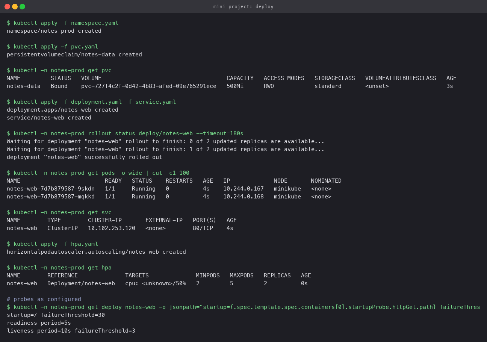
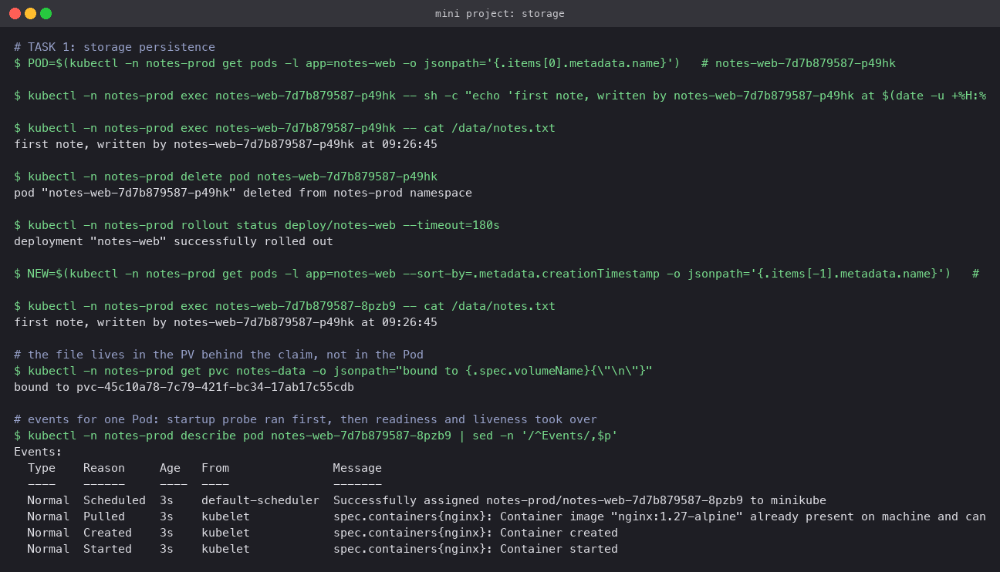
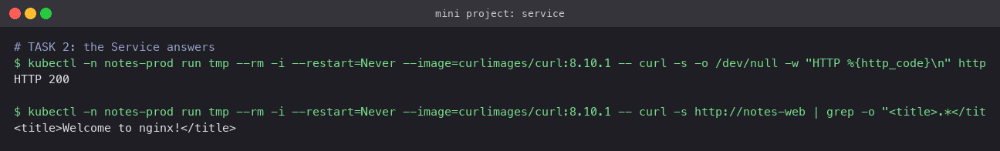
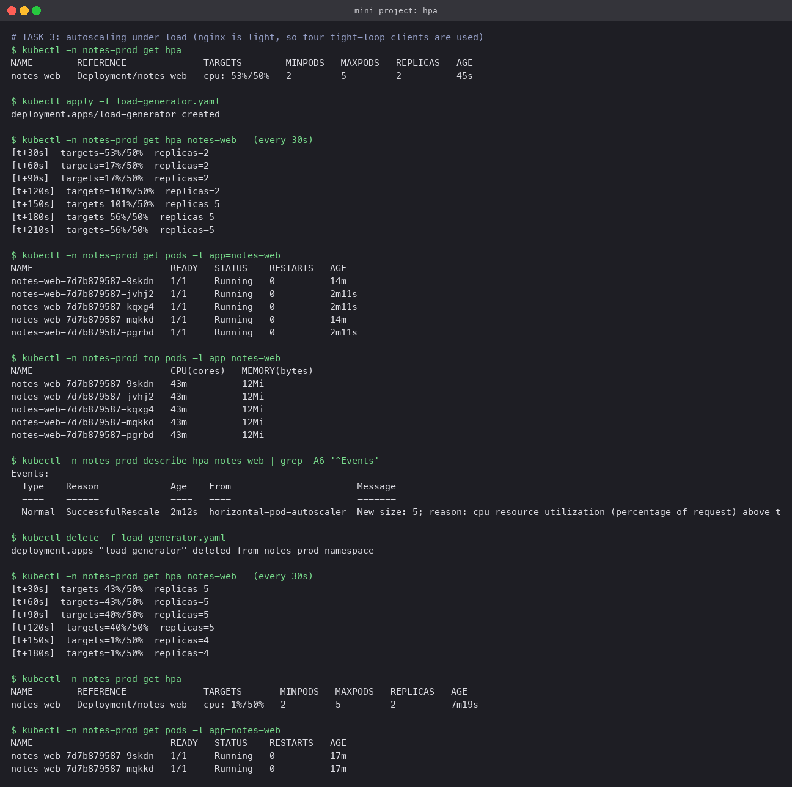
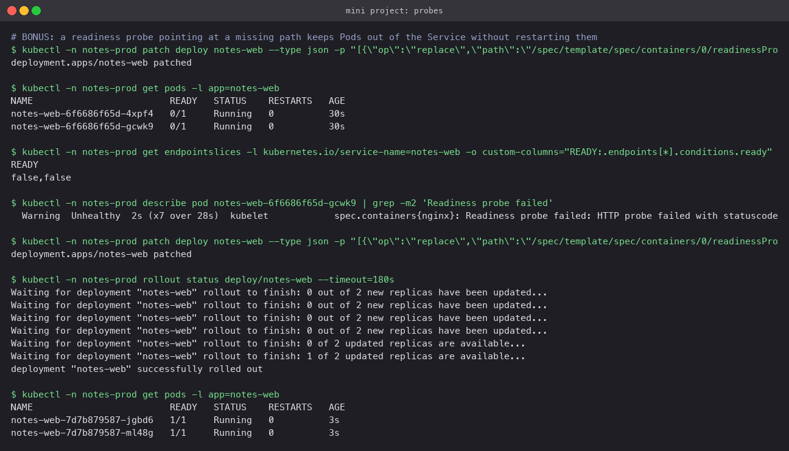
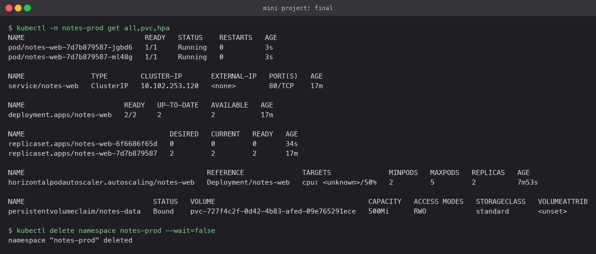

# Mini project: a web app with persistent storage, autoscaling and probes

One small deployment that uses everything from this session together: a PVC for state, an
HPA for scale, and all three probe types for health. Everything lives in its own namespace
so it can be created and torn down in one command each.

## Layout

```
03-mini-project/
├── namespace.yaml        notes-prod
├── pvc.yaml              500Mi ReadWriteOnce, default StorageClass
├── deployment.yaml       2 replicas of nginx, PVC at /data, startup+readiness+liveness probes, CPU requests
├── service.yaml          ClusterIP on port 80
├── hpa.yaml              2 to 5 replicas at 50% CPU, 60s scale-down window
└── load-generator.yaml   four busybox clients in a tight loop (only for Task 3)
```

Design choices in `deployment.yaml`:

- `strategy: Recreate`, because the PVC is `ReadWriteOnce` and a rolling update would try to
  attach it to a second Pod at the same time. (On a single node it would happen to work, but
  the manifest should be right for a real cluster.)
- `resources.requests.cpu: 100m`, which the HPA needs as its denominator.
- Three probes against the same URL with different jobs: **startup** allows up to 60s for the
  container to come up and holds the other two back; **readiness** every 5s decides whether the
  Pod gets Service traffic; **liveness** every 10s with three failures tolerated restarts a
  wedged container.

## Deploy

```bash
kubectl apply -f namespace.yaml
kubectl apply -f pvc.yaml && kubectl -n notes-prod get pvc
kubectl apply -f deployment.yaml -f service.yaml
kubectl -n notes-prod rollout status deploy/notes-web
kubectl apply -f hpa.yaml && kubectl -n notes-prod get hpa
```

The PVC bound to a dynamically provisioned volume within seconds, two Pods came up, and the
HPA showed `<unknown>/50%` until metrics-server's first sample.



## Task 1: storage persistence

```bash
POD=$(kubectl -n notes-prod get pods -l app=notes-web -o jsonpath='{.items[0].metadata.name}')
kubectl -n notes-prod exec $POD -- sh -c 'echo "first note ..." > /data/notes.txt'
kubectl -n notes-prod delete pod $POD
kubectl -n notes-prod rollout status deploy/notes-web
NEW=$(kubectl -n notes-prod get pods -l app=notes-web --sort-by=.metadata.creationTimestamp -o jsonpath='{.items[-1].metadata.name}')
kubectl -n notes-prod exec $NEW -- cat /data/notes.txt
```

A note written by `notes-web-...-p49hk` was read back from its replacement
`notes-web-...-8pzb9`. The Pod was gone; the file was not, because it lives on the volume
behind the claim. (Both replicas mount the same claim here; on a multi-node cluster a RWO
claim would pin them to one node, which is the trade-off the Recreate strategy acknowledges.)



## Task 2: the Service

```bash
kubectl -n notes-prod run tmp --rm -i --restart=Never --image=curlimages/curl:8.10.1 -- curl -s http://notes-web
kubectl -n notes-prod port-forward svc/notes-web 8080:80      # then open http://localhost:8080
```

From a Pod in the namespace, `http://notes-web` returned `HTTP 200` and the nginx welcome page.



## Task 3: autoscaling

nginx barely uses CPU to serve a static page, so four tight-loop clients were needed to push
the two Pods past the 50% target.

```bash
kubectl apply -f load-generator.yaml
kubectl -n notes-prod get hpa notes-web        # repeat
kubectl -n notes-prod top pods
kubectl -n notes-prod describe hpa notes-web
kubectl delete -f load-generator.yaml
```

| | CPU target | Replicas |
|---|---|---|
| before load | 17% | 2 |
| load +120s | 101% | 2 |
| load +150s | 101% | 5 |
| load +180s | 56% | 5 |
| load removed +120s | 40% | 5 |
| load removed +150s | 1% | 4 |
| a minute later | 1% | 2 |

The HPA event reads `New size: 5; reason: cpu resource utilization (percentage of request)
above target`. It jumped straight from 2 to 5 because the desired count is
`ceil(2 x 101/50) = 5`, which is also the cap. After the load stopped it waited out the
stabilisation window and came back down to the minimum of 2.



## Bonus: readiness gating

Patch the readiness probe path to `/does-not-exist` and watch what happens:

```bash
kubectl -n notes-prod patch deploy notes-web --type json \
  -p '[{"op":"replace","path":"/spec/template/spec/containers/0/readinessProbe/httpGet/path","value":"/does-not-exist"}]'
kubectl -n notes-prod get pods -l app=notes-web
kubectl -n notes-prod get endpointslices -l kubernetes.io/service-name=notes-web -o custom-columns=READY:.endpoints[*].conditions.ready
```

The new Pods were `Running` but `0/1 READY`, the EndpointSlice showed `false,false`, and the
events read `Readiness probe failed: HTTP probe failed with statuscode: 404`. No restarts
happened: readiness never restarts, it only removes the Pod from the Service. Restoring the
path to `/` rolled healthy Pods back in. The liveness equivalent (`/crash` path) would instead
show `RESTARTS` climbing, exactly as scenario 08 in the Pod lifecycle lab did.



## Final state and cleanup

```bash
kubectl -n notes-prod get all,pvc,hpa
kubectl delete namespace notes-prod
```


