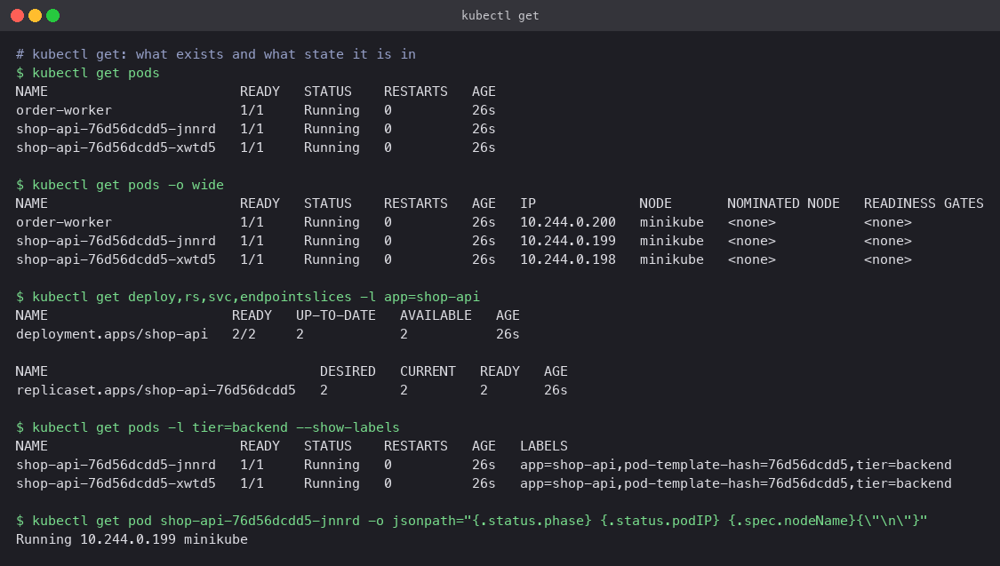
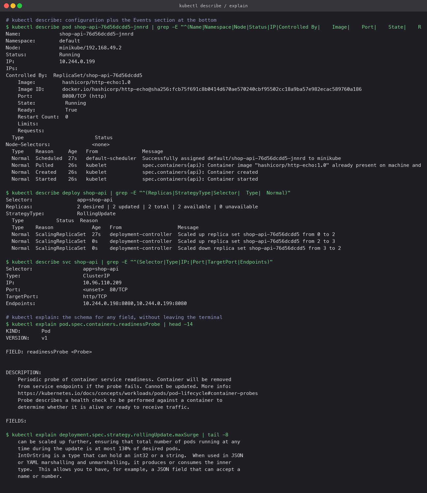
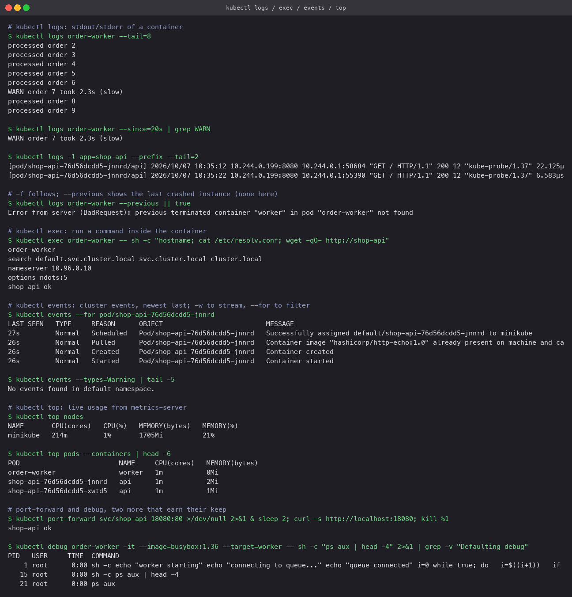

# The commands

`demo.yaml` deploys `shop-api` (two http-echo replicas behind a Service) and `order-worker`
(a busybox loop that logs every few seconds, with an occasional WARN line). Each command
below was run against that.

## kubectl get

The first look. `-o wide` adds node and Pod IP; `-l` filters by label; `--show-labels` shows
what a Service selector would need to match; `-o jsonpath` pulls one field for scripts.

```bash
kubectl get pods
kubectl get pods -o wide
kubectl get deploy,rs,svc,endpointslices -l app=shop-api
kubectl get pods -l tier=backend --show-labels
kubectl get pod <pod> -o jsonpath='{.status.phase} {.status.podIP} {.spec.nodeName}'
kubectl get pods -w                      # stream changes
```



## kubectl describe and kubectl explain

`describe` prints the object's configuration followed by its Events. The Events section is
where kubelet and the scheduler say what went wrong, so for a sick Pod read it first.
`explain` prints the schema of any field so you can check spelling and types without a browser.

```bash
kubectl describe pod <pod>
kubectl describe deploy shop-api
kubectl describe svc shop-api             # Selector, TargetPort, Endpoints: the three Service facts
kubectl explain pod.spec.containers.readinessProbe
kubectl explain deployment.spec.strategy.rollingUpdate.maxSurge
```



## kubectl logs, exec, events, top

```bash
kubectl logs order-worker --tail=8
kubectl logs order-worker --since=20s | grep WARN
kubectl logs -l app=shop-api --prefix --tail=2    # all Pods behind a label, prefixed by Pod name
kubectl logs <pod> --previous                      # the crashed instance before the restart
kubectl logs <pod> -f                              # follow

kubectl exec order-worker -- sh -c 'hostname; cat /etc/resolv.conf; wget -qO- http://shop-api'

kubectl events --for pod/<pod>
kubectl events --types=Warning                     # only warnings, newest last
kubectl events -A -w                               # stream everything

kubectl top nodes
kubectl top pods --containers                      # needs metrics-server
```

Two more that pay for themselves:

```bash
kubectl port-forward svc/shop-api 18080:80         # reach a ClusterIP Service from the laptop
kubectl debug <pod> -it --image=busybox:1.36 --target=worker -- sh   # a tool container sharing the Pod's process namespace
```

`exec` into `order-worker` showed the Pod's resolver config and fetched the Service by name;
`debug` attached a busybox sidecar to a container that has no shell tools of its own and
listed its processes. `events --types=Warning` returning nothing is itself the good news.


