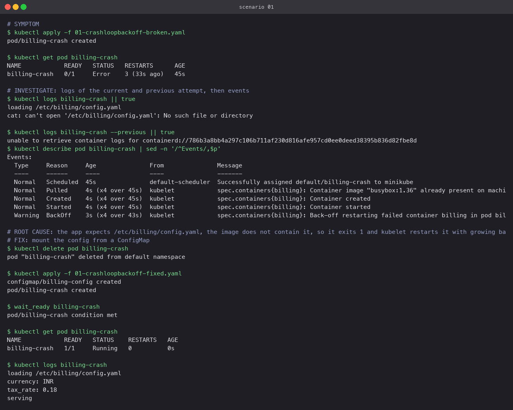
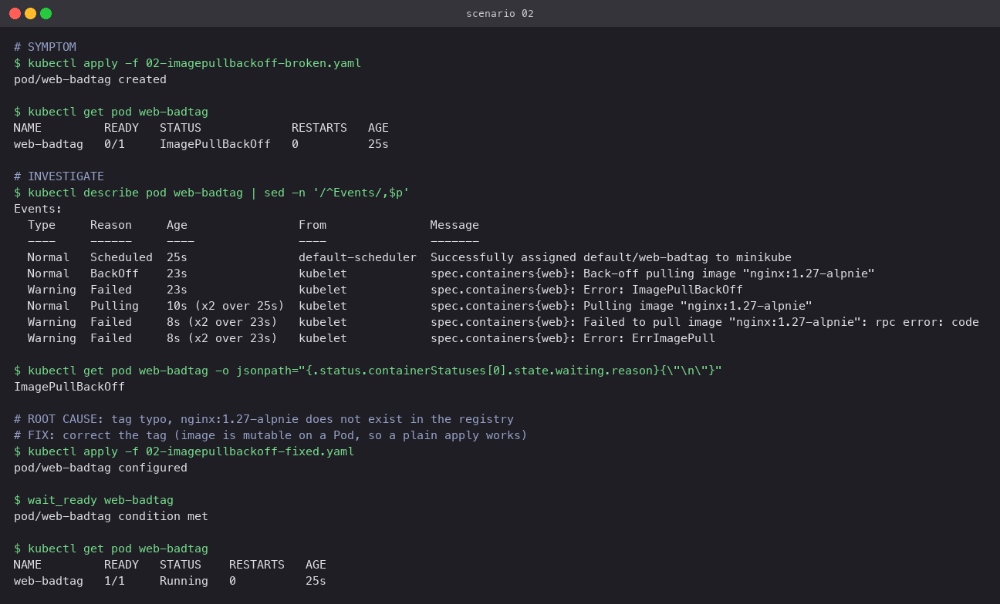
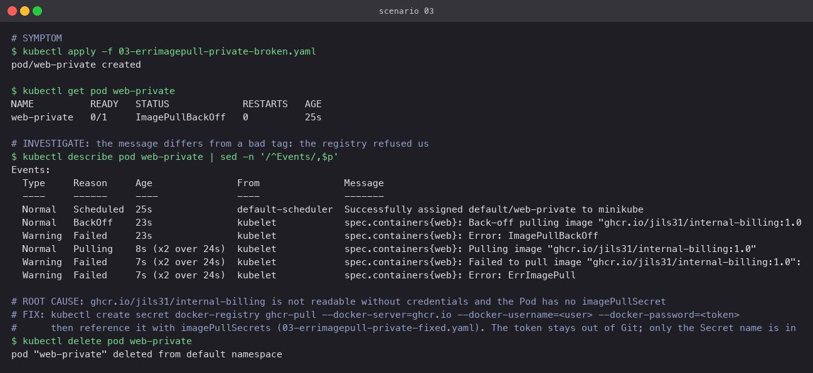
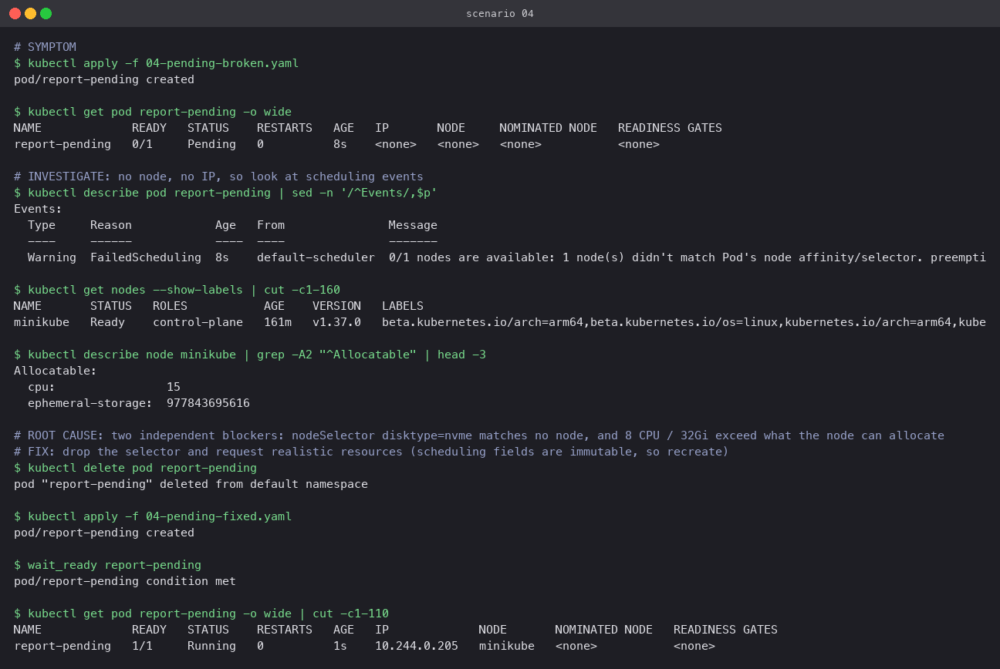
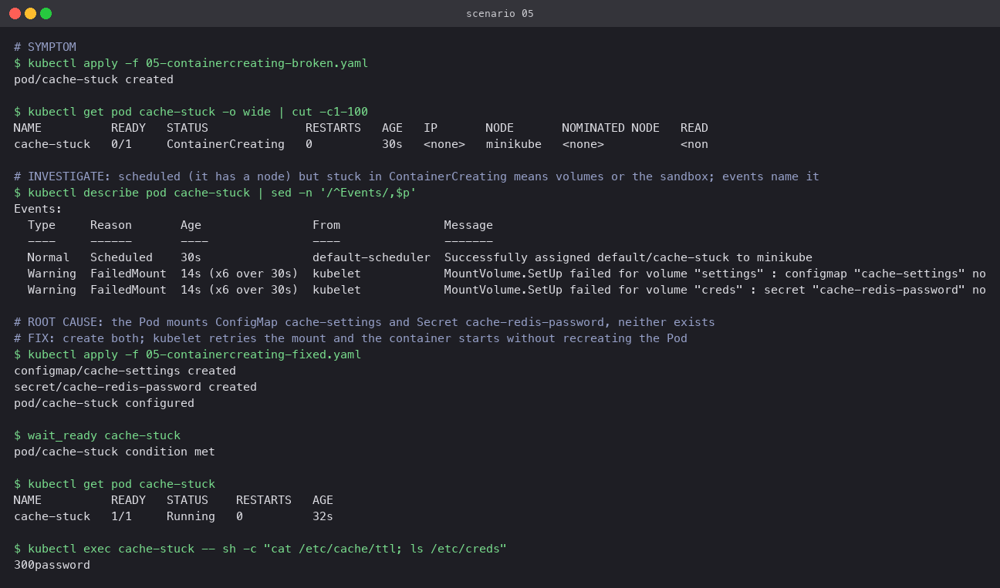
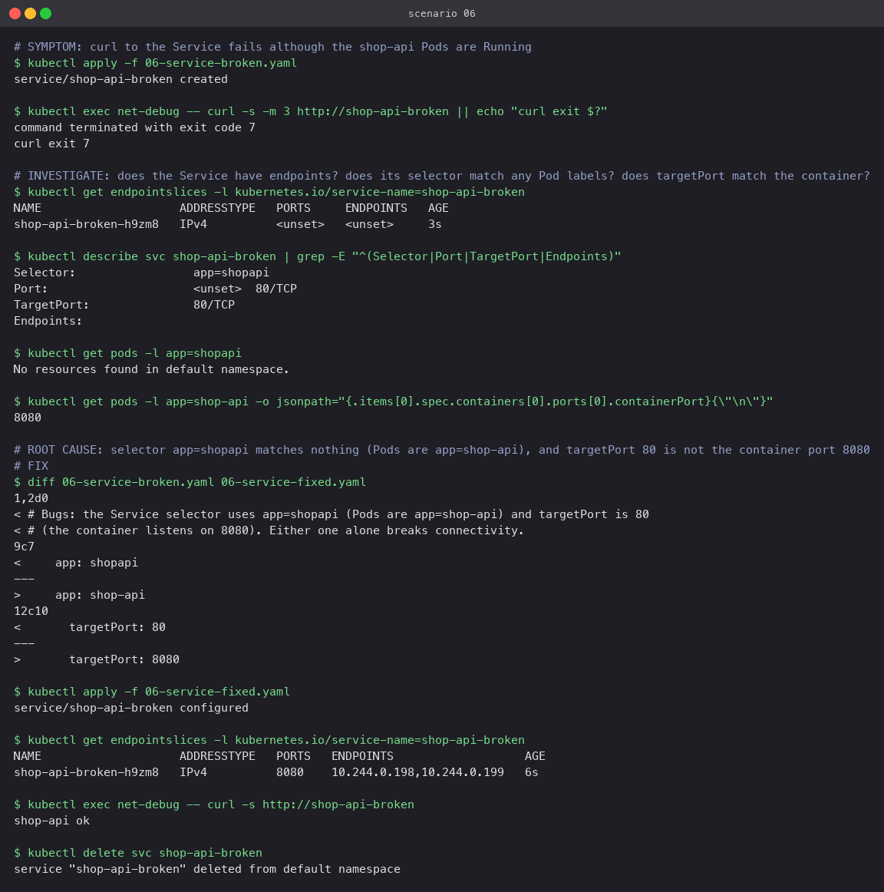
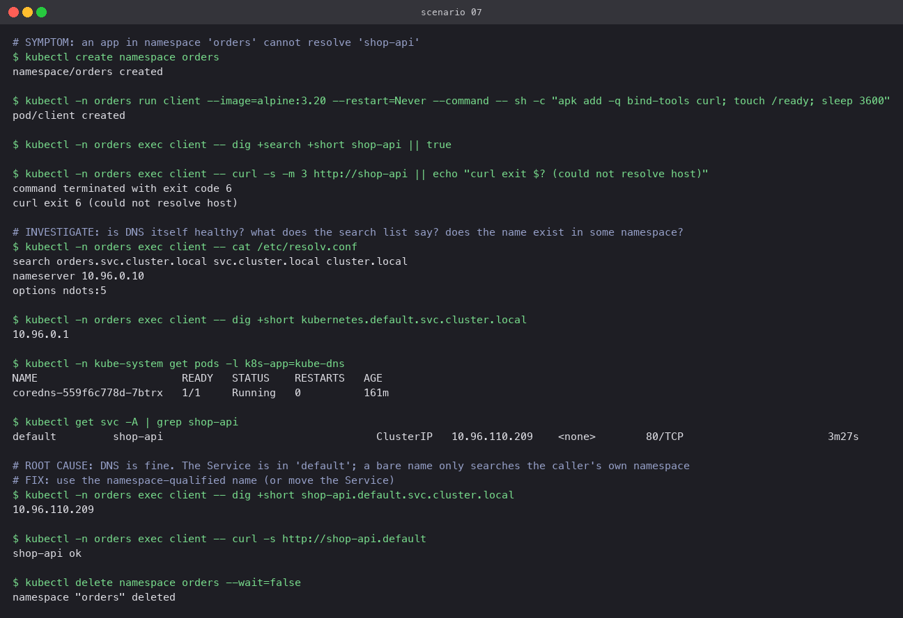
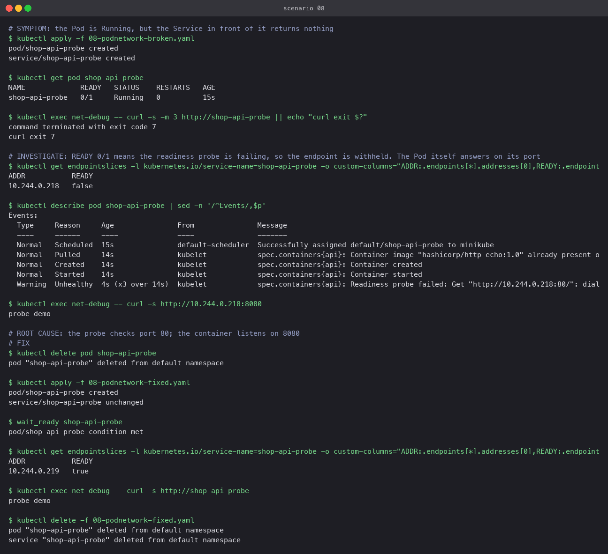
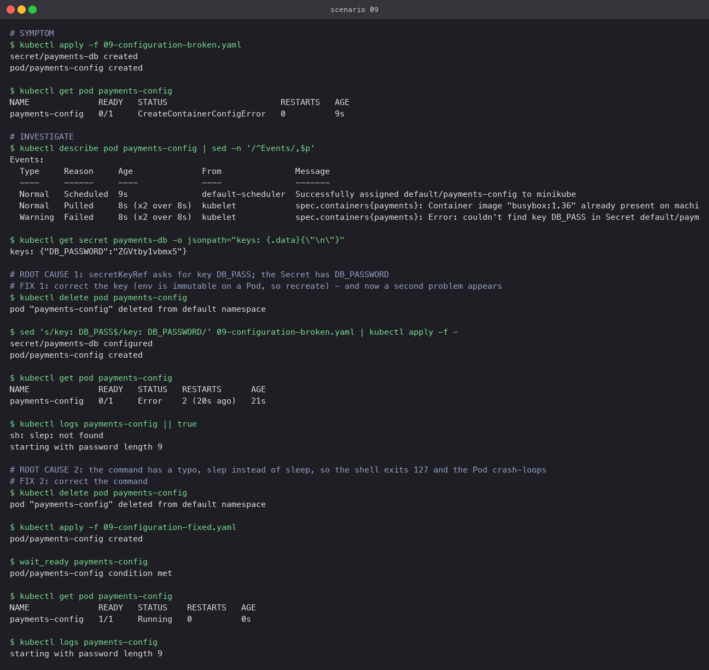

# Scenarios

Each pair of files is `NN-<name>-broken.yaml` and `NN-<name>-fixed.yaml`. For every one: the
symptom as a user would report it, the commands that located the cause, the root cause, and
the fix with its verification. Scenarios 6 to 8 use the `shop-api` Deployment from
`01-commands/demo.yaml` and a `net-debug` Pod (`07-dns-client.yaml`) with `dig` and `curl`.

## 01 CrashLoopBackOff

**Symptom.** `billing-crash` shows `Error` then `CrashLoopBackOff`, `RESTARTS` climbing.
**Found by.** `kubectl logs billing-crash`: `cat: can't open '/etc/billing/config.yaml'`.
Events: `Back-off restarting failed container`.
**Cause.** The start command reads a config file the image does not contain and exits 1.
**Fix.** A ConfigMap mounted at `/etc/billing`. The Pod started and logged the config.

## 02 ImagePullBackOff

**Symptom.** `web-badtag` stuck in `ImagePullBackOff`.
**Found by.** Events: `Failed to pull image "nginx:1.27-alpnie" ... NotFound`.
**Cause.** Typo in the tag.
**Fix.** Correct the tag. The image field is mutable on a Pod, so `kubectl apply` was enough.

## 03 ErrImagePull from a private registry

**Symptom.** Same status as 02, different message.
**Found by.** Events: the registry returned `denied` rather than `NotFound`.
**Cause.** No `imagePullSecrets` for a registry that requires authentication.
**Fix.** `kubectl create secret docker-registry ghcr-pull ...` with a read token, then
reference it from the Pod (`03-errimagepull-private-fixed.yaml`). The token never enters Git.
Not applied here because the repository has no private image to pull; the fixed manifest
shows the shape.

## 04 Pending

**Symptom.** `report-pending` has no node and no IP.
**Found by.** Events: `0/1 nodes are available: 1 node(s) didn't match Pod's node affinity/selector`.
`kubectl get nodes --show-labels` confirms no `disktype=nvme` label; `describe node` shows the
allocatable CPU is far below the 8 cores requested.
**Cause.** Two blockers: an unsatisfiable `nodeSelector` and oversized requests. The scheduler
reports the first one it hits, so fix both or the second appears next.
**Fix.** Remove the selector, request `50m` / `32Mi`. Scheduling fields are immutable, so
the Pod was recreated.

## 05 ContainerCreating

**Symptom.** `cache-stuck` has a node but stays `ContainerCreating`.
**Found by.** Events: `MountVolume.SetUp failed ... configmap "cache-settings" not found` and
the same for a Secret.
**Cause.** Volumes reference objects that do not exist.
**Fix.** Create them. kubelet retries mounts on its own, so the same Pod started without
being recreated.

## 06 Service connectivity

**Symptom.** `curl http://shop-api-broken` fails although the Pods are Running.
**Found by.** `get endpointslices` shows no endpoints; `describe svc` shows
`Selector: app=shopapi` and `TargetPort: 80`; `get pods -l app=shopapi` finds nothing; the
container port is 8080.
**Cause.** Selector typo and wrong targetPort.
**Fix.** Both corrected; endpoints appeared with port 8080 and `curl` returned `shop-api ok`.

## 07 DNS

**Symptom.** A client in namespace `orders` cannot resolve `shop-api`.
**Found by.** `/etc/resolv.conf` search list starts with `orders.svc.cluster.local`;
`dig kubernetes.default.svc.cluster.local` works, so DNS is healthy; `kubectl get svc -A`
shows the Service lives in `default`.
**Cause.** Not a DNS fault. A bare name is only searched in the caller's own namespace.
**Fix.** Use `shop-api.default` or the full FQDN. `curl http://shop-api.default` returned
`shop-api ok`.

## 08 Pod networking

**Symptom.** Pod `Running`, Service returns nothing.
**Found by.** `READY 0/1`; endpoint listed with `ready: false`; events: `Readiness probe
failed ... :80: connection refused`; `curl http://<pod-ip>:8080` works directly.
**Cause.** Probe on port 80, container on 8080. The Pod is healthy but withheld from the
Service.
**Fix.** Probe port corrected. Endpoint flipped to `ready: true` and the Service answered.

## 09 Configuration

**Symptom.** `payments-config` in `CreateContainerConfigError`.
**Found by.** Events: `couldn't find key DB_PASS in Secret default/payments-db`; the Secret
has `DB_PASSWORD`. After fixing that, the Pod crash-looped; `logs`: `sh: slep: not found`.
**Cause.** Two configuration mistakes stacked: a wrong Secret key, then a typo in the command.
**Fix.** Both corrected. A useful lesson: fixing one error can reveal the next, so re-run the
same checks after every change.

