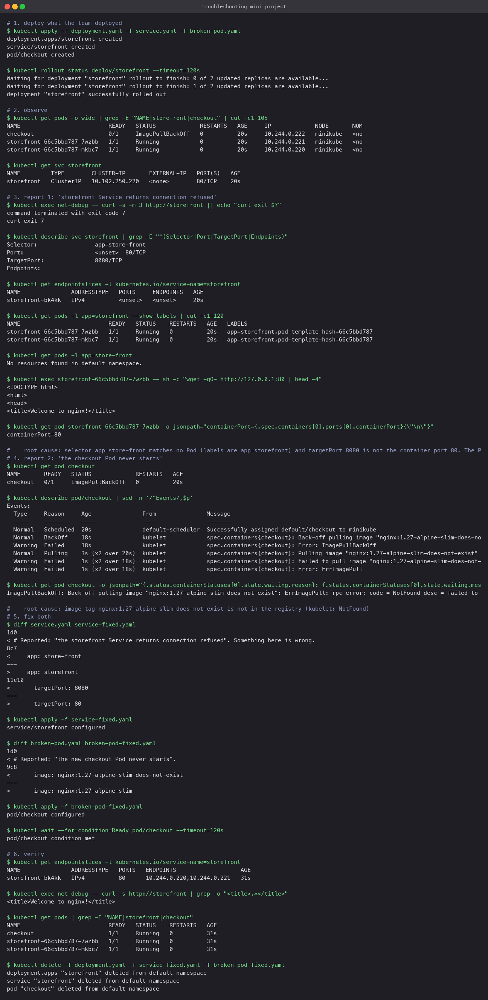

# Mini project: two reports, one afternoon

The team deployed `deployment.yaml`, `service.yaml` and `broken-pod.yaml` and reported two
problems. The rule for this exercise: do not edit any YAML until the commands have proven
what is wrong.

## Deploy and observe

```bash
kubectl apply -f deployment.yaml -f service.yaml -f broken-pod.yaml
kubectl get pods -o wide
kubectl get svc storefront
```

Two `storefront` Pods `Running`, one `checkout` Pod in `ImagePullBackOff`.

## Report 1: "the storefront Service returns connection refused"

| Question | Command | Answer |
|---|---|---|
| Does the Service work? | `kubectl exec net-debug -- curl -s -m 3 http://storefront` | exit 7, refused |
| Does it have endpoints? | `kubectl get endpointslices -l kubernetes.io/service-name=storefront` | none |
| What does it select? | `kubectl describe svc storefront` | `Selector: app=store-front`, `TargetPort: 8080` |
| What do the Pods carry? | `kubectl get pods -l app=storefront --show-labels` | `app=storefront` |
| Does anything match the selector? | `kubectl get pods -l app=store-front` | nothing |
| Is the app itself fine? | `kubectl exec <pod> -- wget -qO- http://127.0.0.1:80` | nginx welcome page |
| Which port does it listen on? | `kubectl get pod <pod> -o jsonpath='{.spec.containers[0].ports[0].containerPort}'` | 80 |

**Root cause.** The Service selects a label no Pod has (`store-front` vs `storefront`) and
targets port 8080 while nginx listens on 80. The Pods are healthy; the path to them is not.

## Report 2: "the checkout Pod never starts"

| Question | Command | Answer |
|---|---|---|
| Status? | `kubectl get pod checkout` | `ImagePullBackOff` |
| Why? | `kubectl describe pod checkout` | `Failed to pull image "nginx:1.27-alpine-slim-does-not-exist" ... NotFound` |
| Which command found it? | `describe`, Events section | the registry's own error message |

**Root cause.** The tag does not exist. `nginx:1.27-alpine-slim` does.

## Fix and verify

```bash
diff service.yaml service-fixed.yaml          # selector and targetPort
kubectl apply -f service-fixed.yaml
diff broken-pod.yaml broken-pod-fixed.yaml    # image tag
kubectl apply -f broken-pod-fixed.yaml
kubectl get endpointslices -l kubernetes.io/service-name=storefront
kubectl exec net-debug -- curl -s http://storefront | grep -o '<title>.*</title>'
kubectl get pods
```

Endpoints appeared for both storefront Pods on port 80, `curl` returned the nginx title, and
`checkout` reached `1/1 Running`.

## Answers to the exercise questions

1. Pod status: `ImagePullBackOff` (with `ErrImagePull` between retries).
2. Actual error: `failed to pull and unpack image "docker.io/library/nginx:1.27-alpine-slim-does-not-exist": not found`.
3. Command that found it: `kubectl describe pod checkout`, Events section. `kubectl get pod
   checkout -o jsonpath='{.status.containerStatuses[0].state.waiting.message}'` gives the same
   text in one line.


