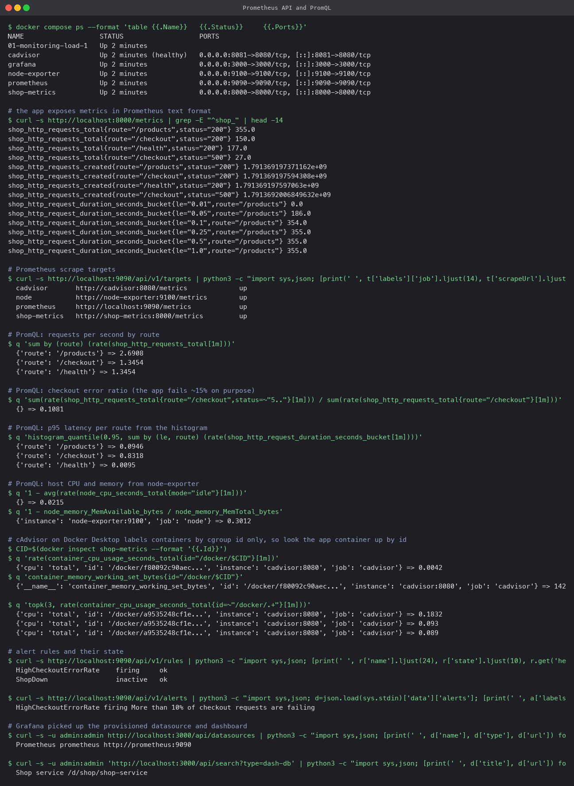
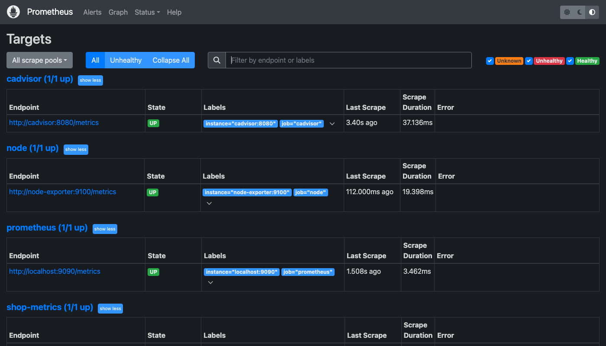
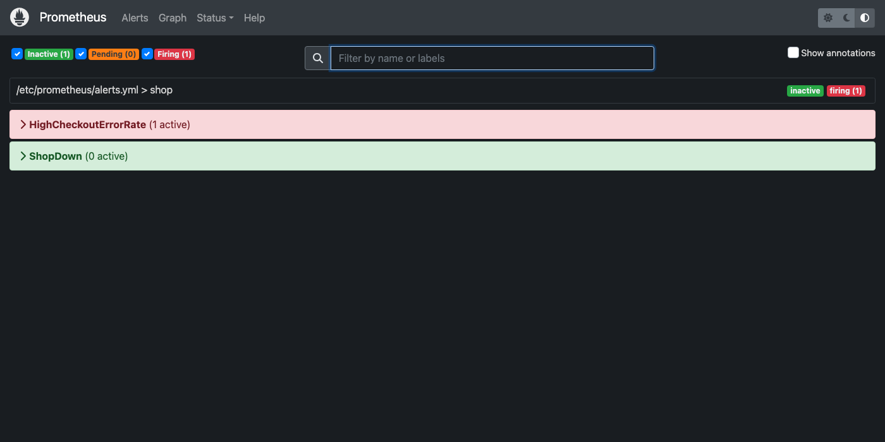
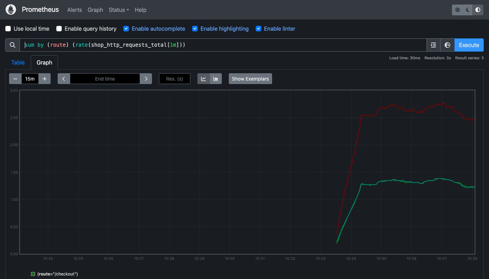
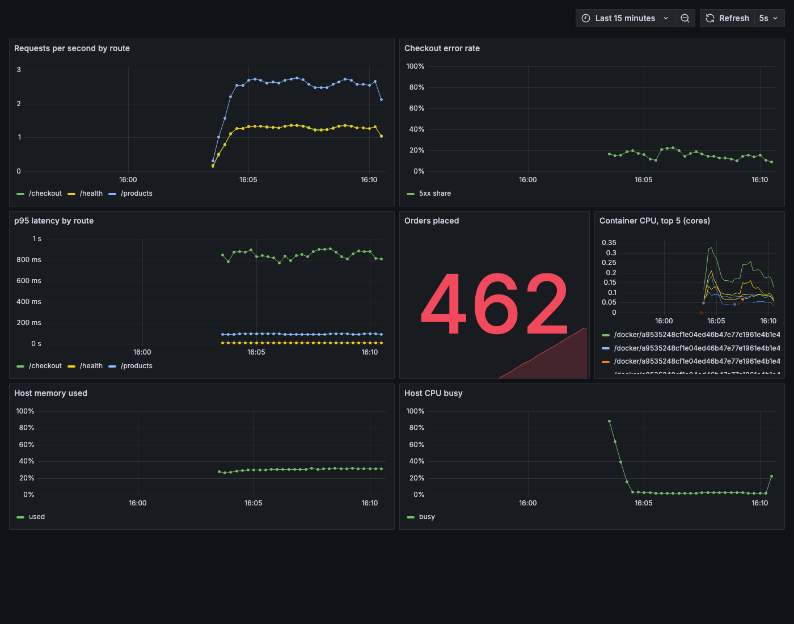

# Monitoring with Prometheus and Grafana

A local stack that monitors a small instrumented service: request rate, error rate, latency,
business counters, container CPU and memory, host CPU and memory, with alert rules and a
Grafana dashboard. Everything runs with one `docker compose up`.

## What is in the stack

| Service | Port | Role |
|---|---|---|
| `shop-metrics` | 8000 | The app. Python, exposes `/metrics` via `prometheus_client`. `/checkout` is slow and fails ~15% of the time on purpose |
| `load` | | A curl loop so the graphs are not flat |
| `prometheus` | 9090 | Scrapes every target every 5s, stores the time series, evaluates alert rules |
| `node-exporter` | 9100 | Host CPU, memory, disk, network |
| `cadvisor` | 8081 | Per-container CPU and memory |
| `grafana` | 3000 | Dashboards. Datasource and the Shop dashboard are provisioned from files, no clicking |

```bash
docker compose up -d --build
open http://localhost:9090/targets      # all four targets UP
open http://localhost:3000/d/shop       # the dashboard (anonymous viewer enabled)
docker compose down
```

## Metrics: how the app exposes them

`metrics-app/app.py` declares four instruments and updates them on every request:

| Metric | Type | Meaning |
|---|---|---|
| `shop_http_requests_total{route,status}` | Counter | How many requests, by route and status code |
| `shop_http_request_duration_seconds{route}` | Histogram | Latency distribution in buckets, which lets Prometheus compute percentiles |
| `shop_http_in_flight` | Gauge | Requests being served right now |
| `shop_orders_total` | Counter | A business number, not a technical one |

Prometheus scrapes `GET /metrics` and gets plain text like
`shop_http_requests_total{route="/checkout",status="500"} 27.0`. The `_created` lines and
`_bucket` lines are what the client library adds for free.

## Queries that answer real questions

| Question | PromQL | Result in the run |
|---|---|---|
| Requests per second per route | `sum by (route) (rate(shop_http_requests_total[1m]))` | /products 2.7, /checkout 1.3, /health 1.3 |
| What share of checkouts fail | `sum(rate(..{route="/checkout",status=~"5.."}[1m])) / sum(rate(..{route="/checkout"}[1m]))` | 0.108, so ~11% |
| p95 latency per route | `histogram_quantile(0.95, sum by (le, route) (rate(shop_http_request_duration_seconds_bucket[1m])))` | /checkout 0.83s, /products 0.09s |
| App container CPU | `rate(container_cpu_usage_seconds_total{id="/docker/<id>"}[1m])` | 0.004 cores |
| App container memory | `container_memory_working_set_bytes{id="/docker/<id>"}` | 14 MB |
| Host CPU busy | `1 - avg(rate(node_cpu_seconds_total{mode="idle"}[1m]))` | 2% |
| Host memory used | `1 - node_memory_MemAvailable_bytes / node_memory_MemTotal_bytes` | 30% |

`rate(...[1m])` is the key idiom: counters only go up, so you always look at how fast they
are going up over a window, never at the raw value. (On Docker Desktop cAdvisor cannot read
container names, so containers are matched by cgroup id; on a Linux host `{name="shop-metrics"}`
works directly.)

## Alerts

`prometheus/alerts.yml` defines two rules:

- `HighCheckoutErrorRate`: fires when more than 10% of checkout requests return 5xx for 30s.
  Because the app fails 15% on purpose, this alert was **firing** during the run, which is the
  point: the graph shows the problem and the rule turns it into a signal somebody is paged on.
- `ShopDown`: fires when the `shop-metrics` target has been down for 15s. Inactive during the
  run. Stop the container and it fires.

In production an Alertmanager would route these to Slack or PagerDuty; here the rule state is
visible on `/alerts` and in the API.

## Grafana

`grafana/provisioning/` tells Grafana about the Prometheus datasource and where to find
dashboards; `grafana/shop-dashboard.json` is the dashboard itself: request rate, checkout error
rate, p95 latency, orders placed, container CPU, host memory, host CPU. Keeping the dashboard
in Git means a fresh `docker compose up` on another machine gives the same screens.

## Captures

Prometheus API: targets, PromQL answers, alert state, Grafana provisioning:



Prometheus UI, targets page and the alerts page with `HighCheckoutErrorRate` firing:




Requests per second graphed in Prometheus:



The provisioned Grafana dashboard after about ten minutes of load:


