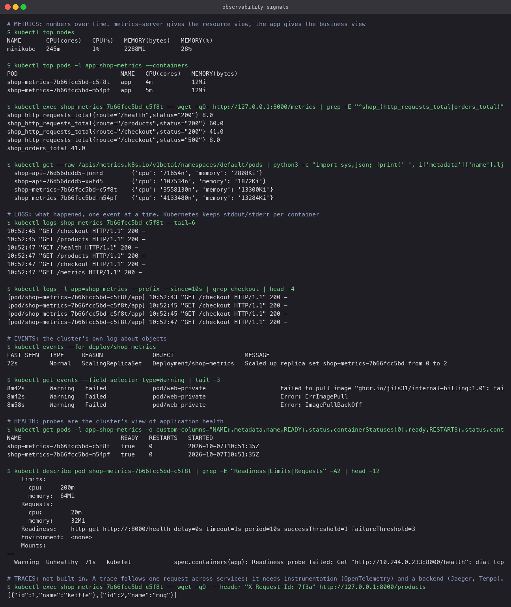

# Observability

## Monitoring versus observability

**Monitoring** asks questions you already know to ask: is the CPU above 80%, is the error rate
above 1%, is the process up. You pick the thresholds in advance and get an alert when they
are crossed. Session 20's Prometheus stack in [01-monitoring](../01-monitoring/) is monitoring.

**Observability** is a property of the system: how well you can work out what is going on
inside it from what it emits, including for questions nobody thought to ask in advance. "Why
are checkouts from one region slow since the 14:00 deploy?" is not a threshold. You answer it
by slicing metrics by label, reading the logs of the requests involved, and following one
request's trace across services. Monitoring is a subset of observability.

## The three pillars

| Signal | What it is | Good for | Cost |
|---|---|---|---|
| **Metrics** | Numbers sampled over time, with labels: `shop_http_requests_total{route="/checkout",status="500"}` | Trends, alerting, dashboards, capacity. Cheap to store for years | Aggregated; you lose the individual event |
| **Logs** | Timestamped text events, one per thing that happened: `10:52:45 "GET /checkout" 500 payment gateway timeout` | Explaining a specific failure, audit, debugging | Volume. Expensive to store and search at scale; needs structure (JSON) to be queryable |
| **Traces** | One request's journey through every service, as a tree of timed spans with a shared trace id | Finding which hop is slow in a chain of microservices | Needs instrumentation in every service and a backend; usually sampled |

They connect through shared identifiers: a metric tells you *that* checkout errors rose at
10:52, a log line with a request id tells you *which* request failed and why, and a trace with
that same id shows *where* in the call chain the time went.

## Why it is required

Containers are short-lived and numerous. You cannot SSH into "the server" because there are
forty Pods and the one that failed was replaced thirty seconds ago. Everything you will ever
know about that Pod is what it emitted before it died. Observability is the discipline of
making sure that is enough.

## Common tools

| Signal | Open source | Hosted |
|---|---|---|
| Metrics | Prometheus, Thanos, Mimir, VictoriaMetrics; Grafana to visualise | Datadog, Grafana Cloud, CloudWatch, New Relic |
| Logs | Loki, Elasticsearch with Fluent Bit or Fluentd, OpenSearch | Datadog Logs, Splunk, CloudWatch Logs |
| Traces | Jaeger, Tempo, Zipkin | Datadog APM, Honeycomb, X-Ray |
| Instrumentation | OpenTelemetry (the standard SDK and collector for all three) | |

## Observability on Kubernetes

Kubernetes gives you some of each signal with no extra install, and the run below exercised
all of them against the instrumented app from the monitoring stack, deployed to Minikube.

**Metrics.** `metrics-server` collects CPU and memory per container and serves them through
the `metrics.k8s.io` API, which is what `kubectl top` and the HPA read. The app's own
`/metrics` endpoint is the business view; a Prometheus in the cluster would scrape it using the
`prometheus.io/scrape` annotations on the Pod template.

```bash
kubectl top nodes
kubectl top pods -l app=shop-metrics --containers
kubectl get --raw /apis/metrics.k8s.io/v1beta1/namespaces/default/pods
kubectl exec <pod> -- wget -qO- http://127.0.0.1:8000/metrics
```

**Logs.** kubelet keeps each container's stdout and stderr; `kubectl logs` reads them, with
`--previous` for the last crashed instance and `-l` plus `--prefix` for all Pods of an app.
This is node-local and lost with the Pod unless a log shipper (Fluent Bit, Promtail) forwards it.

```bash
kubectl logs <pod> --tail=6
kubectl logs -l app=shop-metrics --prefix --since=10s
```

**Events.** The cluster's own log about objects: scheduling, pulls, probe failures, scaling.
Kept for an hour by default.

```bash
kubectl events --for deploy/shop-metrics
kubectl get events --field-selector type=Warning
```

**Application health.** Readiness and liveness probes are the cluster's structured view of
"is the app OK", and their results appear as Pod conditions and events. In the run, the first
readiness check failed once while the process was still starting (`connection refused`), then
passed; both Pods show `READY true, RESTARTS 0`.

**Traces** are the one pillar Kubernetes does not provide. They need OpenTelemetry in the code
and a backend such as Jaeger or Tempo. The cheapest step in that direction is a request id
propagated in headers and written into every log line.


