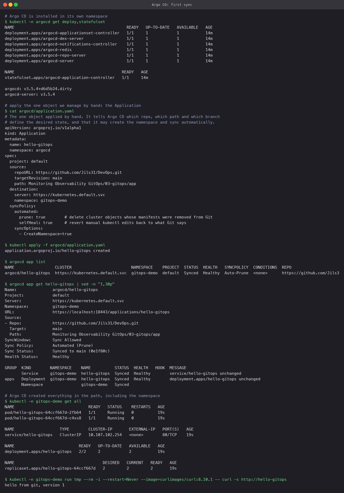
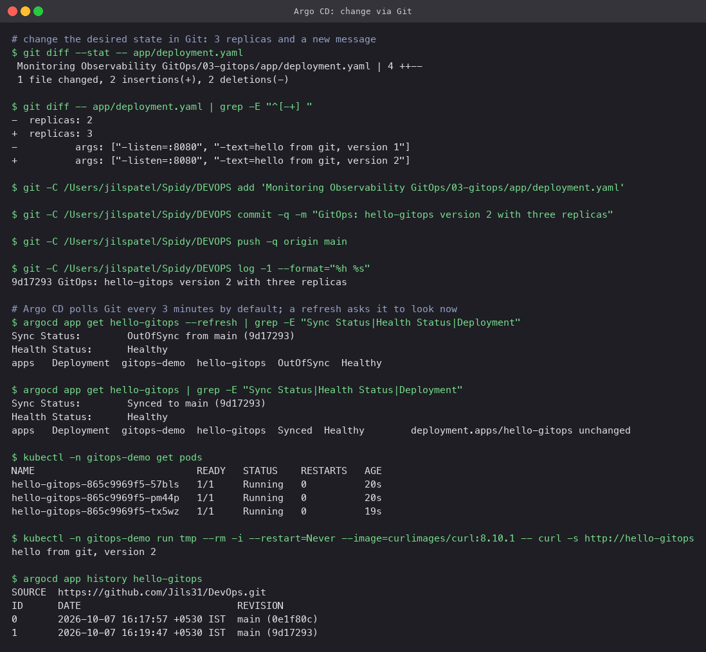
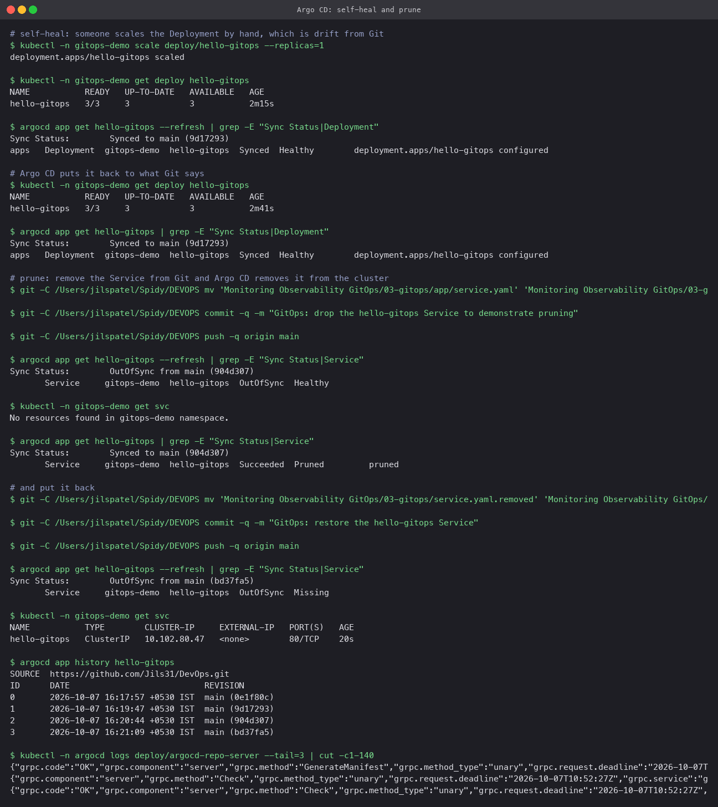

# GitOps with Argo CD

## What GitOps is

Git holds the desired state of the cluster, as plain manifests. A controller in the cluster
compares that desired state with the actual state continuously and makes the cluster match
Git. Nobody runs `kubectl apply` by hand; a change to the cluster is a pull request.

Four properties follow from that:

- **Git as the source of truth.** If it is not in Git, it should not be in the cluster, and
  vice versa. `git log` is the deployment history; `git revert` is the rollback.
- **Declarative.** Manifests say what should exist, not the steps to get there. Argo CD
  works out the steps.
- **Continuous reconciliation.** The controller does not run once at deploy time. It keeps
  watching, so drift (someone's manual `kubectl scale`) is corrected, not just detected.
- **Pull, not push.** The cluster fetches from Git. CI never needs cluster credentials, which
  removes a large attack surface compared with a pipeline that runs `kubectl` against prod.

```
developer -> git push -> GitHub -> Argo CD notices -> kubectl apply (by Argo CD) -> cluster
                                      ^                                               |
                                      +---------- compares desired vs actual ---------+
```

## Layout

```
03-gitops/
├── app/                       desired state: Namespace, Deployment, Service
└── argocd/application.yaml    the one object applied by hand: repo URL, path, branch, sync policy
```

The `Application` points at this repository, branch `master`, path
`Monitoring Observability GitOps/03-gitops/app`, with `automated` sync, `prune: true` and
`selfHeal: true`.

## Setup

```bash
kubectl create namespace argocd
kubectl apply -n argocd --server-side -f https://raw.githubusercontent.com/argoproj/argo-cd/stable/manifests/install.yaml
brew install argocd
kubectl -n argocd port-forward svc/argocd-server 18443:443 &
argocd login localhost:18443 --username admin --password "$(kubectl -n argocd get secret argocd-initial-admin-secret -o jsonpath='{.data.password}' | base64 -d)" --insecure
```

(`--server-side` is needed because the `applicationsets` CRD is too large for client-side
apply's annotation.)

## 1. Apply the Application, Argo CD does the rest

```bash
kubectl apply -f argocd/application.yaml
argocd app list
argocd app get hello-gitops
kubectl -n gitops-demo get all
```

Within seconds the status was `Synced` / `Healthy`, and the namespace, Deployment and Service
existed in the cluster even though nothing in `app/` was ever applied by hand. A `curl` from
inside the cluster returned `hello from git, version 1`.



## 2. Change the cluster by changing Git

```bash
sed -i '' 's/replicas: 2/replicas: 3/; s/version 1/version 2/' app/deployment.yaml
git commit -am "GitOps: hello-gitops version 2 with three replicas" && git push
argocd app get hello-gitops --refresh      # OutOfSync from master (9d17293)
argocd app get hello-gitops                # Synced to master (9d17293), a few seconds later
kubectl -n gitops-demo get pods            # three Pods
argocd app history hello-gitops
```

Argo CD polls Git every three minutes by default (a webhook makes it instant); `--refresh`
asked it to look immediately. It reported `OutOfSync`, synced, and the app answered
`hello from git, version 2` from three Pods. `app history` lists each synced revision by Git
SHA, which is the deployment log.



## 3. Self-heal and prune

**Self-heal.** `kubectl scale deploy/hello-gitops --replicas=1` by hand. Argo CD saw the
drift and restored three replicas so quickly that the very next `kubectl get deploy` already
showed `3/3`. Manual changes do not survive; the fix for "I need one replica" is a commit.

**Prune.** Moving `service.yaml` out of the tracked path and pushing made the Service
`OutOfSync`; Argo CD then deleted it from the cluster (`Pruned`). Moving it back recreated it.
Without `prune: true` Argo CD would only report the orphan, not remove it.



## What this gives a team

- Every production change is a reviewed, attributable commit.
- Rollback is `git revert` and a sync, not a scramble to find the previous YAML.
- Drift is impossible to leave in place by accident.
- The CI pipeline (sessions 16 and 17) builds and pushes an image; a GitOps step is just a
  commit that bumps the image tag in a manifest. CI never touches the cluster.
