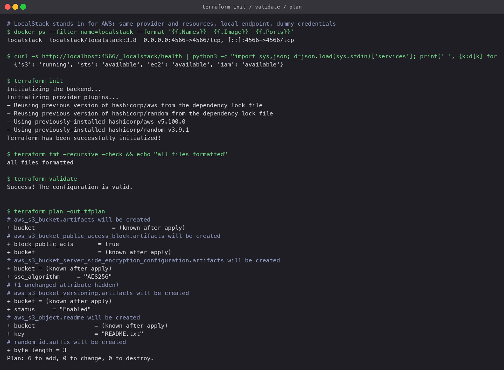
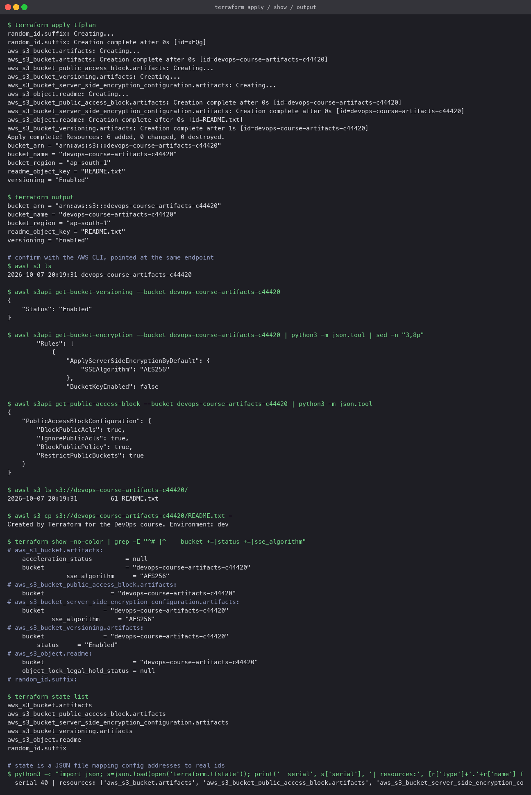
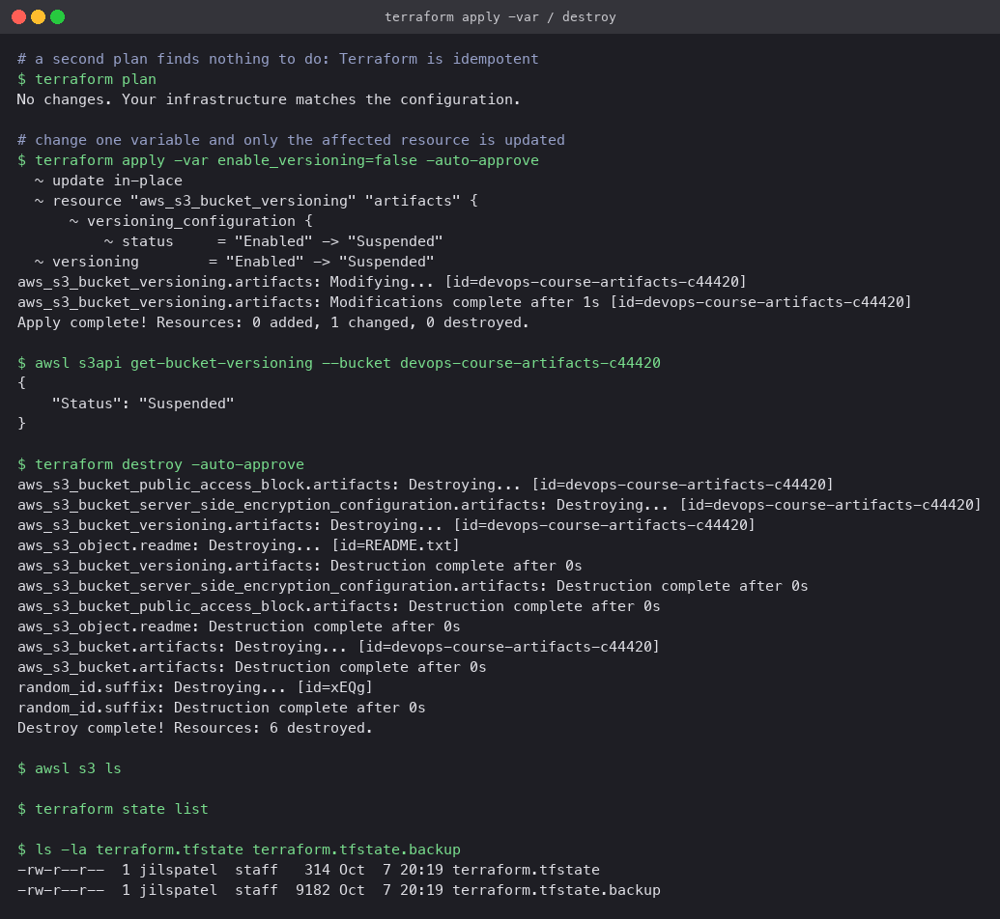

# Terraform S3 demo

One S3 bucket, done properly: random name suffix, versioning, default encryption, public
access blocked, a lifecycle rule, and one object uploaded. The whole Terraform workflow is run
and captured: `init`, `fmt`, `validate`, `plan`, `apply`, `show`, `output`, a no-op plan, a
one-variable change, and `destroy`.

## Where it ran

Against **LocalStack**, a local AWS emulator, in a Docker container on port 4566. The provider
block has a `use_localstack` switch: when true it points the S3 and STS endpoints at
`localhost:4566` and uses dummy keys; when false (the default) it is a normal AWS provider and
needs real credentials from `aws configure`. Nothing else in the configuration changes. The one
exception is the lifecycle rule, which LocalStack's free edition never reports as applied, so
it has `count = var.use_localstack ? 0 : 1` and is created only on real AWS.

```bash
docker run -d --name localstack -p 4566:4566 -e SERVICES=s3,sts,ec2,iam localstack/localstack:3.8
export AWS_ACCESS_KEY_ID=test AWS_SECRET_ACCESS_KEY=test AWS_DEFAULT_REGION=ap-south-1
```

## Files

| File | Holds |
|---|---|
| `terraform.tf` | Terraform and provider version constraints (`aws ~> 5.80`, `random ~> 3.6`) |
| `provider.tf` | The AWS provider, with the LocalStack endpoint block behind the switch |
| `variables.tf` | `aws_region`, `bucket_prefix` (with a regex validation), `environment`, `enable_versioning`, `use_localstack` |
| `main.tf` | `random_id`, the bucket, versioning, encryption, public-access block, lifecycle rule, one object |
| `outputs.tf` | bucket name, ARN, region, versioning status, object key |
| `terraform.tfvars` | The values used for this run. No credentials; they never belong in a tfvars file |
| `.gitignore` | `.terraform/`, `*.tfstate*`, `*.tfplan` |

## The run

### init, fmt, validate, plan

`init` installed `hashicorp/aws v5.100.0` and `hashicorp/random v3.9.1` and pinned them in
`.terraform.lock.hcl`. `fmt -check` passed, `validate` passed. `plan -out=tfplan` listed six
resources to add; bucket-dependent values show as `(known after apply)` because the random
suffix does not exist yet.



### apply, show, output, and a second opinion from the CLI

`apply tfplan` created all six in about a second (`random_id` first, the bucket next, the
four bucket settings and the object in parallel once the bucket existed). `output` printed the
generated name `devops-course-artifacts-c7d363` and its ARN. The AWS CLI, pointed at the same
endpoint, confirmed the bucket exists, versioning is `Enabled`, encryption is `AES256`, all
four public-access blocks are `true`, and `README.txt` is inside with the expected content.
`terraform show` and `state list` show the same objects from Terraform's side, and the state
file's resource list matches.



### no-op, change, destroy

A second `plan` reported `No changes`. Applying with `-var enable_versioning=false` produced a
plan with one in-place update (`Enabled -> Suspended`) and touched nothing else, which the CLI
confirmed. `destroy` removed the six resources in reverse dependency order; `s3 ls` and
`state list` were then empty, and `terraform.tfstate` shrank to an empty state with the
previous version kept in `.backup`.



## Running it against real AWS

```bash
aws configure                      # or export AWS_ACCESS_KEY_ID / AWS_SECRET_ACCESS_KEY
sed -i '' 's/use_localstack    = true/use_localstack    = false/' terraform.tfvars
terraform init && terraform plan && terraform apply
terraform destroy                  # buckets cost nothing while empty, but leave nothing behind
```

The only observable difference will be the lifecycle rule appearing (seven resources instead
of six) and the bucket showing up in the S3 console.
