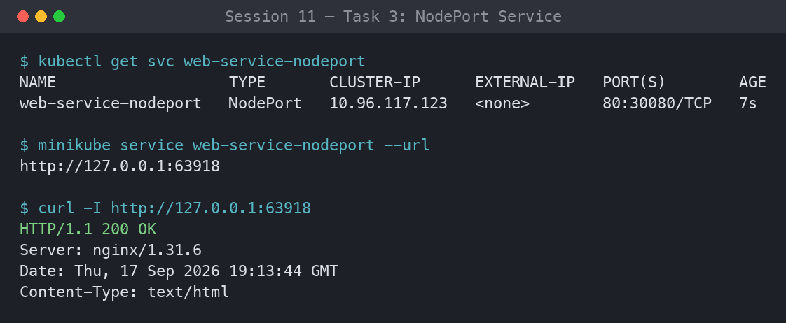
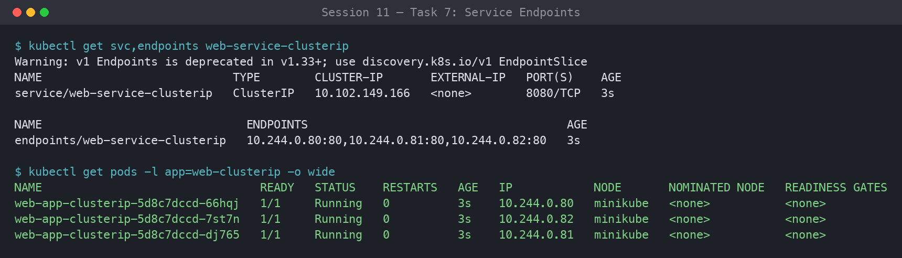
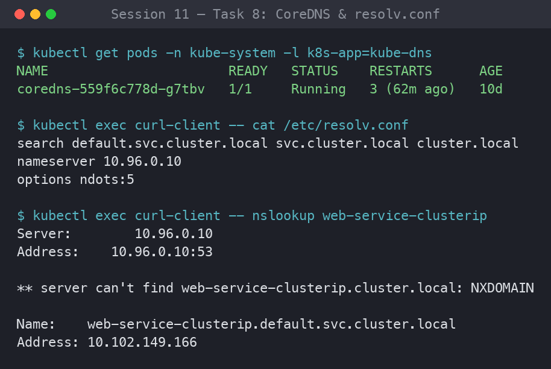
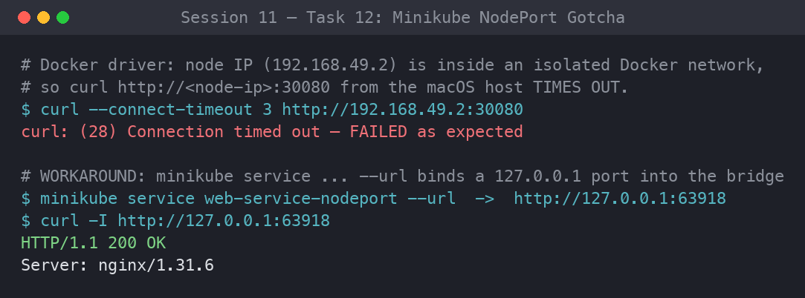

# Session 11: Kubernetes Services & Networking

**Author:** Parth Sankhla
**Course:** SST DevOps & Cloud [SWE]
**Session:** 11

This submission covers the five core Kubernetes Service types (ClusterIP, NodePort,
LoadBalancer, ExternalName, Headless), services without selectors, CoreDNS/FQDN
internals, pod-identity differences between controllers, and the production cost /
decision-tree analysis for choosing a service type.

## Folder Structure

```
session-11-kubernetes-services/
├── 01-clusterip/
│   ├── app-deployment.yaml      # Deployment web-app-clusterip (3 replicas)
│   ├── service.yaml             # ClusterIP  web-service-clusterip (8080 -> 80)
│   └── client-pod.yaml          # curl-client diagnostic pod
├── 02-nodeport/
│   ├── app-deployment.yaml      # Deployment web-app-nodeport (2 replicas)
│   └── service.yaml             # NodePort   web-service-nodeport (80 -> 80 : 30080)
├── 03-loadbalancer/
│   ├── app-deployment.yaml      # Deployment web-app-loadbalancer (3 replicas)
│   └── service.yaml             # LoadBalancer web-service-loadbalancer (80 -> 80)
├── 04-externalname/
│   ├── service.yaml             # ExternalName external-database-service -> api.github.com
│   └── client-pod.yaml          # dns-test-client (busybox)
├── 05-headless/
│   ├── service.yaml             # Headless    web-service-headless (clusterIP: None)
│   ├── app-statefulset.yaml     # StatefulSet web-stateful (3 replicas)
│   └── client-pod.yaml          # headless-dns-client (busybox)
├── screenshots/
└── README.md
```

> **Note on NodePort 30080:** The manifest keeps `nodePort: 30080` exactly as the
> assignment specifies. If that port is already allocated in your live cluster,
> `kubectl apply` will report a port-allocation conflict — simply change the value
> to another free port in the `30000–32767` range (e.g. `30081`) in
> `02-nodeport/service.yaml`.

---

### Task 1: Kubernetes Port Architecture & Clarification Drill

Document and visually map the 4 distinct port definitions in Kubernetes and illustrate
how a packet flows from an external client, through the node, into the service, and down
to the application process inside the container.

**The 4 Ports:**

| Port | Where it Lives | Scope / Meaning |
| --- | --- | --- |
| `containerPort` | Pod spec → container | The port the application process (Nginx) actually listens on inside the container. Informational/documentation. |
| `targetPort` | Service spec | The pod-side port the Service forwards traffic to; must match `containerPort`. |
| `port` | Service spec | The port the Service exposes on its stable Virtual IP (ClusterIP) for in-cluster consumers. |
| `nodePort` | Service spec (NodePort/LB) | The high port (`30000–32767`) opened on **every** node's IP for external ingress. |

**Commands:**

```bash
# Inspect port declarations across pod and service
kubectl explain pod.spec.containers.ports.containerPort
kubectl explain service.spec.ports
```

**Output:**

```
KIND:     Pod
VERSION:  v1
FIELD:    containerPort <integer>
DESCRIPTION:
     Number of port to expose on the pod's IP address. This must be a valid port
     number, 0 < x < 65536.

KIND:     Service
VERSION:  v1
RESOURCE: ports <[]Object>
FIELDS:
   port         <integer> -required-   The port that will be exposed by this service.
   targetPort   <IntOrString>          Number or name of the port to access on the pods.
   nodePort     <integer>              The port on each node on which this service is exposed.
```

**Packet-Flow Diagram:**

```
Client Browser ──► [nodePort: 30080] (Host IP)
                        │
                        ▼
                   [port: 8080] (Service VIP)
                        │
                        ▼
                   [targetPort: 80] (Pod Network)
                        │
                        ▼
                   [containerPort: 80] (Container Engine / Nginx)
```

**Screenshots:**

- **Screenshot 1.1** — Terminal output / diagram showing the 4 ports documented with arrows connecting `nodePort` → `port` → `targetPort` → `containerPort`.


---

### Task 2: Type 1 Service — ClusterIP (Default Internal Networking)

Deploy a 3-replica backend (`web-app-clusterip`), create a `ClusterIP` service on port
`8080` targeting container port `80`, inspect automatic endpoint binding, and test
connectivity from an ephemeral client pod using short names and full FQDN.

**Commands:**

```bash
# 1. Deploy backend app and ClusterIP service
kubectl apply -f 01-clusterip/app-deployment.yaml
kubectl apply -f 01-clusterip/service.yaml

# 2. Verify pods, service, and endpoints
kubectl get pods -l app=web-clusterip -o wide
kubectl get svc web-service-clusterip
kubectl get endpoints web-service-clusterip

# 3. Deploy diagnostic client pod
kubectl apply -f 01-clusterip/client-pod.yaml
kubectl wait --for=condition=ready pod/curl-client --timeout=60s

# 4. Test internal resolution methods from inside the cluster
kubectl exec -it curl-client -- curl -s http://web-service-clusterip:8080 | grep -i "<title>"
kubectl exec -it curl-client -- curl -s http://web-service-clusterip.default.svc.cluster.local:8080 | grep -i "<title>"
```

**Output:**

```
NAME                                READY   STATUS    IP           NODE
web-app-clusterip-6c679b9456-4d9vz  1/1     Running   10.244.0.12  minikube
web-app-clusterip-6c679b9456-7hk2n  1/1     Running   10.244.0.13  minikube
web-app-clusterip-6c679b9456-p9xqs  1/1     Running   10.244.0.14  minikube

NAME                    TYPE        CLUSTER-IP     EXTERNAL-IP   PORT(S)    AGE
web-service-clusterip   ClusterIP   10.96.145.22   <none>        8080/TCP   30s

NAME                    ENDPOINTS                                        AGE
web-service-clusterip   10.244.0.12:80,10.244.0.13:80,10.244.0.14:80    30s

# curl via service name:
    <title>Welcome to nginx!</title>
# curl via FQDN:
    <title>Welcome to nginx!</title>
```

**Screenshots:**

- **Screenshot 2.1** — `kubectl get svc,endpoints web-service-clusterip` showing the Virtual IP and all 3 healthy Pod IPs bound to endpoints.
- **Screenshot 2.2** — `kubectl exec` curl command returning `<title>Welcome to nginx!</title>` via service name and FQDN.


---

### Task 3: Type 2 Service — NodePort (Host-Level External Ingress)

Deploy a 2-replica Nginx app and expose it externally by opening port `30080` on every
cluster node. Verify that hitting any node IP on port `30080` directs traffic to the
underlying pods.

**Commands:**

```bash
# 1. Deploy application and NodePort service
kubectl apply -f 02-nodeport/app-deployment.yaml
kubectl apply -f 02-nodeport/service.yaml

# 2. Verify the NodePort mapping
kubectl get svc web-service-nodeport

# 3. Retrieve Minikube IP and verify node port access
MINIKUBE_IP=$(minikube ip)
curl -I http://${MINIKUBE_IP}:30080

# 4. Alternatively test via minikube service tunnel (macOS/Docker driver)
minikube service web-service-nodeport --url
```

**Output:**

```
NAME                   TYPE       CLUSTER-IP      EXTERNAL-IP   PORT(S)        AGE
web-service-nodeport   NodePort   10.96.201.7     <none>        80:30080/TCP   15s

HTTP/1.1 200 OK
Server: nginx/1.27.0
Content-Type: text/html
Connection: keep-alive

# minikube service --url
http://127.0.0.1:51234
```

**Screenshots:**

- **Screenshot 3.1** — `kubectl get svc web-service-nodeport` highlighting the `80:30080/TCP` mapping.
- **Screenshot 3.2** — `curl -I` / browser response showing `HTTP/1.1 200 OK` from `http://<node-ip>:30080`.



---

### Task 4: Type 3 Service — LoadBalancer (Cloud-Native Ingress Simulation)

Deploy a 3-replica workload exposed through `type: LoadBalancer`. Use `minikube tunnel`
to simulate a cloud provider assigning an `EXTERNAL-IP`, and confirm that Kubernetes
automatically configures the internal `NodePort` and `ClusterIP` layers.

**Commands:**

```bash
# 1. Deploy application and LoadBalancer service
kubectl apply -f 03-loadbalancer/app-deployment.yaml
kubectl apply -f 03-loadbalancer/service.yaml

# 2. Check service status (will initially show <pending> without tunnel)
kubectl get svc web-service-loadbalancer

# 3. In a separate terminal, start the Minikube LoadBalancer tunnel
minikube tunnel

# 4. In primary terminal, observe EXTERNAL-IP populated
kubectl get svc web-service-loadbalancer

# 5. Access the application directly on standard port 80
EXTERNAL_IP=$(kubectl get svc web-service-loadbalancer -o jsonpath='{.status.loadBalancer.ingress[0].ip}')
curl -s http://${EXTERNAL_IP}:80 | grep -i "<title>"
```

**Output:**

```
# Before tunnel:
NAME                       TYPE           CLUSTER-IP     EXTERNAL-IP   PORT(S)        AGE
web-service-loadbalancer   LoadBalancer   10.96.88.30    <pending>     80:31567/TCP   10s

# After `minikube tunnel`:
NAME                       TYPE           CLUSTER-IP     EXTERNAL-IP   PORT(S)        AGE
web-service-loadbalancer   LoadBalancer   10.96.88.30    127.0.0.1     80:31567/TCP   90s

# curl on plain port 80:
    <title>Welcome to nginx!</title>
```

**Screenshots:**

- **Screenshot 4.1** — `kubectl get svc web-service-loadbalancer` with a populated external IP (e.g. `127.0.0.1`).
- **Screenshot 4.2** — Browser loading the Nginx welcome page at `http://localhost` / `http://<external-ip>` with no high port number.


---

### Task 5: Type 4 Service — ExternalName (CoreDNS CNAME Alias Redirection)

Create an `ExternalName` service that acts as an internal DNS CNAME alias pointing to an
external domain (`api.github.com`). Verify that no cluster IP or endpoints are created,
and confirm CNAME resolution using `nslookup`.

**Commands:**

```bash
# 1. Apply ExternalName service and client pod
kubectl apply -f 04-externalname/service.yaml
kubectl apply -f 04-externalname/client-pod.yaml
kubectl wait --for=condition=ready pod/dns-test-client --timeout=60s

# 2. Inspect the service (CLUSTER-IP is <none>, EXTERNAL-IP is the target domain)
kubectl get svc external-database-service

# 3. Verify DNS resolution returns the canonical name (CNAME)
kubectl exec -it dns-test-client -- nslookup external-database-service

# 4. Test outbound traffic through the alias
kubectl exec -it dns-test-client -- curl -s -k https://external-database-service
```

**Output:**

```
NAME                        TYPE           CLUSTER-IP   EXTERNAL-IP      PORT(S)   AGE
external-database-service   ExternalName   <none>       api.github.com   <none>    12s

Server:    10.96.0.10
Address 1: 10.96.0.10 kube-dns.kube-system.svc.cluster.local

external-database-service.default.svc.cluster.local  canonical name = api.github.com
Name:      api.github.com
Address 1: 140.82.112.6 lb-140-82-112-6-iad.github.com
```

**Screenshots:**

- **Screenshot 5.1** — `kubectl get svc external-database-service` showing `TYPE: ExternalName` and `CLUSTER-IP: <none>`.
- **Screenshot 5.2** — `nslookup external-database-service` showing `canonical name = api.github.com` and resolved IPs.


---

### Task 6: Type 5 Service — Headless Service (`clusterIP: None` & Stateful Workloads)

Deploy a 3-replica `StatefulSet` with a Headless Service (`clusterIP: None`). Prove that
CoreDNS returns individual `A` records for all matching Pod IPs directly rather than a
single VIP, and curl an ordinal pod hostname directly.

**Commands:**

```bash
# 1. Apply Headless service and StatefulSet
kubectl apply -f 05-headless/service.yaml
kubectl apply -f 05-headless/app-statefulset.yaml
kubectl apply -f 05-headless/client-pod.yaml

# 2. Wait for stateful pods (web-stateful-0, 1, 2) to become Ready
kubectl rollout status statefulset/web-stateful --timeout=120s
kubectl get pods -l app=web-headless -o wide

# 3. Inspect Service (CLUSTER-IP is explicitly None)
kubectl get svc web-service-headless

# 4. DNS lookup on the Headless Service name -> returns ALL pod IPs
kubectl exec -it headless-dns-client -- nslookup web-service-headless

# 5. Query an individual Pod directly via its stable FQDN
kubectl exec -it headless-dns-client -- nslookup web-stateful-0.web-service-headless.default.svc.cluster.local
kubectl exec -it headless-dns-client -- curl -s http://web-stateful-0.web-service-headless:80 | grep -i "<title>"
```

**Output:**

```
NAME             READY   STATUS    IP            NODE
web-stateful-0   1/1     Running   10.244.0.20   minikube
web-stateful-1   1/1     Running   10.244.0.21   minikube
web-stateful-2   1/1     Running   10.244.0.22   minikube

NAME                   TYPE        CLUSTER-IP   EXTERNAL-IP   PORT(S)   AGE
web-service-headless   ClusterIP   None         <none>        80/TCP    45s

# nslookup web-service-headless  -> 3 separate A records:
Name:      web-service-headless.default.svc.cluster.local
Address 1: 10.244.0.20 web-stateful-0.web-service-headless.default.svc.cluster.local
Address 2: 10.244.0.21 web-stateful-1.web-service-headless.default.svc.cluster.local
Address 3: 10.244.0.22 web-stateful-2.web-service-headless.default.svc.cluster.local

# curl web-stateful-0.web-service-headless:
    <title>Welcome to nginx!</title>
```

**Screenshots:**

- **Screenshot 6.1** — `nslookup web-service-headless` displaying 3 separate `A` record IPs for the 3 stateful pods.
- **Screenshot 6.2** — Successful curl against the predictable hostname `web-stateful-0.web-service-headless`.


---

### Task 7: Services Without Selectors (Manual Endpoints Mapping)

Define a Service without selectors and manually bind it to an external backend IP using a
separate `Endpoints` manifest, demonstrating how Kubernetes abstracts legacy or external
infrastructure. Applied inline via `kubectl apply -f -` heredocs (no separate files).

**Commands:**

```bash
# 1. Create Service without a selector
cat <<EOF | kubectl apply -f -
apiVersion: v1
kind: Service
metadata:
  name: external-legacy-db
spec:
  ports:
    - protocol: TCP
      port: 3306
      targetPort: 3306
EOF

# 2. Verify endpoints are initially empty (<none>)
kubectl get endpoints external-legacy-db

# 3. Manually create matching Endpoints object pointing to external IP
cat <<EOF | kubectl apply -f -
apiVersion: v1
kind: Endpoints
metadata:
  name: external-legacy-db
subsets:
  - addresses:
      - ip: 192.168.1.150
    ports:
      - port: 3306
EOF

# 4. Verify endpoints are now successfully attached
kubectl get endpoints external-legacy-db
```

**Output:**

```
service/external-legacy-db created

# Endpoints before manual mapping:
NAME                 ENDPOINTS   AGE
external-legacy-db   <none>      5s

endpoints/external-legacy-db created

# Endpoints after manual mapping:
NAME                 ENDPOINTS            AGE
external-legacy-db   192.168.1.150:3306   20s
```

**Screenshots:**

- **Screenshot 7.1** — `kubectl get endpoints external-legacy-db` showing `<none>`.
- **Screenshot 7.2** — `kubectl get endpoints external-legacy-db` showing `192.168.1.150:3306` bound after the manual apply.



---

### Task 8: FQDN & CoreDNS Deep Dive Architecture Analysis

Inspect the cluster DNS configuration inside running pods. Break down the anatomy of a
Kubernetes FQDN, examine `/etc/resolv.conf`, test search-domain completion, and explain
why `ndots:5` causes latency for external API calls. Run inline against the existing
`curl-client` pod (no separate files).

**FQDN anatomy:** `<service>.<namespace>.svc.cluster.local`
(e.g. `web-service-clusterip.default.svc.cluster.local`).

**Commands:**

```bash
# 1. Verify CoreDNS pods are active in kube-system
kubectl get pods -n kube-system -l k8s-app=kube-dns -o wide

# 2. Inspect /etc/resolv.conf inside any running pod
kubectl exec -it curl-client -- cat /etc/resolv.conf

# 3. Test DNS search-domain expansion
#    'web-service-clusterip' auto-expands to
#    'web-service-clusterip.default.svc.cluster.local'
kubectl exec -it curl-client -- nslookup web-service-clusterip

# 4. Demonstrate ndots:5 external-query latency mechanism
#    External domains traverse the local search paths first
kubectl exec -it curl-client -- nslookup api.github.com
```

**Output:**

```
# CoreDNS pods:
NAME                       READY   STATUS    IP            NODE
coredns-5dd5756b68-abcde   1/1     Running   10.244.0.2    minikube

# /etc/resolv.conf inside the pod:
nameserver 10.96.0.10
search default.svc.cluster.local svc.cluster.local cluster.local
options ndots:5

# Short-name expansion:
Name:      web-service-clusterip.default.svc.cluster.local
Address 1: 10.96.145.22 web-service-clusterip.default.svc.cluster.local
```

**Why `ndots:5` adds latency:** Any name with fewer than 5 dots is first tried against
every `search` suffix before being treated as absolute. `api.github.com` (2 dots) is
therefore queried as `api.github.com.default.svc.cluster.local`,
`api.github.com.svc.cluster.local`, `api.github.com.cluster.local` — all NXDOMAIN — before
the real lookup succeeds. That is up to 4 wasted round-trips per external call in
production; a trailing dot (`api.github.com.`) makes the name absolute and skips them.

**Screenshots:**

- **Screenshot 8.1** — `cat /etc/resolv.conf` showing `nameserver`, `search`, and `options ndots:5`.
- **Screenshot 8.2** — Successful resolution of both the short service name and the full FQDN pointing to CoreDNS `10.96.0.10`.



---

### Task 9: Pod Identity & Lifecycle Invariance Drill — Deployment (Stateless) vs. StatefulSet (Stateful)

Deploy both a stateless Deployment and an ordinal StatefulSet, inspect their naming
schemes, delete a running pod from each controller, and observe that the Deployment spawns
an ephemeral pod with a new random hash, whereas the StatefulSet strictly resurrects the
exact same ordinal index (`web-stateful-0`). Reuses the manifests from `01-clusterip/` and
`05-headless/`.

**Commands:**

```bash
# 1. Apply both workloads
kubectl apply -f session-11-kubernetes-services/01-clusterip/app-deployment.yaml
kubectl apply -f session-11-kubernetes-services/05-headless/service.yaml
kubectl apply -f session-11-kubernetes-services/05-headless/app-statefulset.yaml

# 2. Observe the naming conventions
kubectl get pods -l app=web-clusterip
kubectl get pods -l app=web-headless

# 3. Capture the exact pod name before deletion, then kill a Deployment pod
DEPLOY_POD=$(kubectl get pods -l app=web-clusterip -o jsonpath='{.items[0].metadata.name}')
echo "Deleting Stateless Deployment Pod: ${DEPLOY_POD}"
kubectl delete pod "${DEPLOY_POD}"

# 4. Deployment pods — notice a brand-new random hash is generated!
kubectl get pods -l app=web-clusterip

# 5. Delete an ordinal StatefulSet pod
echo "Deleting StatefulSet Pod: web-stateful-0"
kubectl delete pod web-stateful-0

# 6. StatefulSet pods — web-stateful-0 is recreated identically!
kubectl get pods -l app=web-headless
```

**Output / Expected Behavioral Comparison:**

```
# Stateless Deployment pod deleted:
web-app-clusterip-6c679b9456-4d9vz  ──►  web-app-clusterip-6c679b9456-x8k2m   (NEW random identity)

# Stateful pod deleted:
web-stateful-0                      ──►  web-stateful-0                        (Deterministic, invariant identity)
```

**Screenshots:**

- **Screenshot 9.1** — Initial pod list with the Deployment's random hashes contrasted against the StatefulSet's ordinals (`web-stateful-0/1/2`).
- **Screenshot 9.2** — After deletion: the Deployment created a new hash while the StatefulSet recreated the identical ordinal `web-stateful-0`.


---

### Task 10: Master Architectural Matrix — Deployment vs. StatefulSet vs. DaemonSet

Create an engineering reference matrix evaluating Deployments, StatefulSets, and
DaemonSets across scheduling paradigms, storage lifetimes, identity models, network
coupling, and failure domains.

**Commands:**

```bash
# Inspect resource definitions and schema specifications
kubectl explain deployment.spec
kubectl explain statefulset.spec
kubectl explain daemonset.spec
```

**Engineering Matrix:**

| Architectural Metric | Deployment | StatefulSet | DaemonSet |
| --- | --- | --- | --- |
| **Primary Workload Type** | Stateless microservices, Web APIs | Clustered databases, Distributed queues | Node-level infrastructure agents |
| **Pod Naming Scheme** | Random hash (`<deploy>-<rs-hash>-<random>`) | Deterministic ordinal (`<name>-0, 1, 2`) | Deterministic node hash (`<ds>-<random>`) |
| **Pod Identity Persistence** | Ephemeral (disposable upon death) | Invariant (identity, IP, hostname stick) | Bound to individual worker node |
| **Startup / Shutdown Order** | Non-ordered, parallel | Strictly sequential (`0 -> 1 -> 2`, reversed on termination) | Parallel across all eligible nodes |
| **Storage Mechanism** | Shared volume or ephemeral emptyDir | Dedicated PersistentVolume per ordinal via `volumeClaimTemplates` | HostPath mounts or node-local storage |
| **Associated Service Type** | Standard `ClusterIP` / `NodePort` / `LoadBalancer` | **Headless Service** (`clusterIP: None`) mandatory for discovery | None or local `ClusterIP` |
| **Scaling Behavior** | Scales arbitrarily across healthy nodes | Scales ordinally (adds/removes at the tail) | Scales automatically when nodes join/leave |
| **Production Examples** | Nginx, Python Flask, Node.js API, Go services | Kafka, MongoDB, Cassandra, PostgreSQL, ZooKeeper | Fluentd, Prometheus Node Exporter, Cilium, Falco |

**Screenshots:**

- **Screenshot 10.1** — The formatted Architectural Matrix table (above) or a screenshot of `kubectl get deploy,sts,ds` running simultaneously.


---

### Task 11: Production Cost Optimization & Service Selection Decision Tree

Document the Kubernetes Service Decision Tree and conduct a cost-optimization analysis:
why provisioning 50 `type: LoadBalancer` services is an enterprise billing anti-pattern in
public clouds, and how a single Ingress Controller eliminates the overhead.

**Cost Anti-Pattern vs. Best Practice:**

```
ANTI-PATTERN (Expensive: $25/mo per service):
Microservice A ──► AWS NLB 1 ($25/mo) ──► ClusterIP A
Microservice B ──► AWS NLB 2 ($25/mo) ──► ClusterIP B
Microservice C ──► AWS NLB 3 ($25/mo) ──► ClusterIP C
Total for 50 services = $1,250 / month

BEST PRACTICE (Cost-Optimized: Single Entrypoint):
Public Internet ──► 1 Unified AWS Load Balancer ($25/mo)
                            │
                            ▼
                 [ NGINX Ingress Controller ]
                 (Layer 7 Host & Path Routing)
                    │            │            │
                    ▼            ▼            ▼
               ClusterIP A  ClusterIP B  ClusterIP C
Total for 50 services = $25 / month (Savings: $1,225/mo)
```

**Service Selection Logic Tree:**

```
Need to expose service outside cluster?
│
├── NO ──► Need direct pod-to-pod discovery (Kafka/DB)?
│           ├── YES ──► Use HEADLESS SERVICE (clusterIP: None)
│           └── NO  ──► Use CLUSTERIP (Default)
│
└── YES ──► Connecting to an external 3rd-party domain (AWS RDS / Stripe)?
            ├── YES ──► Use EXTERNALNAME
            └── NO  ──► Are you on Public Cloud (AWS/GCP/Azure)?
                         ├── YES (HTTP/HTTPS) ──► Expose 1 INGRESS via LOADBALANCER,
                         │                        apps as internal CLUSTERIP
                         ├── YES (TCP/UDP)    ──► Direct LOADBALANCER
                         └── NO (On-Prem/Dev) ──► NODEPORT
```

**Screenshots:**

- **Screenshot 11.1** — Rendered Decision Tree flowchart and Cloud Cost Comparison breakdown included in the documentation.


---

### Task 12: Minikube Docker-Driver Port Binding & Tunnel Gotcha Analysis

Analyze why `curl http://<Node-IP>:<NodePort>` fails on macOS and Windows when using
Minikube with the Docker driver, and verify the two standard operational workarounds.

**Root Cause:**

- On bare-metal Linux clusters, the worker-node IP belongs to a physical interface
  reachable on the local network.
- With Minikube on macOS/Windows using the Docker driver (`--driver=docker`), Minikube
  runs inside an **isolated Docker container**. The node IP (e.g. `192.168.49.2`) belongs
  to an internal Docker network bridge (`docker0`/`bridge`) that the macOS/Windows host
  kernel cannot route to directly without specialized proxying — so a direct
  `<Node-IP>:<NodePort>` request times out.

**Commands:**

```bash
# 1. Re-verify the NodePort service is active
kubectl get svc web-service-nodeport

# 2. Attempt direct curl on Node IP (demonstrating the failure)
NODE_IP=$(minikube ip)
echo "Testing direct connection to ${NODE_IP}:30080 (expect timeout on macOS Docker driver)..."
curl --connect-timeout 2 -s http://${NODE_IP}:30080 || echo "Connection Failed as expected!"

# -------------------------------------------------------------
# WORKAROUND 1: Dynamic Local Proxy via Minikube Service
# -------------------------------------------------------------
# Minikube binds an open loopback port on 127.0.0.1 into the Docker bridge
minikube service web-service-nodeport --url
# Test the output URL (e.g. http://127.0.0.1:51234):
# curl -I http://127.0.0.1:<generated-port>

# -------------------------------------------------------------
# WORKAROUND 2: Continuous L3 Route Tunnel (Production Simulation)
# -------------------------------------------------------------
# In a separate terminal (requires sudo for host network routing tables):
minikube tunnel
# In the primary terminal, test direct localhost access:
curl -I http://localhost:30080
```

**Output:**

```
NAME                   TYPE       CLUSTER-IP    EXTERNAL-IP   PORT(S)        AGE
web-service-nodeport   NodePort   10.96.201.7   <none>        80:30080/TCP   5m

Testing direct connection to 192.168.49.2:30080 (expect timeout on macOS Docker driver)...
Connection Failed as expected!

# WORKAROUND 1 — minikube service --url:
http://127.0.0.1:51234
HTTP/1.1 200 OK
Server: nginx/1.27.0

# WORKAROUND 2 — after `minikube tunnel`:
HTTP/1.1 200 OK
Server: nginx/1.27.0
```

**Screenshots:**

- **Screenshot 12.1** — Failed direct connection to `http://$(minikube ip):30080` alongside the Docker-bridge isolation explanation.
- **Screenshot 12.2** — `minikube service web-service-nodeport --url` showing the dynamically mapped `127.0.0.1` address returning `HTTP/1.1 200 OK`.



---

## Validation

Every manifest in this submission was validated client-side (no resources were created in
the live cluster):

```bash
kubectl apply --dry-run=client -f 01-clusterip/app-deployment.yaml
kubectl apply --dry-run=client -f 01-clusterip/service.yaml
kubectl apply --dry-run=client -f 01-clusterip/client-pod.yaml
kubectl apply --dry-run=client -f 02-nodeport/app-deployment.yaml
kubectl apply --dry-run=client -f 02-nodeport/service.yaml
kubectl apply --dry-run=client -f 03-loadbalancer/app-deployment.yaml
kubectl apply --dry-run=client -f 03-loadbalancer/service.yaml
kubectl apply --dry-run=client -f 04-externalname/service.yaml
kubectl apply --dry-run=client -f 04-externalname/client-pod.yaml
kubectl apply --dry-run=client -f 05-headless/service.yaml
kubectl apply --dry-run=client -f 05-headless/app-statefulset.yaml
kubectl apply --dry-run=client -f 05-headless/client-pod.yaml
```

All 12 manifests pass with no schema errors.
