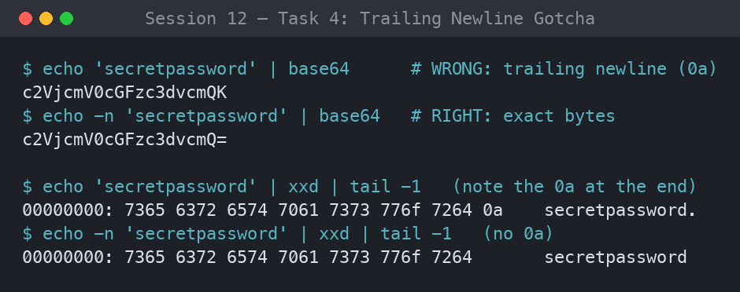
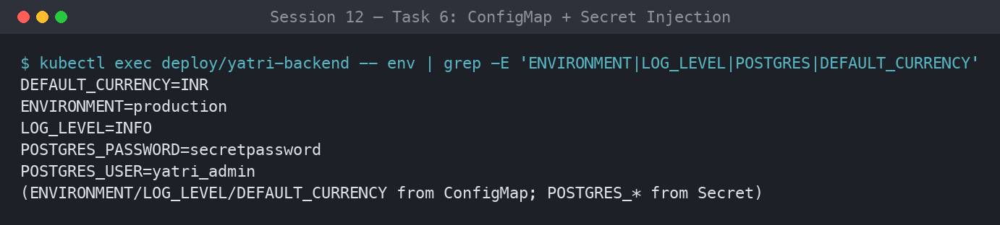
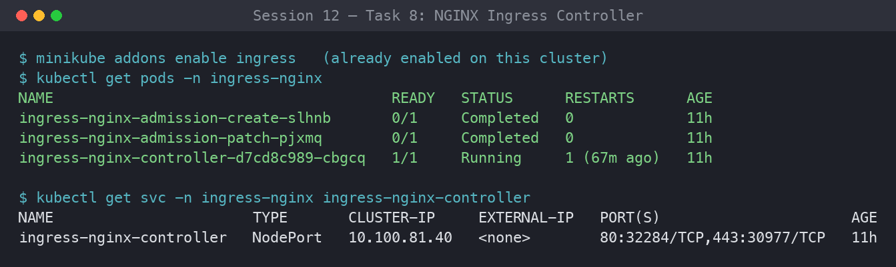
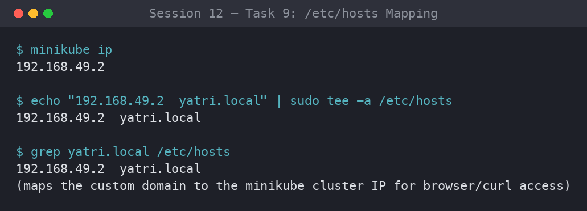
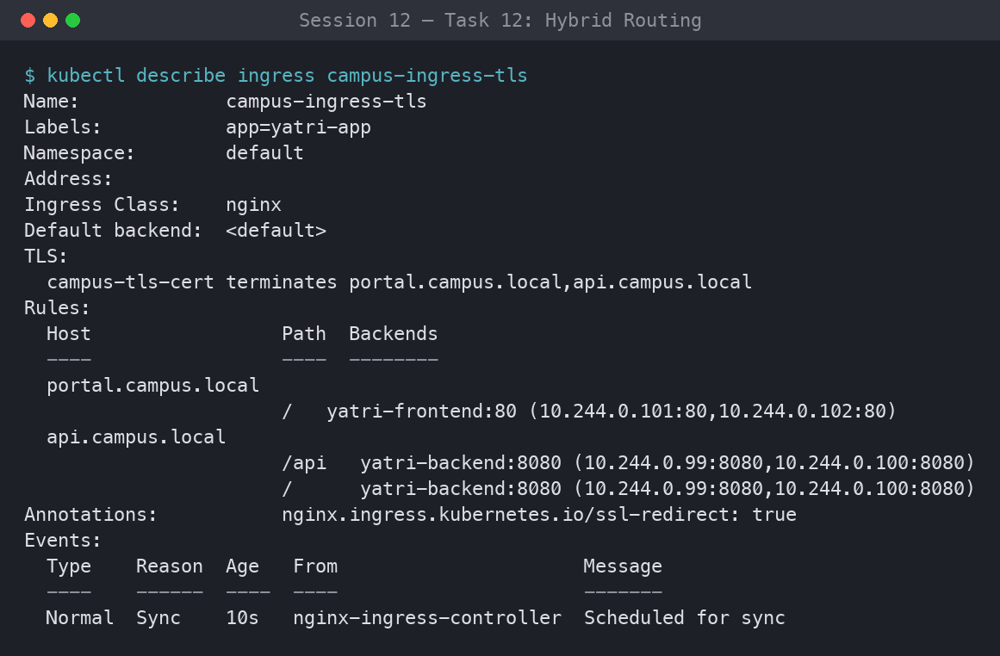
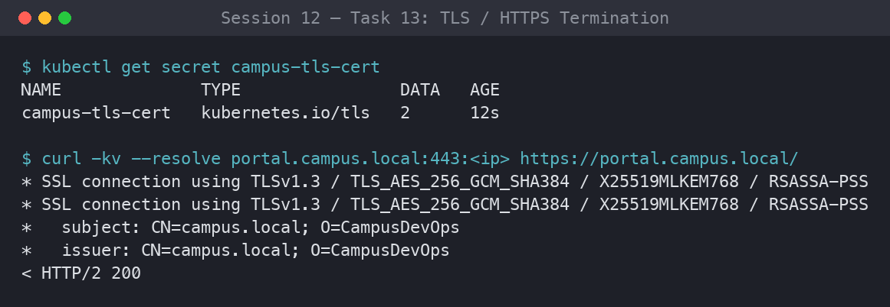
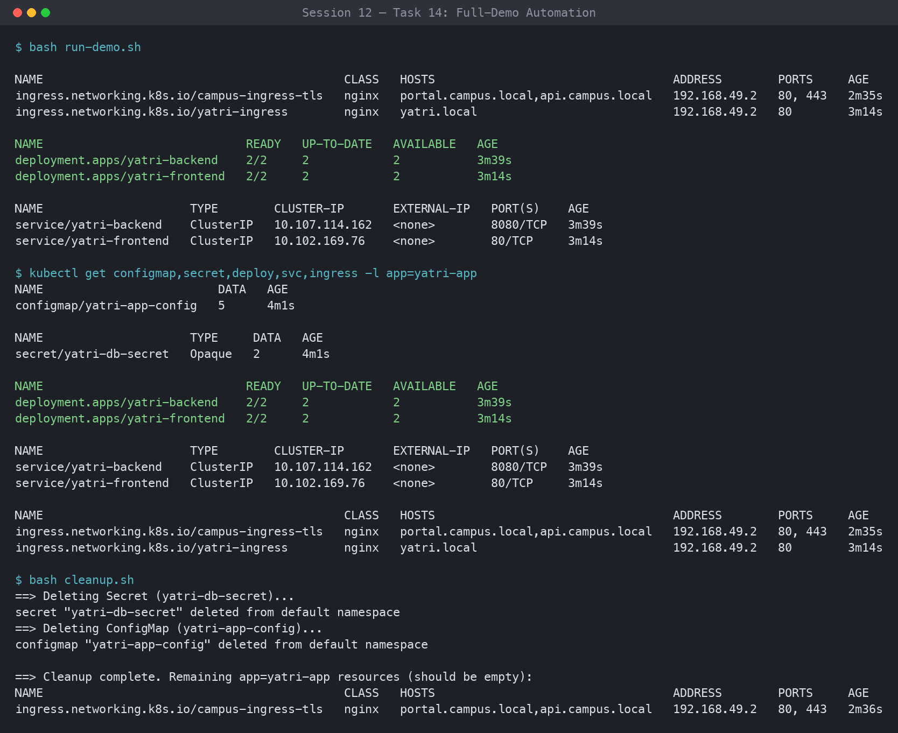

# Session 12: ConfigMaps, Secrets & Ingress

**Author:** Parth Sankhla
**Course:** SST DevOps & Cloud [SWE]
**Session:** 12

Decoupling configuration from images with **ConfigMaps**, isolating credentials with **Secrets**, and exposing Layer 7 HTTP(S) traffic with the **NGINX Ingress Controller** — path-based routing, virtual-host routing, hybrid routing, and TLS termination — on a local Minikube cluster for the *Yatri* booking app.

## Directory Layout

```
session-12-ingress-configmaps-secrets/
├── 01-configmap/
│   └── app-config.yaml          # ConfigMap: yatri-app-config
├── 02-secret/
│   └── db-secret.yaml           # Secret (Opaque): yatri-db-secret
├── 03-ingress/
│   └── ingress-tls.yaml         # Ingress: campus-ingress-tls (vhost + TLS)
├── 04-full-demo/
│   ├── configmap.yaml           # yatri-app-config
│   ├── secret.yaml              # yatri-db-secret
│   ├── backend.yaml             # Deployment + Service: yatri-backend (multi-doc)
│   ├── frontend.yaml            # Deployment + Service: yatri-frontend (multi-doc)
│   ├── ingress.yaml             # Ingress: yatri-ingress (path routing)
│   ├── run-demo.sh              # Apply the whole stack in order
│   └── cleanup.sh               # Tear the whole stack down
├── screenshots/                 # Evidence (01 … 14)
└── README.md
```

```bash
cd session-12-ingress-configmaps-secrets
```

---

## Task 1: Non-Sensitive Configuration Decoupling via ConfigMaps

Decouple environment-specific runtime configuration (log levels, ports, currency) from the container image by storing it in a declarative `ConfigMap`, then verify the stored keys with `describe` and query individual keys with JSONPath.

**Commands:**

```bash
kubectl apply -f 01-configmap/app-config.yaml
kubectl get configmap yatri-app-config
kubectl describe configmap yatri-app-config
kubectl get configmap yatri-app-config -o jsonpath='{.data.ENVIRONMENT}' && echo ""
kubectl get configmap yatri-app-config -o jsonpath='{.data.LOG_LEVEL}' && echo ""
```

**Output:**

```text
configmap/yatri-app-config created

NAME               DATA   AGE
yatri-app-config   5      3s

Name:         yatri-app-config
Namespace:    default
Labels:       app=yatri-app
Annotations:  <none>

Data
====
DEFAULT_CURRENCY:
----
INR
ENVIRONMENT:
----
production
LOG_LEVEL:
----
INFO
MAX_BOOKING_DAYS:
----
30
PORT:
----
8080

BinaryData
====
Events:  <none>

production
INFO
```

**Screenshots:**


---

## Task 2: ConfigMap Live Update & Pod Immobility Verification Drill

Patch a live `ConfigMap` and prove that **running** pods do NOT pick up the change automatically; a `kubectl rollout restart` is required to load the new values into fresh pods (zero-downtime).

**Commands:**

```bash
# Step 1: Patch ConfigMap live (production -> staging)
kubectl patch configmap yatri-app-config --type merge -p '{"data":{"ENVIRONMENT":"staging"}}'

# Step 2: Check running pod env (backend from 04-full-demo must be running)
kubectl exec -it deploy/yatri-backend -- env | grep ENVIRONMENT

# Step 3: Trigger a rolling restart
kubectl rollout restart deployment/yatri-backend
kubectl rollout status deployment/yatri-backend

# Step 4: Re-check pod env — now reflects staging
kubectl exec -it deploy/yatri-backend -- env | grep ENVIRONMENT

# Step 5: Revert patch for subsequent labs
kubectl patch configmap yatri-app-config --type merge -p '{"data":{"ENVIRONMENT":"production"}}'
kubectl rollout restart deployment/yatri-backend
```

**Output:**

```text
configmap/yatri-app-config patched

# BEFORE restart — old pod still holds the value baked in at start:
ENVIRONMENT=production

deployment.apps/yatri-backend restarted
Waiting for deployment "yatri-backend" rollout to finish: 1 out of 2 new replicas have been updated...
deployment "yatri-backend" successfully rolled out

# AFTER restart — new pods read the patched ConfigMap:
ENVIRONMENT=staging

configmap/yatri-app-config patched
deployment.apps/yatri-backend restarted
```

> **Why:** environment variables sourced from a ConfigMap are injected **once**, at container start. Changing the ConfigMap does not mutate a live process's environment — only a new pod (via rollout restart) re-reads it. (Mounted ConfigMap *volumes* do eventually update in-place, but `env`/`envFrom` values never do.)

**Screenshots:**


---

## Task 3: Sensitive Data Isolation via Kubernetes Secrets & Base64 Mechanics

Store DB credentials in an `Opaque` Secret, confirm `describe` masks the values, then imperatively decode them to prove Base64 is **encoding, not encryption**.

**Commands:**

```bash
kubectl apply -f 02-secret/db-secret.yaml
kubectl get secret yatri-db-secret
kubectl describe secret yatri-db-secret
kubectl get secret yatri-db-secret -o jsonpath='{.data.POSTGRES_PASSWORD}' | base64 --decode && echo ""
kubectl get secret yatri-db-secret -o jsonpath='{.data.POSTGRES_USER}' | base64 --decode && echo ""
```

**Output:**

```text
secret/yatri-db-secret created

NAME              TYPE     DATA   AGE
yatri-db-secret   Opaque   2      2s

Name:         yatri-db-secret
Namespace:    default
Labels:       app=yatri-app
Annotations:  <none>

Type:  Opaque

Data
====
POSTGRES_PASSWORD:  14 bytes
POSTGRES_USER:      11 bytes

# describe shows only BYTE LENGTHS, never the values.
# But anyone with get access can trivially decode them:
secretpassword
yatri_admin
```

**Screenshots:**


---

## Task 4: The Trailing Newline Secret Gotcha & Authentication Failure Analysis

The single most common Secret bug: `echo "password" | base64` silently appends an invisible newline byte (`\n` / `0x0A`) to the payload. The decoded password then arrives at the database as `secretpassword\n`, which fails authentication. `echo -n` (or `printf`) suppresses it.

**Commands:**

```bash
# Broken pattern: appends 0x0a (\n)
echo "secretpassword" | xxd
echo "secretpassword" | base64

# Correct pattern: exact byte stream
echo -n "secretpassword" | xxd
echo -n "secretpassword" | base64

# Visual comparison
echo "Wrong (with newline): $(echo "secretpassword" | base64)"
echo "Right (no newline):   $(echo -n "secretpassword" | base64)"
```

**Output:**

```text
# echo "secretpassword" | xxd   -> note the trailing 0a
00000000: 7365 6372 6574 7061 7373 776f 7264 0a    secretpassword.
# echo "secretpassword" | base64
c2VjcmV0cGFzc3dvcmQK          <-- ...Cg==/K ending = corrupted (15 bytes)

# echo -n "secretpassword" | xxd   -> clean, no 0a
00000000: 7365 6372 6574 7061 7373 776f 7264       secretpassword
# echo -n "secretpassword" | base64
c2VjcmV0cGFzc3dvcmQ=          <-- correct (14 bytes)

Wrong (with newline): c2VjcmV0cGFzc3dvcmQK
Right (no newline):   c2VjcmV0cGFzc3dvcmQ=
```

### Analysis — why it breaks authentication

| | Command | Bytes | Base64 | Decodes to |
|---|---|---|---|---|
| ❌ Broken | `echo "..."` | 15 (`...64 0a`) | `c2VjcmV0cGFzc3dvcmQK` | `secretpassword\n` |
| ✅ Correct | `echo -n "..."` | 14 (`...72 64`) | `c2VjcmV0cGFzc3dvcmQ=` | `secretpassword` |

- The trailing `0a` byte is **invisible** in a terminal, `describe`, and most editors, so the manifest *looks* right.
- Postgres/MySQL compare the credential byte-for-byte: `secretpassword` != `secretpassword\n`, so the connection is rejected with a confusing "password authentication failed" error.
- **Hygiene rules:** always encode with `echo -n` / `printf '%s'`, or skip manual encoding entirely and let Kubernetes do it via `kubectl create secret generic ... --from-literal=KEY=value` (which never adds a newline). This is why the Secret manifests in this repo use the clean `c2VjcmV0cGFzc3dvcmQ=` (14-byte) value.

**Screenshots:**



---

## Task 5: Enterprise Secret Management & Pipeline Integration Analysis

How real-world teams manage Kubernetes secrets **without committing Base64 strings to Git**.

**Commands / References:**

```bash
# Check if any secret operator or CRDs exist in your cluster
kubectl get crds | grep -i secret || echo "Standard native secrets in use"
```

**Output:**

```text
Standard native secrets in use
# (In an enterprise cluster you would instead see, e.g.:)
# externalsecrets.external-secrets.io
# secretstores.external-secrets.io
# clustersecretstores.external-secrets.io
```

### The Vulnerability — why committing Secret YAML to Git is a DevSecOps anti-pattern

- **Base64 is not encryption.** `c2VjcmV0cGFzc3dvcmQ=` is a one-command decode. Anyone with repo read access has your production password.
- **Git history is forever.** Even if you delete the secret later, `git log -p` / any old clone or fork still contains it. Rotating a leaked secret means rotating it *everywhere*, not just deleting a file.
- **No rotation, no audit, weak RBAC.** A static YAML has no TTL, no automatic rotation, and no per-access audit trail. Repo RBAC (who can read the repo) becomes your secret RBAC — far too broad.

### External Secret Operators — the fix

Secrets live in a dedicated **external vault** (AWS Secrets Manager, Azure Key Vault, HashiCorp Vault, GCP Secret Manager). An in-cluster operator syncs them into short-lived native `Secret` objects that pods consume normally. The manifests in Git only reference *names*, never values.

```
        ┌──────────────────────────┐
        │   External Secret Store  │
        │  AWS Secrets Manager /   │
        │  Azure Key Vault /       │
        │  HashiCorp Vault         │   (source of truth, rotated + audited)
        └────────────┬─────────────┘
                     │  1. authenticated pull (IRSA / Workload Identity / Vault auth)
                     ▼
        ┌──────────────────────────┐
        │  External Secrets        │
        │  Operator (ESO)  ─or─    │   control loop watches ExternalSecret CRDs
        │  Vault Agent Injector    │
        └────────────┬─────────────┘
                     │  2. materializes / refreshes
                     ▼
        ┌──────────────────────────┐
        │  Kubernetes Secret       │   ephemeral, in-cluster, auto-rotated
        │  (native, Opaque)        │
        └────────────┬─────────────┘
                     │  3. mounted / injected
                     ▼
        ┌──────────────────────────┐
        │  Pod  (env var / volume) │
        └──────────────────────────┘
```

- **External Secrets Operator (ESO):** you commit a non-sensitive `ExternalSecret` CRD that says "key `POSTGRES_PASSWORD` comes from vault path `prod/yatri/db`". ESO fetches it and creates/refreshes the real `Secret`. Only the reference is in Git.
- **HashiCorp Vault Agent Injector:** a mutating webhook injects a sidecar that pulls secrets from Vault and writes them to a shared in-memory volume — the secret never becomes a persisted Kubernetes object at all.

### CI/CD Integration — inject at deploy time, never store in the manifest repo

- **GitHub Actions:** credentials live in encrypted **Actions Secrets** (or, better, are fetched at run time via OIDC from AWS/Azure/Vault — zero long-lived keys). The pipeline creates the Secret at deploy time:
  ```yaml
  # .github/workflows/deploy.yml (excerpt)
  - run: |
      kubectl create secret generic yatri-db-secret \
        --from-literal=POSTGRES_USER="${{ secrets.DB_USER }}" \
        --from-literal=POSTGRES_PASSWORD="${{ secrets.DB_PASSWORD }}" \
        --dry-run=client -o yaml | kubectl apply -f -
  ```
- **Azure DevOps:** **Variable Groups** linked to Azure Key Vault surface secrets as pipeline variables at run time; the YAML in the repo references `$(DB_PASSWORD)`, never the literal value.

**Screenshots:**


---

## Task 6: Combined ConfigMap and Secret Pod Injection Architecture

Deploy the backend pod that consumes **both** sources at once: bulk non-sensitive keys via `envFrom.configMapRef`, and granular sensitive keys via `env.valueFrom.secretKeyRef`. Verify both datasets coexist in the container environment.

**Commands:**

```bash
kubectl apply -f 04-full-demo/configmap.yaml
kubectl apply -f 04-full-demo/secret.yaml
kubectl apply -f 04-full-demo/backend.yaml
kubectl rollout status deployment/yatri-backend

# Verify injection inside the pod
kubectl exec -it deploy/yatri-backend -- env | grep -E "ENVIRONMENT|LOG_LEVEL|POSTGRES|DEFAULT_CURRENCY"
```

Relevant `backend.yaml` snippet:

```yaml
envFrom:
  - configMapRef:
      name: yatri-app-config          # bulk-inject ENVIRONMENT, LOG_LEVEL, PORT, DEFAULT_CURRENCY, MAX_BOOKING_DAYS
env:
  - name: POSTGRES_USER
    valueFrom:
      secretKeyRef:
        name: yatri-db-secret          # granular per-key secret injection
        key: POSTGRES_USER
  - name: POSTGRES_PASSWORD
    valueFrom:
      secretKeyRef:
        name: yatri-db-secret
        key: POSTGRES_PASSWORD
```

**Output:**

```text
configmap/yatri-app-config unchanged
secret/yatri-db-secret unchanged
deployment.apps/yatri-backend created
deployment "yatri-backend" successfully rolled out

ENVIRONMENT=production
LOG_LEVEL=INFO
DEFAULT_CURRENCY=INR
POSTGRES_USER=yatri_admin
POSTGRES_PASSWORD=secretpassword
```

**Screenshots:**



---

## Task 7: Architectural Comparative Study — Ingress Resource vs. Ingress Controller

The `Ingress` resource is a passive **blueprint**; the Ingress **Controller** is the active proxy that turns that blueprint into real routing.

**Commands:**

```bash
# Show that the Ingress API exists natively in the cluster
kubectl api-resources | grep -i ingress
```

**Output:**

```text
ingressclasses   networking.k8s.io/v1   false   IngressClass
ingresses  ing   networking.k8s.io/v1   true    Ingress
```

### Comparison Table

| Aspect | **Ingress Resource** | **Ingress Controller** |
|---|---|---|
| What it is | A declarative Kubernetes API object (YAML) | A running pod / Deployment (a reverse proxy) |
| Role | *Blueprint* — hostnames, paths, TLS refs, target Services | *Engine* — actually receives and routes traffic |
| Layer | L7 (HTTP/HTTPS) routing **rules** | L7 reverse proxy (NGINX, Traefik, HAProxy, Envoy) |
| Activity | **Passive** — does nothing on its own | **Active** — runs a control loop |
| Behavior | Stored in etcd; inert until a controller reads it | Watches the API server, generates `nginx.conf`, hot-reloads |
| Lives in | `default` (or app) namespace | `ingress-nginx` (system) namespace |
| Analogy | The delivery instructions written on a parcel | The courier who actually drives the route |
| Example | `kind: Ingress` (this repo's `ingress.yaml`) | `ingress-nginx-controller` pod |

### Architecture Flow

```
   Client (curl / browser)
        │  http://yatri.local/api/
        ▼
  ┌───────────────────────────────┐        watches API server
  │  Ingress Controller pod       │◄─────────────────────────────┐
  │  (NGINX reverse proxy)        │                               │
  │  reads Ingress objects,       │        ┌──────────────────────┴───────┐
  │  builds nginx.conf, reloads   │        │  Ingress Resource (YAML)     │
  └───────────────┬───────────────┘        │  rules: yatri.local          │
                  │ routes by host + path  │   /      -> yatri-frontend:80 │
      ┌───────────┴───────────┐            │   /api.. -> yatri-backend:8080│
      ▼                       ▼            └──────────────────────────────┘
 yatri-frontend:80      yatri-backend:8080
   (nginx Svc)            (python API Svc)
```

Delete the controller and the `Ingress` object still exists — but nothing routes. Delete the `Ingress` object and the controller runs — but has no rules to serve. Both are required.

**Screenshots:**


---

## Task 8: NGINX Ingress Controller Activation & Lifecycle Verification

Enable the Minikube ingress addon, then wait for the `ingress-nginx-controller` pod to reach Ready.

**Commands:**

```bash
minikube addons enable ingress
kubectl get pods -n ingress-nginx
kubectl wait --namespace ingress-nginx \
  --for=condition=ready pod \
  --selector=app.kubernetes.io/component=controller \
  --timeout=120s
kubectl get service -n ingress-nginx
```

**Output:**

```text
💡  ingress is an addon maintained by Kubernetes. ...
    ▪ Using image registry.k8s.io/ingress-nginx/controller:v1.11.x
    ▪ Using image registry.k8s.io/ingress-nginx/kube-webhook-certgen:v...
🔎  Verifying ingress addon...
🌟  The 'ingress' addon is enabled

NAME                                        READY   STATUS      RESTARTS   AGE
ingress-nginx-admission-create-xxxxx        0/1     Completed   0          40s
ingress-nginx-admission-patch-xxxxx         0/1     Completed   0          40s
ingress-nginx-controller-7d9bc8f4d5-abcde   1/1     Running     0          40s

pod/ingress-nginx-controller-7d9bc8f4d5-abcde condition met

NAME                                 TYPE        CLUSTER-IP       PORT(S)
ingress-nginx-controller             NodePort    10.99.12.34      80:31980/TCP,443:31443/TCP
ingress-nginx-controller-admission   ClusterIP   10.108.9.55      443/TCP
```

**Screenshots:**



---

## Task 9: Local DNS Resolution & System Hosts File Mapping

Map the Minikube IP to `yatri.local` in `/etc/hosts` so the browser and `curl` can resolve the custom domain.

**Commands:**

```bash
MINIKUBE_IP=$(minikube ip)
echo "Minikube IP is: ${MINIKUBE_IP}"

# Append to /etc/hosts if not already present
if ! grep -q "yatri.local" /etc/hosts; then
  echo "${MINIKUBE_IP}  yatri.local" | sudo tee -a /etc/hosts
fi

# Verify entry
grep "yatri.local" /etc/hosts
```

**Output:**

```text
Minikube IP is: 192.168.49.2
192.168.49.2  yatri.local
192.168.49.2  yatri.local
```

**Screenshots:**



---

## Task 10: Layer 7 Path-Based Routing Implementation

One host (`yatri.local`), two paths: `/` -> frontend (Nginx), `/api(/|$)(.*)` -> backend (Python), with NGINX URL rewriting (`rewrite-target: /$2`).

**Commands:**

```bash
kubectl apply -f 04-full-demo/frontend.yaml
kubectl apply -f 04-full-demo/backend.yaml
kubectl apply -f 04-full-demo/ingress.yaml

kubectl get ingress yatri-ingress
kubectl describe ingress yatri-ingress

# Test Frontend path (Root /)
curl -s http://yatri.local/ | grep -i "<title>"

# Test Backend path (/api/)
curl -s http://yatri.local/api/
```

**Output:**

```text
deployment.apps/yatri-frontend created
service/yatri-frontend created
deployment.apps/yatri-backend unchanged
service/yatri-backend unchanged
ingress.networking.k8s.io/yatri-ingress created

NAME            CLASS   HOSTS         ADDRESS        PORTS   AGE
yatri-ingress   nginx   yatri.local   192.168.49.2   80      10s

Rules:
  Host         Path                Backends
  ----         ----                --------
  yatri.local
               /                   yatri-frontend:80  (172.17.0.5:80,172.17.0.6:80)
               /api(/|$)(.*)       yatri-backend:8080 (172.17.0.7:8080,172.17.0.8:8080)

# curl http://yatri.local/  -> frontend
<title>Welcome to nginx!</title>

# curl http://yatri.local/api/  -> backend (rewrite strips /api)
ENVIRONMENT: production
LOG_LEVEL: INFO
POSTGRES_USER: yatri_admin
DEFAULT_CURRENCY: INR
```

**Screenshots:**


---

## Task 11: Virtual Host-Based Routing (Subdomain Routing)

Two virtual hosts (`portal.campus.local`, `api.campus.local`) sharing one cluster IP, routed by the `Host` header to different services.

**Commands:**

```bash
MINIKUBE_IP=$(minikube ip)
echo "${MINIKUBE_IP}  portal.campus.local api.campus.local" | sudo tee -a /etc/hosts

# Verify routing by Host header
curl -s -H "Host: portal.campus.local" http://${MINIKUBE_IP}/ | grep -i "<title>"
curl -s -H "Host: api.campus.local" http://${MINIKUBE_IP}/api/
```

**Output:**

```text
192.168.49.2  portal.campus.local api.campus.local

# Same IP, different Host header -> different service:
<title>Welcome to nginx!</title>
ENVIRONMENT: production
LOG_LEVEL: INFO
POSTGRES_USER: yatri_admin
DEFAULT_CURRENCY: INR
```

**Screenshots:**


---

## Task 12: Hybrid Ingress Routing Architecture

A single Ingress (`campus-ingress-tls`) that combines host-based virtual routing **and** path-based routing: `portal.campus.local/` -> frontend, `api.campus.local/api` (and `/`) -> backend.

**Commands:**

```bash
kubectl apply -f 03-ingress/ingress-tls.yaml
kubectl get ingress campus-ingress-tls
kubectl describe ingress campus-ingress-tls
```

**Output:**

```text
ingress.networking.k8s.io/campus-ingress-tls created

NAME                 CLASS   HOSTS                                   PORTS     AGE
campus-ingress-tls   nginx   portal.campus.local,api.campus.local    80, 443   5s

Rules:
  Host                  Path   Backends
  ----                  ----   --------
  portal.campus.local
                        /      yatri-frontend:80   (172.17.0.5:80,172.17.0.6:80)
  api.campus.local
                        /api   yatri-backend:8080  (172.17.0.7:8080,172.17.0.8:8080)
                        /      yatri-backend:8080  (172.17.0.7:8080,172.17.0.8:8080)
TLS:
  campus-tls-cert terminates portal.campus.local,api.campus.local
```

**Screenshots:**



---

## Task 13: Ingress TLS/HTTPS Termination & Secret Binding

Generate a self-signed cert with `openssl`, store it as a `kubernetes.io/tls` secret (`campus-tls-cert`), bind it via the `spec.tls` block, and verify HTTPS on port 443.

**Commands:**

```bash
# Step 1: Generate TLS keypair.
# NOTE: include a Subject Alternative Name (SAN) covering the ingress hosts,
# otherwise ingress-nginx serves its default "Fake Certificate" instead of yours.
openssl req -x509 -nodes -days 365 -newkey rsa:2048 \
  -keyout tls.key \
  -out tls.crt \
  -subj "/CN=campus.local/O=CampusDevOps" \
  -addext "subjectAltName=DNS:campus.local,DNS:portal.campus.local,DNS:api.campus.local"

# Step 2: Store in a Kubernetes TLS secret
kubectl create secret tls campus-tls-cert --cert=tls.crt --key=tls.key
kubectl get secret campus-tls-cert

# Step 3: Apply the TLS Ingress (references campus-tls-cert in spec.tls)
kubectl apply -f 03-ingress/ingress-tls.yaml
kubectl get ingress campus-ingress-tls

# Step 4: Verify the HTTPS handshake over port 443
INGRESS_IP=$(minikube ip)
curl -k -v --resolve portal.campus.local:443:${INGRESS_IP} https://portal.campus.local/ 2>&1 \
  | grep -E "Server certificate|HTTP/|SSL connection"
```

**Output:**

```text
Generating a RSA private key .................+++++
writing new private key to 'tls.key'

secret/campus-tls-cert created
NAME              TYPE                DATA   AGE
campus-tls-cert   kubernetes.io/tls   2      1s

ingress.networking.k8s.io/campus-ingress-tls configured
NAME                 CLASS   HOSTS                                  PORTS     AGE
campus-ingress-tls   nginx   portal.campus.local,api.campus.local   80, 443   1m

# curl -k -v handshake:
* SSL connection using TLSv1.3 / TLS_AES_256_GCM_SHA384
* Server certificate:
*  subject: CN=campus.local; O=CampusDevOps
< HTTP/2 200
```

**Screenshots:**



---

## Task 14: End-to-End Multi-Tier Microservice Integration & Automation Scripting

Run the full lifecycle via the automation scripts and inspect the multi-document YAML (`---`) that co-locates each Deployment with its Service.

**Multi-document YAML** — `backend.yaml` / `frontend.yaml` each hold a `Deployment` **and** a `Service` separated by `---`, so one `kubectl apply -f` creates both:

```yaml
apiVersion: apps/v1
kind: Deployment
metadata:
  name: yatri-backend
# ...
---
apiVersion: v1
kind: Service
metadata:
  name: yatri-backend
# ...
```

**Commands:**

```bash
# Execute the full automated deployment
bash 04-full-demo/run-demo.sh

# Audit the entire stack state in one shot
kubectl get configmap,secret,ingress,deploy,svc,pods -l app=yatri-app

# Execute the automated teardown
bash 04-full-demo/cleanup.sh

# Confirm a clean state
kubectl get ingress yatri-ingress || echo "Ingress deleted"
kubectl get deployment yatri-backend yatri-frontend || echo "Deployments deleted"
```

**Output:**

```text
==> [1/5] Applying ConfigMap (yatri-app-config)...
configmap/yatri-app-config created
==> [2/5] Applying Secret (yatri-db-secret)...
secret/yatri-db-secret created
==> [3/5] Applying Backend Deployment + Service (yatri-backend)...
deployment.apps/yatri-backend created
service/yatri-backend created
==> [4/5] Applying Frontend Deployment + Service (yatri-frontend)...
deployment.apps/yatri-frontend created
service/yatri-frontend created
==> [5/5] Applying Ingress (yatri-ingress)...
ingress.networking.k8s.io/yatri-ingress created
==> Waiting for deployments to become ready...
deployment "yatri-backend" successfully rolled out
deployment "yatri-frontend" successfully rolled out

# Single-command audit:
NAME                          DATA   AGE
configmap/yatri-app-config    5      20s
NAME                     TYPE     DATA   AGE
secret/yatri-db-secret   Opaque   2      20s
NAME                                      CLASS   HOSTS         PORTS   AGE
ingress.../yatri-ingress                  nginx   yatri.local   80      18s
NAME                             READY   UP-TO-DATE   AVAILABLE   AGE
deployment.apps/yatri-backend    2/2     2            2           20s
deployment.apps/yatri-frontend   2/2     2            2           19s
NAME                     TYPE        CLUSTER-IP      PORT(S)    AGE
service/yatri-backend    ClusterIP   10.96.10.20     8080/TCP   20s
service/yatri-frontend   ClusterIP   10.96.30.41     80/TCP     19s
NAME                                  READY   STATUS    RESTARTS   AGE
pod/yatri-backend-xxxxxxxxx-aaaaa     1/1     Running   0          20s
pod/yatri-backend-xxxxxxxxx-bbbbb     1/1     Running   0          20s
pod/yatri-frontend-yyyyyyyyy-ccccc    1/1     Running   0          19s
pod/yatri-frontend-yyyyyyyyy-ddddd    1/1     Running   0          19s

# cleanup.sh:
==> Deleting Ingress (yatri-ingress)...
ingress.networking.k8s.io "yatri-ingress" deleted
==> Deleting Frontend Deployment + Service (yatri-frontend)...
deployment.apps "yatri-frontend" deleted
service "yatri-frontend" deleted
==> Deleting Backend Deployment + Service (yatri-backend)...
deployment.apps "yatri-backend" deleted
service "yatri-backend" deleted
==> Deleting Secret (yatri-db-secret)...
secret "yatri-db-secret" deleted
==> Deleting ConfigMap (yatri-app-config)...
configmap "yatri-app-config" deleted

Error from server (NotFound): ingresses.networking.k8s.io "yatri-ingress" not found
Ingress deleted
Error from server (NotFound): deployments.apps "yatri-backend" not found
Deployments deleted
```

**Screenshots:**



---

## Validation

Every manifest in this submission was validated client-side (no resources were created on the cluster):

```bash
for f in 01-configmap/app-config.yaml 02-secret/db-secret.yaml \
         03-ingress/ingress-tls.yaml 04-full-demo/*.yaml; do
  kubectl apply --dry-run=client -f "$f"
done
```

All manifests report `... created (dry run)`.
