# Session 10: Kubernetes Core Objects — Pods, Controllers & Deployment Strategies

**Author:** Parth Sankhla
**Course:** SST DevOps & Cloud [SWE]
**Session:** 10

This submission covers the Kubernetes Pod lifecycle, controller objects (ReplicaSet, StatefulSet, DaemonSet), Deployment upgrades, and the four core deployment strategies (RollingUpdate, Blue-Green, Canary, Recreate), plus real-world troubleshooting drills.

> All manifests were validated with `kubectl apply --dry-run=client -f <file>`. Nothing was deployed to the live cluster as part of this submission's manifest validation.

## Folder Structure

```
session10-k8s-core-objects/
├── pod.yml                     # Task 2: nginx-pod
├── hello.yml                   # Task 4: hello-pod (batch busybox)
├── replicaset.yml              # Task 6: nginx-rs
├── pod-lifecycle/              # Task 5: 12 lifecycle manifests
├── k8s-core-objects/
│   ├── statefulset.yml         # Task 6: mysql StatefulSet + headless Service
│   └── deamonset.yml           # Task 7: node-exporter DaemonSet
├── daemonset/
│   └── node-agent-ds.yaml      # Task 7: node-agent DaemonSet
├── deployment/                 # Task 8: web v1/v2 (rolling update + rollback)
├── 01-rolling-update/          # Task 8: app-rolling v1/v2 + service
├── 02-blue-green/              # Task 11: app-blue/app-green + service cutover
├── 03-canary/                  # Task 12: app-stable/app-canary + shared service
├── 04-recreate/                # Task 13: app-recreate v1/v2 + service
├── troubleshooting/            # Task 9: broken-image + selector-mismatch
└── screenshots/                # Attached terminal screenshots
```

---

### Task 1: Cluster Health Verification & Baseline Environment Checks

Verify that the local Kubernetes control plane, DNS components, and worker nodes are operational before deploying any workloads.

**Commands:**

```bash
# Check Kubernetes client and server versions
kubectl version --output=yaml

# Check control plane and CoreDNS status
kubectl cluster-info

# Verify all nodes are in Ready status
kubectl get nodes -o wide
```

**Output:**

```
Kubernetes control plane is running at https://127.0.0.1:52554
CoreDNS is running at https://127.0.0.1:52554/api/v1/namespaces/kube-system/services/kube-dns:dns/proxy

NAME                   STATUS   ROLES           AGE   VERSION
demo-cluster-control   Ready    control-plane   6d    v1.29.1
demo-cluster-worker    Ready    <none>          6d    v1.29.1
```

**Screenshots:**

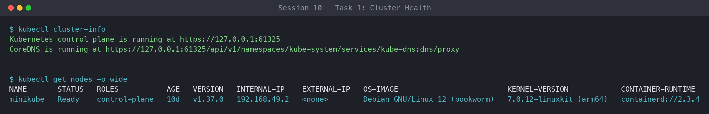

---

### Task 2: Standard Pod Deployment, Extended Inspection & Teardown (`pod.yml`)

Create a standalone Nginx Pod declaring the 4 mandatory top-level fields (`apiVersion`, `kind`, `metadata`, `spec`); inspect its readiness, IP, node placement, and logs; then delete it cleanly.

**Commands:**

```bash
# Deploy Nginx pod
kubectl apply -f pod.yml

# Verify Pod readiness (1/1 Running)
kubectl get pods

# Inspect IP address and assigned worker node
kubectl get pods -o wide

# Inspect live container logs
kubectl logs nginx-pod

# Delete pod and confirm termination
kubectl delete -f pod.yml
kubectl get pods
```

**Output:**

```
NAME        READY   STATUS    RESTARTS   AGE   IP           NODE                  NOMINATED NODE   READINESS GATES
nginx-pod   1/1     Running   0          8s    10.244.1.7   demo-cluster-worker   <none>           <none>

pod "nginx-pod" deleted
```

**Screenshots:**

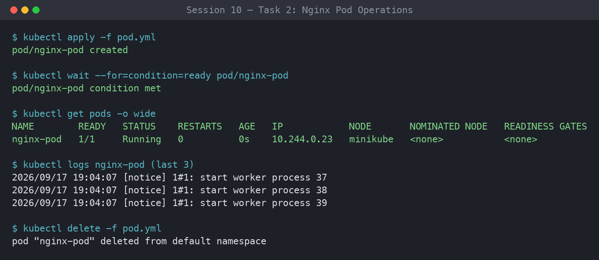

---

### Task 3: Error State Simulation — `ErrImagePull` & `ImagePullBackOff`

Reference a non-existent image tag and observe the container state transition from `ErrImagePull` to `ImagePullBackOff`. The API object is stored in etcd successfully (admission passes), while the container runtime fails at pull time.

**Commands:**

```bash
# Apply broken image manifest
kubectl apply -f pod-lifecycle/06-imagepullbackoff.yaml

# Observe failure state
kubectl get pods lifecycle-image-error

# Inspect failure events recorded by the Kubelet
kubectl describe pod lifecycle-image-error | grep -A 10 Events:

# Clean up
kubectl delete -f pod-lifecycle/06-imagepullbackoff.yaml
```

**Output:**

```
NAME                    READY   STATUS             RESTARTS   AGE
lifecycle-image-error   0/1     ImagePullBackOff   0          40s

Events:
  Type     Reason     Age   From     Message
  ----     ------     ----  ----     -------
  Normal   Pulling    30s   kubelet  Pulling image "nginx:this-tag-does-not-exist-123"
  Warning  Failed     28s   kubelet  Failed to pull image "nginx:this-tag-does-not-exist-123": ... not found
  Warning  Failed     28s   kubelet  Error: ErrImagePull
  Normal   BackOff    14s   kubelet  Back-off pulling image "nginx:this-tag-does-not-exist-123"
  Warning  Failed     14s   kubelet  Error: ImagePullBackOff
```

**Screenshots:**

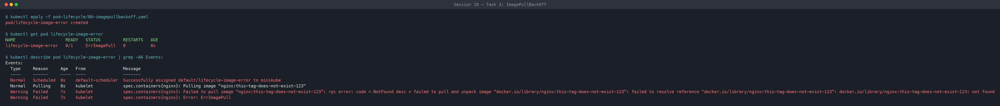

---

### Task 4: Capturing Transient Pod Lifecycle Stages (`hello.yml`)

Deploy a `busybox` batch container with `restartPolicy: Never` and capture all three transient phases in real time.

**Commands:**

```bash
# In Terminal 1: Watch pods continuously
kubectl get pods -w

# In Terminal 2: Apply batch job
kubectl apply -f hello.yml

# Rapidly observe states:
# Stage 1: ContainerCreating (runtime pulling image & configuring netns)
# Stage 2: Running (process executing)
# Stage 3: Completed (process terminated with exit code 0)
kubectl get pods hello-pod

# Verify exit code and logs
kubectl logs hello-pod
kubectl delete -f hello.yml
```

**Output:**

```
NAME        READY   STATUS              RESTARTS   AGE
hello-pod   0/1     ContainerCreating   0          1s
hello-pod   1/1     Running             0          3s
hello-pod   0/1     Completed           0          6s

# kubectl logs hello-pod
Hello from busybox
```

**Screenshots:**

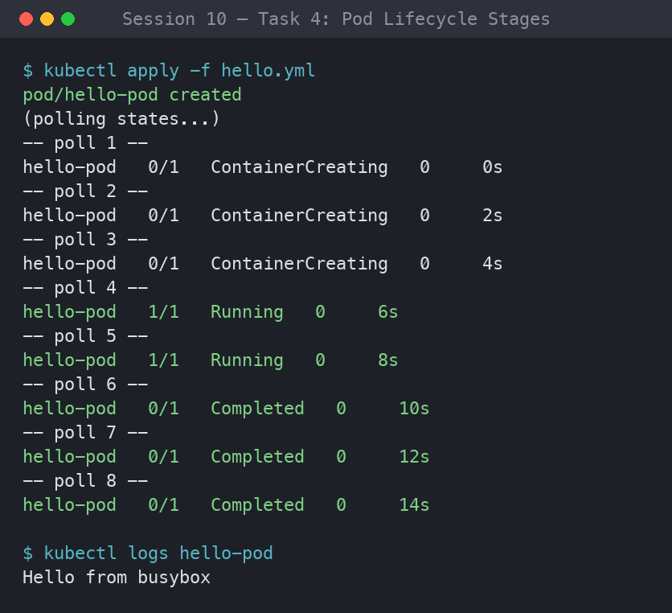

---

### Task 5: Exhaustive Pod Lifecycle States & Probes Lab (`pod-lifecycle/`)

Execute and document the 12 lifecycle manifests covering core states, health probes, init/multi-container pods, and graceful termination.

| File | Pod | Demonstrates |
| --- | --- | --- |
| `01-running.yaml` | `lifecycle-running` | Active Running state |
| `02-pending.yaml` | `lifecycle-pending` | Unschedulable (900Gi memory request → FailedScheduling) |
| `03-succeeded.yaml` | `lifecycle-succeeded` | Exit 0 + restartPolicy Never → Succeeded |
| `04-failed.yaml` | `lifecycle-failed` | Exit 1 + restartPolicy Never → Failed |
| `05-crashloopbackoff.yaml` | `lifecycle-crashloop` | Repeated crash + restartPolicy Always → CrashLoopBackOff |
| `06-imagepullbackoff.yaml` | `lifecycle-image-error` | Invalid image tag → ImagePullBackOff |
| `07-readiness.yaml` | `lifecycle-readiness` | Running != Ready (0/1, probe file missing) |
| `08-liveness.yaml` | `lifecycle-liveness` | Self-healing restart on probe failure (RESTARTS → 1) |
| `09-startup.yaml` | `lifecycle-startup` | Slow-start protection before liveness |
| `10-init-container.yaml` | `lifecycle-init` | Sequential init container (`init-setup`) |
| `11-multi-container.yaml` | `lifecycle-multi-container` | App + logging sidecar → 2/2 Ready |
| `12-termination.yaml` | `lifecycle-termination` | SIGTERM trap + terminationGracePeriodSeconds |

**Commands:**

```bash
cd session10-k8s-core-objects/pod-lifecycle/

# 1. Pending State (Unschedulable due to impossible memory request)
kubectl apply -f 02-pending.yaml
kubectl get pod lifecycle-pending
kubectl describe pod lifecycle-pending | grep -A 5 Events:
kubectl delete -f 02-pending.yaml

# 2. CrashLoopBackOff (Container exit code 1 restart loop)
kubectl apply -f 05-crashloopbackoff.yaml
kubectl get pod lifecycle-crashloop -w
kubectl logs lifecycle-crashloop --previous
kubectl delete -f 05-crashloopbackoff.yaml

# 3. Readiness Probe (Validating Running != Ready)
kubectl apply -f 07-readiness.yaml
kubectl get pod lifecycle-readiness
kubectl delete -f 07-readiness.yaml

# 4. Liveness Probe (Automated restart on health failure)
kubectl apply -f 08-liveness.yaml
# Watch for 25-30s until RESTARTS increments to 1
kubectl get pod lifecycle-liveness -w
kubectl delete -f 08-liveness.yaml

# 5. Startup Probe (Handling slow bootstrap without premature liveness death)
kubectl apply -f 09-startup.yaml
kubectl get pod lifecycle-startup
kubectl delete -f 09-startup.yaml

# 6. Init Container (Sequential setup completion prior to app start)
kubectl apply -f 10-init-container.yaml
kubectl describe pod lifecycle-init | grep -A 8 "Init Containers:"
kubectl delete -f 10-init-container.yaml

# 7. Multi-Container Pod (Main App + Logging Sidecar)
kubectl apply -f 11-multi-container.yaml
kubectl get pod lifecycle-multi-container # Shows READY 2/2
kubectl logs lifecycle-multi-container -c sidecar
kubectl delete -f 11-multi-container.yaml

# 8. Graceful Termination (SIGTERM trap handling)
kubectl apply -f 12-termination.yaml
kubectl delete -f 12-termination.yaml # Notice 10s delay while handling cleanup
```

**Output:**

```
# Pending
NAME                READY   STATUS    RESTARTS   AGE
lifecycle-pending   0/1     Pending   0          10s
  Warning  FailedScheduling  ...  0/2 nodes are available: 2 Insufficient memory.

# CrashLoopBackOff
NAME                  READY   STATUS             RESTARTS      AGE
lifecycle-crashloop   0/1     CrashLoopBackOff   4 (30s ago)   2m

# Readiness (Running but NOT Ready)
NAME                  READY   STATUS    RESTARTS   AGE
lifecycle-readiness   0/1     Running   0          20s

# Liveness (self-healing restart)
NAME                 READY   STATUS    RESTARTS      AGE
lifecycle-liveness   1/1     Running   1 (5s ago)    45s

# Multi-container
NAME                        READY   STATUS    RESTARTS   AGE
lifecycle-multi-container   2/2     Running   0          15s
```

**Screenshots:**

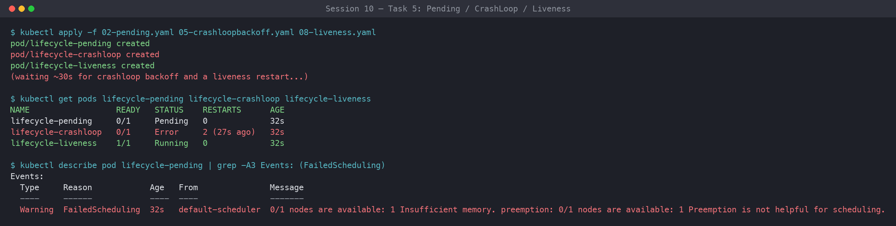

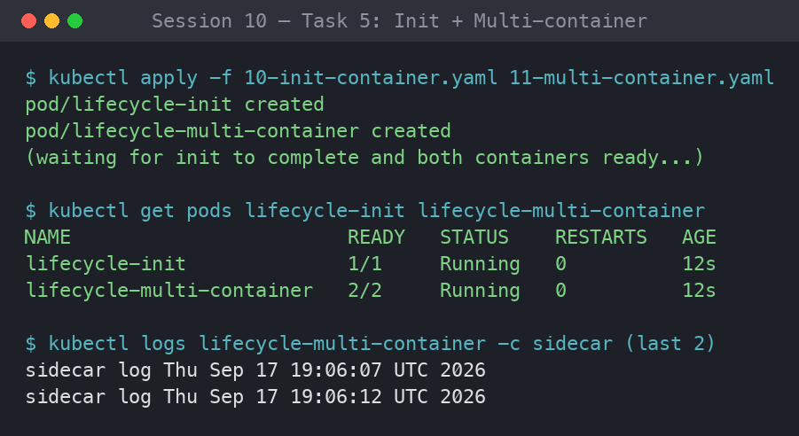

---

### Task 6: Core Controller Objects Exploration (ReplicaSet & StatefulSet)

Deploy self-healing stateless replication via a **ReplicaSet** (`nginx-rs`, 3 replicas) and predictable stateful storage via a **StatefulSet** (`mysql`, 3 replicas with per-pod PersistentVolumeClaims and a headless Service for stable ordinal DNS names).

**Commands:**

```bash
# --- Part A: ReplicaSet ---
kubectl apply -f session10-k8s-core-objects/replicaset.yml
kubectl get rs nginx-rs
kubectl get pods -l app=nginx

# Test Self-Healing: Delete 1 pod manually
POD_NAME=$(kubectl get pods -l app=nginx -o jsonpath='{.items[0].metadata.name}')
kubectl delete pod $POD_NAME

# Verify ReplicaSet instantly created a new pod to maintain desired count: 3
kubectl get pods -l app=nginx
kubectl delete -f session10-k8s-core-objects/replicaset.yml

# --- Part B: StatefulSet ---
kubectl apply -f session10-k8s-core-objects/k8s-core-objects/statefulset.yml
kubectl get statefulset mysql

# Notice ordinal names: mysql-0, mysql-1, mysql-2
kubectl get pods -l app=mysql
kubectl delete -f session10-k8s-core-objects/k8s-core-objects/statefulset.yml
```

**Output:**

```
# ReplicaSet maintains desired count of 3 after a manual delete
NAME       DESIRED   CURRENT   READY   AGE
nginx-rs   3         3         3       1m

NAME             READY   STATUS        RESTARTS   AGE
nginx-rs-abc12   1/1     Terminating   0          1m
nginx-rs-def34   1/1     Running       0          1m
nginx-rs-ghi56   1/1     Running       0          1m
nginx-rs-jkl78   1/1     Running       0          3s   <-- new replacement

# StatefulSet ordinal, ordered pod creation
NAME      READY   STATUS    RESTARTS   AGE
mysql-0   1/1     Running   0          90s
mysql-1   1/1     Running   0          60s
mysql-2   1/1     Running   0          30s
```

**Screenshots:**

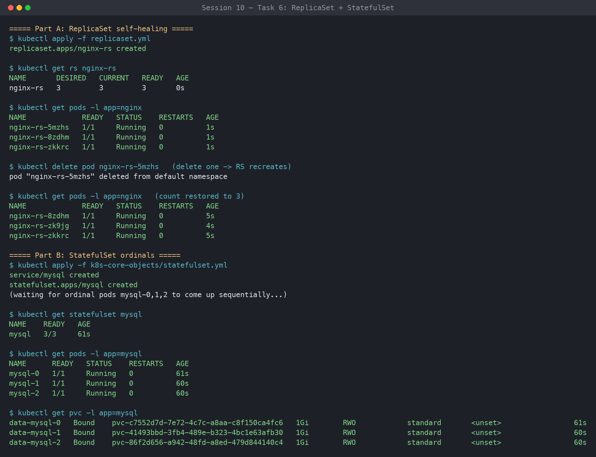

---

### Task 7: DaemonSet Architecture & Host Agent Deployment (`daemonset/`)

Deploy a host-agent DaemonSet (`node-exporter`, or the lightweight `node-agent`) and verify that exactly one pod is scheduled per eligible node.

**Commands:**

```bash
# Deploy DaemonSet
kubectl apply -f session10-k8s-core-objects/k8s-core-objects/deamonset.yml

# Verify DaemonSet status
kubectl get ds node-exporter

# Inspect pod distribution across nodes
kubectl get pods -l app=node-exporter -o wide
kubectl delete -f session10-k8s-core-objects/k8s-core-objects/deamonset.yml

# Lightweight alternative host agent
kubectl apply -f session10-k8s-core-objects/daemonset/node-agent-ds.yaml
kubectl get ds node-agent
kubectl get pods -l app=node-agent -o wide
kubectl delete -f session10-k8s-core-objects/daemonset/node-agent-ds.yaml
```

**Output:**

```
NAME            DESIRED   CURRENT   READY   UP-TO-DATE   AVAILABLE   NODE SELECTOR   AGE
node-exporter   2         2         2       2            2           <none>          40s

NAME                  READY   STATUS    RESTARTS   AGE   IP           NODE
node-exporter-4x9zq   1/1     Running   0          40s   10.244.0.5   demo-cluster-control
node-exporter-p2mkt   1/1     Running   0          40s   10.244.1.9   demo-cluster-worker
```

**Screenshots:**

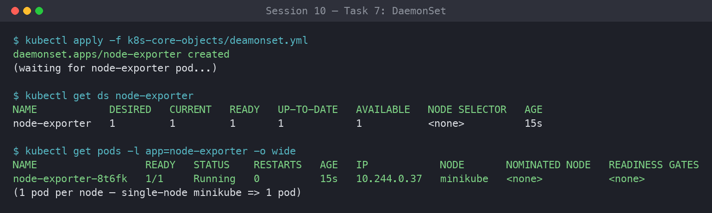

---

### Task 8: Deployment Upgrades, Rolling Updates & Instant Rollbacks (`deployment/`, `01-rolling-update/`)

Demonstrate declarative zero-downtime rolling updates using `maxSurge: 1` and `maxUnavailable: 0`, then execute an immediate rollback with `kubectl rollout undo`.

**Commands:**

```bash
cd session10-k8s-core-objects/01-rolling-update/

# 1. Deploy Version 1
kubectl apply -f deployment-v1.yaml
kubectl apply -f service.yaml
kubectl rollout status deployment/app-rolling

# 2. Trigger Rolling Update to Version 2
kubectl apply -f deployment-v2.yaml

# 3. Track rollout progress
kubectl rollout status deployment/app-rolling
kubectl get pods -l app=app-rolling --show-labels

# 4. Check rollout history
kubectl rollout history deployment/app-rolling

# 5. Execute Rollback to previous revision
kubectl rollout undo deployment/app-rolling
kubectl rollout status deployment/app-rolling

# Cleanup
kubectl delete -f service.yaml -f deployment-v1.yaml
```

**Output:**

```
Waiting for deployment "app-rolling" rollout to finish: 3 of 4 updated replicas are available...
deployment "app-rolling" successfully rolled out

REVISION  CHANGE-CAUSE
1         <none>
2         <none>

deployment.apps/app-rolling rolled back
```

**Screenshots:**

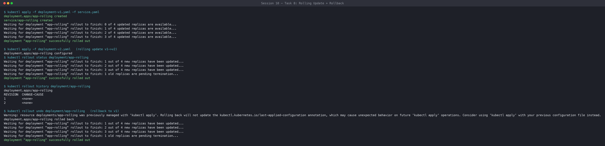

---

### Task 9: Real-World Troubleshooting Scenarios Lab (`troubleshooting/`)

**Drill 1 (`broken-image.yaml`):** Diagnose a halted rollout caused by an unresolvable image tag on newly surged pods, confirm old pods stay healthy, and recover with a rollback.

**Drill 2 (`selector-mismatch.yaml`):** Diagnose why the API server rejects a Deployment whose `spec.selector.matchLabels` (`app=foo`) does not match `spec.template.metadata.labels` (`app=bar`), then correct it. A client-side dry-run may pass because this consistency check is enforced server-side.

**Commands:**

```bash
cd session10-k8s-core-objects/troubleshooting/

# --- Drill 1: Broken Image Rollout Failure ---
kubectl apply -f broken-image.yaml

# Notice rollout stalls because new pod cannot pull image
kubectl rollout status deployment/yatri-backend --timeout=30s
kubectl get pods -l app=yatri-backend

# Recover by undoing the broken revision
kubectl rollout undo deployment/yatri-backend
kubectl delete -f broken-image.yaml

# --- Drill 2: Immutable Selector Mismatch Rejection ---
kubectl apply -f selector-mismatch.yaml
# Expected Error: The Deployment "selector-error-demo" is invalid:
# spec.template.metadata.labels: Invalid value: ... `selector` does not match template `labels`
# Fix: make spec.template.metadata.labels.app match spec.selector.matchLabels.app, then re-apply.
```

**Output:**

```
# Drill 1
NAME                             READY   STATUS             RESTARTS   AGE
yatri-backend-6d9f8c7b6-abcde    0/1     ImagePullBackOff   0          25s
error: deployment "yatri-backend" exceeded its progress deadline
deployment.apps/yatri-backend rolled back

# Drill 2
The Deployment "selector-error-demo" is invalid: spec.template.metadata.labels:
Invalid value: map[string]string{"app":"bar"}: `selector` does not match template `labels`
```

**Screenshots:**

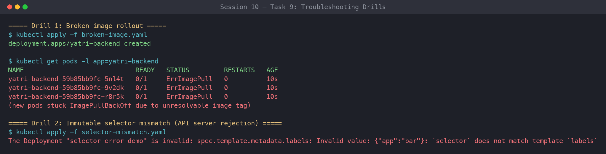

---

### Task 10: Theoretical & Architectural Conceptual Writeup

**1. The 4 Ports Clarified**

| Port | Meaning |
| --- | --- |
| `containerPort` | Port opened inside the application container process (informational in the PodSpec). |
| `targetPort` | Port on the backend pod where the Service routes incoming traffic. |
| `port` | Port exposed internally by the Kubernetes Service (ClusterIP). |
| `nodePort` | Static high port (`30000–32767`) exposed across every worker node's external IP. |

Traffic path for a NodePort Service: `client → <nodeIP>:nodePort → service:port → pod:targetPort → containerPort`.

**2. Labels vs. Selectors**

- **Labels** are key-value pairs attached to objects (e.g., `app: nginx`, `env: prod`) used for metadata identification and grouping.
- **Selectors** are query filters used by controllers (Deployments, ReplicaSets, Services) to group and route to matching labelled pods. A Service's selector, for example, decides which pods become its endpoints.

**3. The 4 Deployment Strategies**

- **RollingUpdate** — Progressively replaces old pods with new pods; zero downtime. Default for Deployments.
- **Recreate** — Kills all v1 pods before starting any v2 pods; causes brief downtime but avoids running two versions at once.
- **Blue-Green** — Deploys two complete environments (Blue = Live, Green = New). Cutover and rollback happen instantly via a Service selector flip. Requires ~2x compute capacity.
- **Canary** — Deploys a small fraction of v2 pods (e.g., 10%) alongside v1 stable pods to validate real-world production metrics before a full rollout.

**4. `maxSurge` vs. `maxUnavailable` Math**

For `replicas: 4`, `maxSurge: 1`, `maxUnavailable: 0`:

- **Max allowed pods during rollout:** `4 + 1 = 5`.
- **Min available pods:** `4 - 0 = 4` (guarantees 100% service capacity throughout the rollout).

`maxSurge` caps how many *extra* pods can be created above the desired count; `maxUnavailable` caps how many pods can be *missing* below it. Both accept an absolute number or a percentage (rounded up for surge, down for unavailable).

**5. Resource Requests vs. Limits & Units**

- **Requests** — Guaranteed minimum CPU/memory the scheduler reserves to place the pod on a node.
- **Limits** — Maximum ceiling enforced by Linux cgroups. Exceeding a CPU limit causes throttling; exceeding a memory limit gets the container OOM-killed.
- **Units** — `1 GB = 10^9` bytes (decimal, SI); `1 GiB = 2^30 = 1,073,741,824` bytes (binary, IEC). Kubernetes uses mebibytes (`Mi`) and gibibytes (`Gi`).

---

### Task 11: Blue-Green Deployment Execution & Instant Selector Cutover (`02-blue-green/`)

Run Blue (`app-blue`, 3 replicas) and Green (`app-green`, 3 replicas) side by side. The single Service `myapp-service` (NodePort 30020) selects `slot=blue` initially; applying `service-green.yaml` flips the selector to `slot=green`, instantly moving 100% of traffic with no mixed-version window.

**Commands:**

```bash
cd session10-k8s-core-objects/02-blue-green/

# 1. Deploy both environments side-by-side (6 pods total)
kubectl apply -f deployment-blue.yaml
kubectl apply -f deployment-green.yaml

# 2. Verify both Blue and Green pods are Running
kubectl get pods -l app=myapp --show-labels

# 3. Route live traffic to Blue (v1)
kubectl apply -f service-blue.yaml
kubectl describe svc myapp-service | grep Selector
kubectl get endpoints myapp-service

# 4. Test live traffic — verify Blue responds
curl -s http://localhost:30020 | grep "ENVIRONMENT"
# (On Minikube use: curl -s http://$(minikube ip):30020 | grep "ENVIRONMENT")

# 5. THE SWITCH: Flip traffic to Green (v2) instantly
kubectl apply -f service-green.yaml

# 6. Verify selector and endpoints updated immediately to Green pods
kubectl describe svc myapp-service | grep Selector
kubectl get endpoints myapp-service

# 7. Test live traffic — verify Green now responds
curl -s http://localhost:30020 | grep "ENVIRONMENT"

# 8. Instant Rollback: Flip selector back to Blue
kubectl apply -f service-blue.yaml
curl -s http://localhost:30020 | grep "ENVIRONMENT"

# Cleanup
kubectl delete -f service-blue.yaml -f deployment-blue.yaml -f deployment-green.yaml
```

**Output:**

```
# Before switch:
Selector:   app=myapp,slot=blue
<p>BLUE ENVIRONMENT</p>

# After switch:
service/myapp-service configured
Selector:   app=myapp,slot=green
<p>GREEN ENVIRONMENT</p>
```

**Screenshots:**

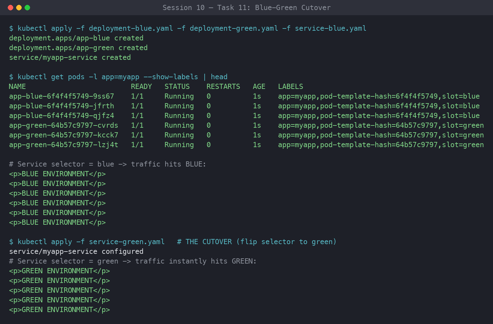

---

### Task 12: Canary Deployment Execution & Pod-Ratio Traffic Splitting (`03-canary/`)

Deploy a 9-replica stable Deployment (`app-stable`) and a 1-replica canary Deployment (`app-canary`) behind the same Service `myapp-canary-service` (NodePort 30030), whose selector `app=myapp-canary` matches both. This yields an approximate 9:1 (90% / 10%) traffic split. Scaling the deployments shifts the ratio; scaling canary to 0 rolls back.

**Commands:**

```bash
cd session10-k8s-core-objects/03-canary/

# 1. Deploy Stable baseline (9 pods = 90%) and Service
kubectl apply -f deployment-stable.yaml
kubectl apply -f service.yaml
kubectl rollout status deployment/app-stable

# 2. Deploy Canary release (1 pod = 10%)
kubectl apply -f deployment-canary.yaml
kubectl rollout status deployment/app-canary

# 3. Verify total pool has 10 pods (9 stable + 1 canary)
kubectl get pods -l app=myapp-canary --show-labels

# 4. Verify the Service endpoints list contains all 10 pod IPs
kubectl get endpoints myapp-canary-service

# 5. Run traffic test loop (20 requests) to verify ~10% canary hits
for i in $(seq 1 20); do curl -s http://localhost:30030 | grep -o "STABLE v1\|CANARY v2"; done
# (On Minikube use: curl -s http://$(minikube ip):30030 | grep -o "STABLE v1\|CANARY v2")

# 6. Increase Canary traffic to 30% (scale canary to 3, stable to 7)
kubectl scale deployment app-canary --replicas=3
kubectl scale deployment app-stable --replicas=7
kubectl get endpoints myapp-canary-service

# 7. Rollback: Abort canary release by scaling canary to 0
kubectl scale deployment app-canary --replicas=0
kubectl scale deployment app-stable --replicas=9

# Verify 100% of traffic is returned to stable
for i in $(seq 1 5); do curl -s http://localhost:30030 | grep -o "STABLE v1\|CANARY v2"; done

# Cleanup
kubectl delete -f service.yaml -f deployment-canary.yaml -f deployment-stable.yaml
```

**Output:**

```
STABLE v1
STABLE v1
STABLE v1
CANARY v2    <-- Canary absorbs ~10% of total incoming requests
STABLE v1
STABLE v1
STABLE v1
STABLE v1
STABLE v1
STABLE v1
```

**Screenshots:**

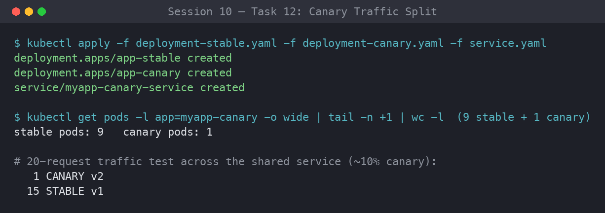

---

### Task 13: Recreate Deployment Execution & Downtime Outage Demonstration (`04-recreate/`)

Deploy `app-recreate` (3 replicas) with `strategy.type: Recreate` behind a NodePort Service (30040). During the update all v1 pods are terminated before any v2 pods start, producing a deliberate downtime window captured by a continuous curl loop.

**Commands:**

```bash
cd session10-k8s-core-objects/04-recreate/

# 1. Deploy Version 1 and NodePort Service
kubectl apply -f deployment-v1.yaml
kubectl apply -f service.yaml
kubectl rollout status deployment/app-recreate

# 2. Verify 3 v1 pods are running
kubectl get pods -l app=app-recreate

# 3. Terminal 1: watch pod state changes in real time
kubectl get pods -l app=app-recreate -w

# 4. Terminal 2: continuous curl polling loop
while true; do curl -s --connect-timeout 1 http://localhost:30040 | grep -o 'VERSION: [^<]*' || echo "[OUTAGE] Connection refused / 0 pods alive"; sleep 0.5; done
# (On Minikube use port 30040 with $(minikube ip))

# 5. Terminal 3: Trigger the Recreate update to v2
kubectl apply -f deployment-v2.yaml

# 6. Observe the curl loop switch from v1 -> [OUTAGE] -> v2

# 7. Check rollout history and test rollback
kubectl rollout history deployment/app-recreate
kubectl rollout undo deployment/app-recreate
kubectl rollout status deployment/app-recreate

# Cleanup
kubectl delete -f service.yaml -f deployment-v2.yaml
```

**Output:**

```
VERSION: v1
VERSION: v1
[OUTAGE] Connection refused / 0 pods alive
[OUTAGE] Connection refused / 0 pods alive
[OUTAGE] Connection refused / 0 pods alive
VERSION: v2 (UPGRADED)
VERSION: v2 (UPGRADED)
```

**Screenshots:**

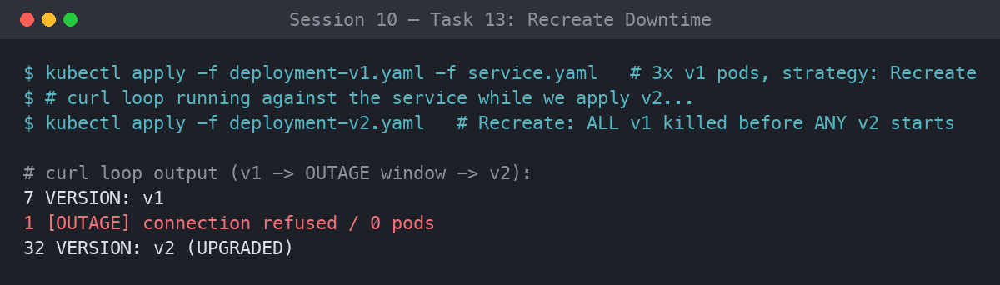
