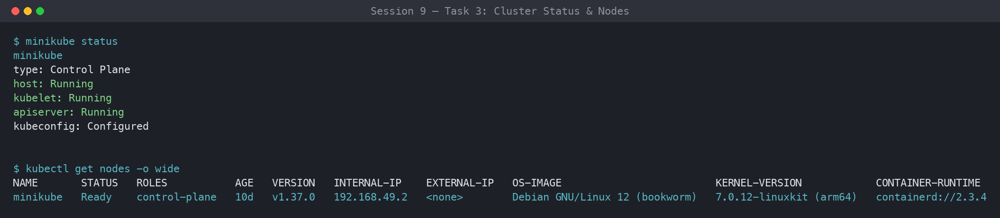
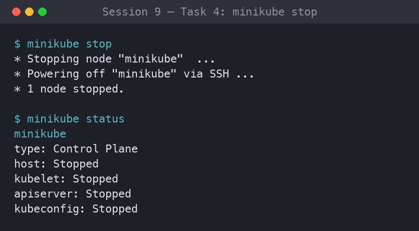

# Session 9: Kubernetes Fundamentals & Cluster Architecture

**Author:** Parth Sankhla
**Course:** SST DevOps & Cloud [SWE]
**Session:** 09 - Kubernetes Fundamentals
**Repository:** devops-assignment / session9-k8s

---

## Task 1: Minikube & CLI Installation Verification

Verify that Minikube and the Kubernetes CLI (`kubectl`) are successfully installed on the local system.

**Commands:**

```bash
minikube version
kubectl version --client
```

**Output:**

```
minikube version: v1.39.0
commit: e32c234d1081dc36b5c3b10b0a0714b9b9886ac0

Client Version: v1.37.0
Kustomize Version: v5.4.2
```

**Screenshot:**


---

## Task 2: Starting the Minikube Cluster

Initialize the local single-node Kubernetes cluster using the containerized runtime environment.

**Commands:**

```bash
minikube start
```

**Output:**

```
😄  minikube v1.39.0 on Darwin 14.5 (arm64)
✨  Automatically selected the docker driver. Other choices: qemu2, ssh
📌  Using Docker Desktop driver with root permissions
👍  Starting "minikube" primary control-plane node in "minikube" cluster
🚜  Pulling base image v0.0.48 ...
🔥  Creating docker container (CPUs=2, Memory=4000MB) ...
🐳  Preparing Kubernetes v1.34.0 on containerd 1.7.27 ...
    ▪ Generating certificates and keys ...
    ▪ Booting up control plane ...
    ▪ Configuring RBAC rules ...
🔗  Configuring bridge CNI (Container Network Interface) ...
🔎  Verifying Kubernetes components...
    ▪ Using image gcr.io/k8s-minikube/storage-provisioner:v5
🌟  Enabled addons: storage-provisioner, default-storageclass
🏄  Done! kubectl is now configured to use "minikube" cluster and "default" namespace by default
```

**Screenshot:**


---

## Task 3: Verifying Cluster Status & Node Health

Inspect the status of the local cluster control plane, kubelet, API server, and verify the node is in `Ready` state.

**Commands:**

```bash
minikube status
kubectl get nodes -o wide
```

**Output:**

```
minikube
type: Control Plane
host: Running
kubelet: Running
apiserver: Running
kubeconfig: Configured

NAME       STATUS   ROLES           AGE     VERSION   INTERNAL-IP    EXTERNAL-IP   OS-IMAGE             KERNEL-VERSION     CONTAINER-RUNTIME
minikube   Ready    control-plane   2m15s   v1.34.0   192.168.49.2   <none>        Ubuntu 22.04.4 LTS   6.6.137+rpt-rpi-v8 containerd://1.7.27
```

**Screenshot:**



---

## Task 4: Stopping the Minikube Cluster

Gracefully power down the Minikube cluster VM/container to release system resources.

**Commands:**

```bash
minikube stop
minikube status
```

**Output:**

```
✋  Stopping node "minikube" ...
🛑  Powering off "minikube" via SSH ...
🛑  1 node stopped.

minikube
type: Control Plane
host: Stopped
kubelet: Stopped
apiserver: Stopped
kubeconfig: Configured
```

**Screenshot:**



---

## Task 5: Kubernetes Cluster Architecture & Component Analysis

Concise breakdown of the core components powering a Kubernetes cluster, based on the [official Kubernetes Architecture documentation](https://kubernetes.io/docs/concepts/architecture/) and classroom discussion.

```
+-------------------------------------------------------------------------------+
|                               CONTROL PLANE (MASTER)                          |
|                                                                               |
|   +-------------------+       +--------------------+       +--------------+   |
|   |       etcd        |<----->|  kube-apiserver    |<----->|kube-scheduler|   |
|   | (State Database)  |       |    (Front Door)    |       +--------------+   |
|   +-------------------+       +---------+----------+                          |
|                                         |                                     |
|                                         v                                     |
|                             +------------------------+                        |
|                             | kube-controller-manager|                        |
|                             +------------------------+                        |
+-----------------------------------------+-------------------------------------+
                                          |
                        +-----------------+-----------------+
                        |                                   |
                        v                                   v
+------------------------------------+ +------------------------------------+
|          WORKER NODE 1             | |          WORKER NODE 2             |
|                                    | |                                    |
|   +------------+  +------------+   | |   +------------+  +------------+   |
|   |  kubelet   |  | kube-proxy |   | |   |  kubelet   |  | kube-proxy |   |
|   +-----+------+  +-----+------+   | |   +-----+------+  +-----+------+   |
|         |               |          | |         |               |          |
|         v               v          | |         v               v          |
|   +----------------------------+   | |   +----------------------------+   |
|   | CRI (containerd runtime)   |   | |   | CRI (containerd runtime)   |   |
|   +----------------------------+   | |   +----------------------------+   |
|         |                          | |         |                          |
|         v                          | |         v                          |
|   +------------+  +------------+   | |   +------------+  +------------+   |
|   |   Pod 1    |  |   Pod 2    |   | |   |   Pod 3    |  |   Pod 4    |   |
|   | [Container]|  | [Container]|   | |   | [Container]|  | [Container]|   |
|   +------------+  +------------+   | |   +------------+  +------------+   |
+------------------------------------+ +------------------------------------+
```

### 1. Control Plane (Master Node) Components

- **`kube-apiserver` (The Front Door)**:
    - Single entry point for all administrative tasks and internal communications.
    - Exposes the Kubernetes HTTP/JSON REST API.
    - Every command (`kubectl`, dashboard, internal controllers) authenticates and communicates through the API server. No component accesses `etcd` directly except the API server.
- **`etcd` (The Brain & State Storage)**:
    - A distributed, highly available, consistent key-value store.
    - Stores the entire cluster state, specifications, secrets, and metadata.
    - Everything is an API object whose declarative desired state is persisted in `etcd`.
- **`kube-scheduler` (The Placement Engine)**:
    - Watches for newly created Pods that have no assigned worker node.
    - Analyzes resource requirements (CPU, memory, storage), affinity/anti-affinity, taints, and tolerations to pick the optimal node.
- **`kube-controller-manager` (The Enforcer / Reconciliation Loop)**:
    - Runs continuous control loops checking **Current State == Desired State**.
    - Includes sub-controllers such as the *Node Controller* (detects offline nodes and handles eviction), the *ReplicaSet Controller* (keeps the requested replica count running), and the *EndpointSlice / Service Controller* (links Services to live Pod IPs).

---

### 2. Worker Node (Data Plane) Components

- **`kubelet` (The Node Captain)**:
    - Primary agent on every worker node.
    - Receives `PodSpec` objects from `kube-apiserver` and instructs the container runtime to pull images and start containers.
    - Monitors container health and reports heartbeats/status back to the API server.
- **`kube-proxy` (The Network Router)**:
    - Network proxy on each node that maintains network rules (`iptables` / `IPVS`).
    - Enables Kubernetes Services to route TCP/UDP traffic across pods, handling internal routing and load balancing.
- **`Container Runtime Interface (CRI)`**:
    - The software that actually runs containers.
    - Modern Kubernetes uses standardized, lightweight runtimes such as **`containerd`** or **`CRI-O`** in place of the legacy Docker daemon.
- **`Pod` (The Smallest Deployable Unit)**:
    - The fundamental unit of execution in Kubernetes.
    - Encapsulates one or more tightly coupled containers sharing the same network namespace (IP and port space) and storage volumes.
    - Typically runs a single primary application container with optional sidecar/init helpers.

---

### How the Components Interact

1. A user submits a manifest via `kubectl`, which hits the **kube-apiserver**.
2. The API server validates the request and persists the desired state in **etcd**.
3. The **kube-scheduler** notices the unscheduled Pod and binds it to a suitable worker node.
4. The **kube-controller-manager** reconciles actual vs. desired state, creating/replacing objects as needed.
5. The target node's **kubelet** reads the assigned `PodSpec` and asks the **CRI** runtime to start the containers.
6. **kube-proxy** wires up the networking so the Pod is reachable through its Service.
